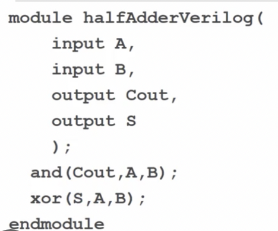

## UPF란, (Unified Power Format) IEEE 1801, 저전력 반도체 설계 방법 in vlsi

수십년 전의 반도체는 "기능 동작"만 하면 성공이었는데,

요즘 반도체는 "속도도 빨라야하고, 작아야하고, 저전력이여야하고, 수율도 좋아야"합니다.

​

UPF란, "반도체의 효율적인 전력 설계/검증/구현"을 위해 사용하는 방법론 혹은 언어라고 보시면 됩니다. IEEE Standard로, IEEE 1801에 있습니다.

​

디지털 논리 설계는 보통 "HDL"로 만듭니다.

아래처럼 input A, B

output은 Cout, S로 두고~~ 어떤 "논리회로"를 연결한다고 표현이 되어있죠.

HDL은 정말 논리 설계를 위한 언어에요. 이거로도 전력 최적화 회로를 설계 할 수 있지만, 제한이 많습니다. 초기에는 HDL만으로 설계를 했으니까요.

​

그래서 반도체 엔지니어들은 "전력에 대한 설계"를 작성 할 수 있는 방법이 필요했습니다.

​

다음은 논리설계/검증/구현 중에 UPF가 사용되는 위치를 보여주는 EDA flow입니다. (UPF Flow라고 검색하시면 각 EDA Tool vendor에서 더 자세한 흐름을 보여줍니다. 저는 가장 간단한 것을 갖고왔어요.)

(참고로 설계는 논리 회로 설계를 말하는거고, 구현은 논리회로를 물리적 회로로 변환하는 흐름을 뜻합니다)

​

UPF Flow

​

​

​

그래서 UPF가 전력 설계를 할 수 있는데, 전력 설계가 뭐냐면,

​

1. Power domain와 hierarchy:

Power domain은 별도의 Power/Ground Network입니다.

(1) 어떤 Power가 어떤 부분을 제어할지?

(2) 그 Power는 어떤 값을 갖고있고, 어떤 속성을 갖는지?

(3) 만약에 내 Design을 먼저 구현하고, 상위 디자인에서 내 디자인을 사용하는 경우, 이 디자인에 어떤 속성을 상위 디자인에 알려줘야하는지?

​

2. Power Status / Mode :

요즘 칩들은 모드가 다양해요. 게임 할 때는 고성능 모드, 대기상태에선 저전력모드로 변환이 되죠.

설계에서 이런 모드를 만들어놓았기에 가능한거죠.

(1) 어떤 부분은 게임 할 때만 전력 공급이 필요

(2) 어떤 부분은 대기 상태일 때는 낮은 전력 공급

​

3. 다양한 전력 도메인 사용

낮은 전압으로 동작하는 로직에서, 높은 전압으로 동작하는 로직으로 데이터를 보낼 때 voltage swing이 다르기 때문에 일반적으론 정상동작하지 않습니다. 그렇기 때문에 이런 전압차이가 발생하는걸 어디서 케어해줄 것인지 정의가 필요합니다.

Level shifter 같은 추가 로직이 필요합니다.

​

4. 격리 및 보존 전략:

특정 모드에선 아예 전력을 차단해버리는 모듈이 있을 수 있습니다.

하지만 마지막에 담고있는 데이터는 그 모듈에 그대로 갖고 있을 경우도 있겠죠? 이런 것들에 대한 정의가 필요합니다.

이런 경우를 위해 Isolation cell, retention cell들이 필요합니다.

​

5. EDA Tool과의 인터페이스:

UPF는 단순한 이론적인 프레임워크가 아닙니다. EDA Tool과 완벽하게 통합되어 SoC Flow 전반에 걸쳐 전력 의도가 일관되게 전달되도록 보장합니다. IEEE Standard라는게 중요합니다. 업계 표준이에요.

​

UPF Flow 진행 시 아래 과정에서 사용 될 수 있습니다.

Logic Synthesis : UPF는 지정된 전력 의도, 전압 레벨 및 전력 모드를 준수하면서 설계를 최적화하도록 합성 도구를 안내합니다.

Place & Route: 배치 및 경로 중에

​

UPF는 RTL 설계/검증 단계부터 GDS를 뽑을 때까지 계속 사용이 되는데요.

같은 UPF File로 RTL 설계 / Logic Synthesis / Place & Route 하는 방법이 있구,

RTL단계에서 UPF를 만들고 설계/검증,

그 UPF를 Logic Syntheis 단계에 입력 후 EDA Tool을 통해 UPF'를 출력하고 설계/구현/검증,

그 UPF'를 P&R 단계에 EDA Tool을 통해 UPF''를 뽑아 설계/구현/검증

​

하는 flow도 있습니다.

​

​

create_power_domain -name PD_CORE -ports {VDD VSS}

이런식으로 Power domain을 선언하고~~ 각종 전력 설계를 정의합니다.

​

SDC랑도 비슷한 점이 일부 있습니다. 자세한 command들은 ieee에서 확인하시면 됩니다~~

 해시태그 : 