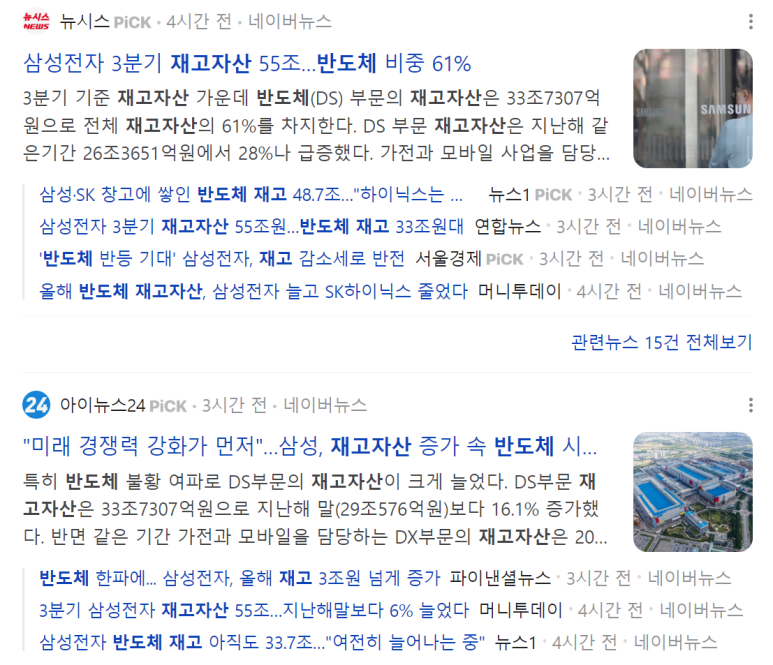
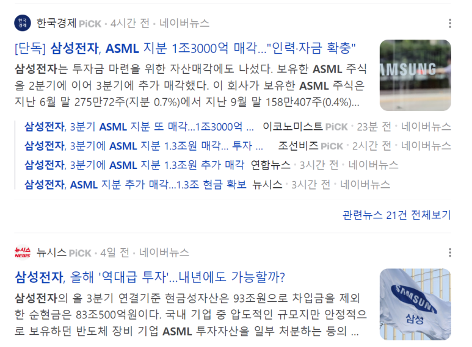

## 2023-11-14 반도체뉴스요약: 엔비디아 H200 출시, YMTC 특허소송, 독일 TSMC 팹 건설, 삼성전자 재고자산 증가, 삼성전자 ASML 지분 매각

​

중국 최대 메모리 반도체 생산업체인 양쯔메모리테크놀로지가 미국의 마이크론 상대로 특허 소송을 제기하였습니다.

관련 품목은 96단, 128단, 176단, 232단 3차원(D) 낸드플래시 메모리입니다.

​

미중무역분쟁이 특허전쟁으로 이어지고 있네요.

​

​

2.독일에 TSMC 팹 건설. Bosch, NXP, Infineon 합작 예정.

​

3. 삼성전자, 하이닉스 재고자산이 계속 증가하고 있습니다.

반면에 영업이익은 개선 되고 있습니다.

4. 삼성전자가 ASML 지분 1.3조를 매각했습니다. 현재 보유 현금이 100조 정도이고, 이 돈을 어디에 사용하는지 지켜봐야 할 것 같습니다. 설비 투자? 회사 인수???

​

5. 엔비디아에서 최신 AI 칩 H200을 공개했습니다. H100의 출력 속도 두 배라고 합니다.

H100이 나왔을 때, 빅데이터, AI를 하는 회사들이 엄청나게 빠르게 발전했습니다.

Chat GPT도 H100이 이용되었죠. 1만대 이상의 H100이 사용되었습니다. (참고로 현재 H100의 시장가는 5~6000만원입니다.)

​

이 H100은 가정용 PC같은게 아니라, AI Training에 사용되는 칩이라서,

AI를 하는 회사들이 올 해에는 두배 더 빠른 속도로 AI 제품을 내놓는다는거죠.

​

Chat GPT 쓰면서도, AI 시대에 가까워졌다고 느꼈는데.... 2024년은 더 빠른 한 해가 되겠습니다.

​

전세계 회사들이 반도체를 핵심으로 투자하고,

반도체가 n배 빨라지면 n*m배 효과를 내는 AI 회사들..

​

저는 "AI 회사들이 수익성이 높은 사업들을 먼저 정복하고, 차차 수익성이 낮지만 매출을 올릴 수 있는 모든 사업을 정복할 것"이라고 믿는데요.

이 순간이 매년 엄청나게 빨라지는 것 같습니다.

​

엔비디아 팔지 말고 갖고 있어야겠다...ㅎㅎ

 해시태그 : 