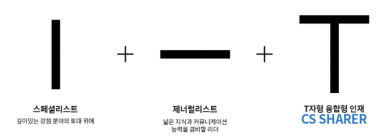
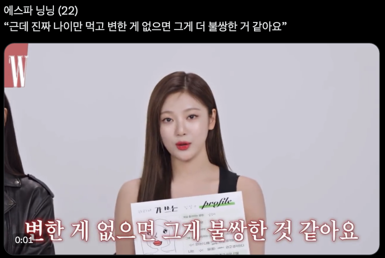
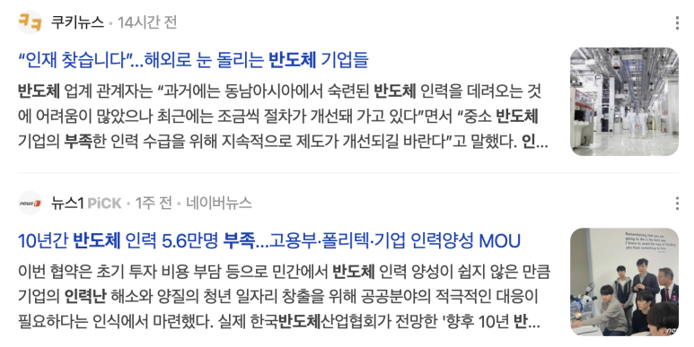
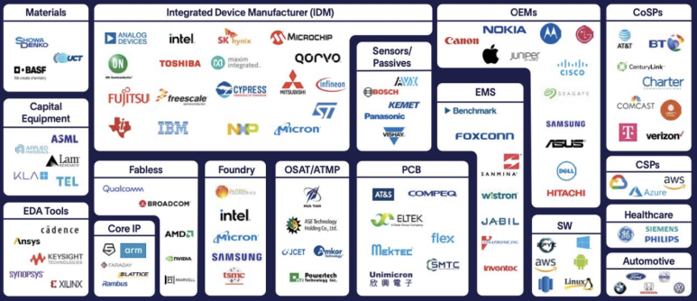

## "공대생 진로 추천, 성공적인 경력 구축 가이드" (전기공학, 전자공학, 반도체공학, 컴퓨터공학)

오늘은 전기, 전자, 컴퓨터, 반도체 공학에서 진로에 대해서 알아보려고 합니다.

제 블로그 연령, 성별 통계를 보면, 주로 "취업 준비"를 하는 사회초년생이 많더라구요.

​

제 지인들이 제 블로그를 보기에, 이런 글 쓰기가 참으로 부끄럽지만... 누군가에겐 도움이 되길 바라며 작성합니다.

​

MBTI처럼 질문 몇 개로 여러분의 진로를 딱 정해주면 좋겠지만, 여러분이 대답하기가 어려울거에요.

왜냐하면 여러분들은 "내가 그거 좋아하나?? 안 해봤는데??" 이럴거잖아요.

​

​

이 글의 방향은 "전기/전자/컴퓨터 공대생들의 진로 소개 ~ VLSI 설계"로 이어집니다.

시작합니다.

​

​

사회에서 원하는 인재가 이런 T자형 혹은 π형 인재에요.

다양한 분야를 알면서, 특정 분야에 깊이 있는 인재입니다.

근데 제너럴해질 기회는 거의 대학교에서 끝난다고 보시면 됩니다.

대학원을 가거나, 회사에 가는 것은 특정 분야의 스페셜리스트가 되는거에요.

​

특히 우리 전기, 전자, 컴퓨터, 반도체인들은 할 수 있는게 진짜 많잖아요.

코딩 배워서 SW쪽 갈 수도 있고, 전기 배워서 에너지 쪽 갈 수도 있고, 회로 배워서 반도체 쪽 갈 수도 있고.

근데... 이렇다보니까, 우리 분야는 "다양하게 알면서, 한 분야에 깊이"가 있어야함.

​

1. 처음엔 ㅡ자형 인재, 제너럴리스트로 방향을.

일단 이것저것 많이 해봐야, "뭘 잘하고, 뭘 좋아하고, 뭘 사회에서 필요로 하는지"를 알 수 있다.

일단 ㅡ자로 넓혀가며 진로 탐색을 해야함.

​

1.1) 취업시즌까지 ".자 인재라면", 급하게 채용 공고에 아무거나 써야하기 때문에, 취업도 어렵고~ 취직해서도 일이 힘들 가능성이 큼.

1.2) 취업시즌까지 "ㅡ자형 인재"로 남으면 취업 할 때 좀 어려울 수 있다.

넓지도, 깊지도 않으면.. 에스파 닝닝이 당신을 불쌍하다고 생각 할 수도 있다.

진로 결정을 제대로 못했다면, 불안한 마음을 갖고 당장 찾아나서야 한다.

​

​

저는 어떻게 했냐면, 일단 저는 졸업 할 때까지 학과에 개설된 모든 전공과목을 다 수강했어요.

(1) 대학 새내기 때 특허, 아이디어 관련 강의를 재밌게 들었어서, 군대 있는 동안 변리사 공부(민법+자연과학)를 좀 해보다가, 일찍 관뒀습니다.

로스쿨 변호사가 쏟아져 나오면서 수가가 계속 떨어지고 있었어서.. ROI가 낮다고 생각했어요. 변리사 공부는 양이 엄청 많고, 뽑는 사람도 제한적인데.... 변호사랑 업무가 겹치니까요. (로스쿨도 같은 이유로 갈 생각 안했구요.)

(2) 대학 다니면서 신호 및 시스템, 암호학을 제일 재밌게 들었어서, 이쪽 분야를 좀 알아보니, 대부분 "디지털회로설계" 직군에서 뽑더라구요. 마침 컴퓨터 구조 강의도 재밌게 들었구요.

재미없게 들었던 과목 : 제어공학, 에너지, 전력, 전파, 디스플레이, 광전자, 재료공학... 엄청 많음.

(3) 그래서, "디지털회로설계"로 가야겠다. 결정을 했어요.

​

​

2.I자로 전문성 쌓아가기

IT Tech 기업은.. 한국에만 Office가 있지 않고, 전세계에 있어요.

외국엔 주 6~70시간 근무를 당연하게 생각하는 인도, 베트남, 중국 명문대 엔지니어도 있어요.(인도는 1년에 150만명의 엔지니어가 나와요!)

​

주 최대 52시간 일하는 당신을 고용하는 것보다

주 6~70시간 근무하고 영어 할 줄 아는 명문대 출신 외국인 엔지니어 3명 고용하는게 더 저렴할 수도 있어요.

여러분이 CEO라면 누구 뽑을 것 같아요?

​

요즘 IT인력을 한국보다 외국에서 더 많이 구인하고 있어요. linkedin 설치해서 india bangalore라는 지역 한번 보십쇼.

​

한국 뉴스 보면, "반도체 인력난" 이런 뉴스 많잖아요.

근데 일 할 사람이 없다는 내용을 자세히보면, 2가지로 분류 할 수 있습니다.

(1) 보상/워라벨/비전이 나빠서, 지원자가 없거나

(2) 보상/워라벨/비전도 좋고, 지원자도 많은데, 기업이 원하는 능력을 가진사람이 없거나

저는 (2)에 집중을 했습니다.

한국이 저 나라들보다 제조 시설 인프라가 잘 되어있고, 실무 중심 교육이 많습니다.

(제조기반이 아닌, SW 자체는 이미 인도나 중국이 더 잘하는 것 같구요.)

​

저는 원하는 Job Description(경력 먼저 읽어보고, 그리고 신입 읽어봄) 읽어보니, "내가 뭐가 부족하군" 이게 보이더라구요. 그래서 관련 경험 쌓고.

추천하는 교육들(순서는 상관 없음. 사설강의도 좋긴한데, 어쨌든 이름있고+배울거 많은 교육) : 

1.공정 실습 교육: 서울대, 연세대, 렛유인, 엔지닉, SPTA, SEMI 등

2.설계 실습 교육: ETRI, IDEC, 서울시 AI양재 허브 등

3.대기업 인턴: 삼성 대학생 인턴, SK 청년 인턴

​

(1)가고싶은 회사의 실무자들한테 개인적으로 많이 물어보고.. 이력서도 보여주고.

(2)같이 하는 사람들 중 에이스들이 어떻게 하는지 잘 배끼고.

(3)시간 지나면 다 까먹기에, 짧은 요약 노트 정리하기. (면접 때 다 물어보고, 실무 할 때 필요함.)

​

마지막엔, 프로젝트, 논문,  공모전을 관련분야로 마무리.

​

아, 그리고  Job Description을 보고, 직무를 대강은 정해야합니다.

"이 일이 내 학위로 할 수 있는 일인가?" 이걸 빨리 판단해야해요. 대학원 가야 하는것인지 고려를 해야하니..

​

​

3.세부 진로 결정하기: 누울 자리 보고 발 뻗어라

아까 얘기했던 것처럼, 그냥 취업만을 목표하면... 일이 재미 없으면서, 일도 고되고, 비전도 없는데, 나이만 먹어 갈 수 있다. 억지로 일하다보니 실력 있는 경력자는 못되고.

그래서, 이 분야의 생태계를 잘 알아야한다.

서로 갑-을 관계가 되는 회사들입니다.

그렇기에... 엔지니어라도, 자체 연구개발만 하는 엔지니어, 타사 기술지원을 하는 엔지니어로 나눠집니다.

​

나는 회로설계로 가기로 마음을 먹었으니, Core IP, Fabless, IDM, OEM, EDA Tools 정도가 내가 갈 수 있는 회사 직군이 된다.

여기 그림에서만 봐도, 지원 할 수 있는 기업이 30개가 넘는다. 많아보이지만, 한국에서 신입 공채는 가뭄에 콩나듯 나옵니다.

​

연구개발 직군 : 자사에서 연구+개발.

Application 직군 : 자사 제품을 고객 지원+영업

​

반도체 분야에서 높은 분들 보면, Idea부터 Chip까지 모든 과정을 다 해보시고, 한 분야에 정통한 분들입니다.

그래서, 디지털회로설계를 하시는 분들이라면, RTL2GDS 모든 과정을 다 해보고, 한 분야에 집중하는 것을 추천합니다.

​

저는 "RTL2GDS"라고 불리는 디지털 반도체 설계 전체과정을 해보고... "Sign-off 전문가가 되어야겠다." 결정을 했습니다.

​

​

4. 채용 발표 후: 포커에서 들어오는 패는 어쩔 수 없다. 중요한 건 패에 맞게 게임을 하는 것

​

제가 말한대로 다 했다면... 취업은 문제 없을 것 같고,

합격한 회사 중 어떤 회사를 가야 할 지 고민이 있으실겁니당.

​

회사도 잘 정해야합니다! 똑같은 직무더라도, 비슷한 연봉이더라도..

평생 비슷한 산업군에서 일 할 가능성이 큽니다. 지금 잘 나가는 회사가 나중에 못 나갈 수 있는데, 그 때 이직이 어려울 수도 있어요.

​

서버향 반도체 회사로 가면 서버향 반도체 위주로 이직하게 되고..

자동차 반도체 회사로 가면 자동차 반도체 위주로 이직하게 되고..

산업군 바꾸기 쉽지 않아요. 큰 흐름은 같지만, 설계 규칙이 다르거든요.

​

​

​

그래서 제가 어떻게 했는지 3요약을 하면,

(1) 이것저것 해보면서 내가 뭘 좋아하는지? -> 신호처리, 암호학, 디지털회로설계

(2) 정한 분야에 대해서 경험 쌓기 -> 반도체 설계 교육, 프로젝트

(3) 정한 분야에 대해서 세부 직무 골라서 그 분야 집중 탐색. -> RTL2GDS 해보고, Sign-off쪽 해야겠다 결심!

​

궁금한 것 있으시면 댓글 달아주세요.

 해시태그 : 