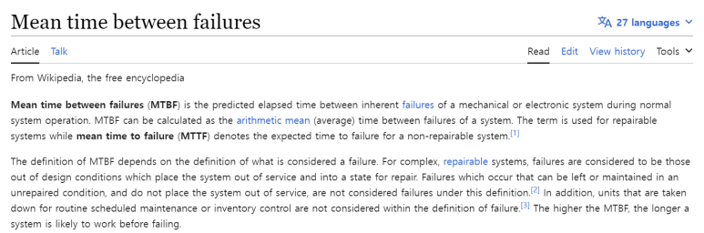

## 양산을 위해 필요한 "반도체 설계에서의 품질경영방법론": DFM과 DFT, HTOL, TCT, HAST, THB, HTS, MSV, ESD, Latch-up Test

반도체 경쟁력은 PPA에 더불어, 품질경영이 중요하다고 볼 수 있습니다.

현재 삼성,tsmc가 사활 걸며 하고있는 3나노 반도체는 2003년에 첫 개발되었어요. 다만, 양산 가능한 품질, 수율, 경제성 확보에 20년이 걸린거죠.

​

품질경영을 위해 어떤 것을 설계에서 고려해야하고, 칩 테스트를 위해 어떤 설계를 해야하는지?

미국 팹리스들은 어떻게 하는지, 각 항목에 대해 소개를 할 계획입니다.

​

이번 글에는 어떤 것들이 있는지만 소개합니다.

​

품질표준 및 기준, 고려사항

ISO 9001 품질 인증

MTBF 값

JEDEC 표준

 ISO 14001 환경 인증

IPC 표준

​

설계 방법론

DFM(Design For Methodology) 및 DFT(Design For Testability) 원칙을 활용하여 설계 레벨부터 공정 후 패키지된 제품의 품질과 안정성을 염두에 두고 제작합니다.

제품 검증

제품 검증에는 Pre-Silicon-Test와 Post-Silicon-Test를 시행합니다.

Pre silicon test란: EDA Tool level에서 동적 시뮬레이션, 몬테카를로, 정적검증

Post silicon test란 : Packaged silicon의 속도, 기능 및 안정성, 신뢰성 테스트

​

신뢰성 테스트 항목

대표적인 안정성 스트레스 테스트에는 다음이 있고, 복사선, 방사선 테스트 등 더 있습니다.

HTOL 테스트

예비 테스트

TCT

HAST

THB

HTS

MSV

ESD

Latch-up

SER

보드 레벨 안정성 특성

Temp cycle

Year end

​

각 테스트 항목을 설명하긴 꽤 길어질 것 같아, 이후 포스트에서 각각 설명하겠습니다.

​

MTBF 예측을 위한 안정성 데모 테스트

DVT

EVT

HALT

HASS

 해시태그 : 