## SPICE란? SPICE Simulation이란? Synopsys HSPICE란? 몬테카를로 시뮬레이션이란? Thermal model이란?

HSPICE란, Synopsys사가 개발한 High-level Simulation Program with Integrated Circuit Emphasis 입니다.

HSPICE에 대한 소개를 하면,

> 회로 시뮬레이션을 위한 업계의 Golden standard tool

출처 : No Site

성능적으로 모든 SPICE Tool 중 가장 우수하고, 가장 인기 있고, 가장 많은 설계도를 칩으로 만든 Foundry의 인증을 받은 제품입니다. 최초로 인증을 받았기도 했고, 미세공정으로 들어가는 첨단노드도 가장 먼저 파운드리의 지원을 받습니다.

​

HSPICE 외에도, PSPice, ORCAD, LTSPICE, SIMetrix, Apctre, ADS, Eldo 등 경쟁 제품도 있습니다.

​

HSPICE는 다음과 같은 기능을 제공합니다.

1. MOS Device algorithm

2. 아날로그/RF/Mixed Signal IC 설계, Cell & Memory Characterization

3. 칩/패키지/보드/Back-plain Signal Integrity 시뮬레이션

​

​

이번 글에서는 SPICE가 무엇인지 알아보고, 이후 포스팅에서 HSPICE를 갖고 Simulation 하는 걸 보여드릴겁니다. (크랙 버전 찾을 수는 있지만... IDEC에 있는 자료로 설명하려고 해요.)

​

SPICE란?

과거엔 회로 설계와 검증을 할 때, 특성을 고려하려면 엔지니어가 종이 위에 그리고.. 엔지니어가 수식을 계산했지만, 요즘은 컴퓨터로 EDA Tool를 사용합니다. 그 EDA Tool중 SPICE라는 Tool을 사용하는데요.

SPICE는 컴퓨터에서 회로 설계/검증을 할 수 있는 소프트웨어입니다. 1973년에 버클리 대학에서 개발되었습니다.

SPICE는 스파이스라고 읽히며,  Simulation Program with Integrated Circuit Emphasis (집적 회로용 시뮬레이션 프로그램)의 이니셜을 조합한 단어입니다.

당시에는 OP Amp 등의 IC, 트랜지스터, 다이오드, 저항, 콘덴서 등에 의한 아날로그 회로 동작의 시뮬레이션을 주된 목적으로 사용하였습니다.

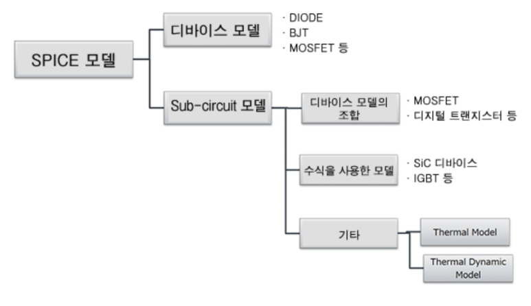

회로 설계/검증에 다양한 EDA Tool이 있는데, 우리는 SPICE Tool에 대해서 볼겁니다. SPICE Model은 두 종류로 나뉩니다.

- Device Model : Diode, BJT, MOSFET 같은 트랜지스터 Level을 다룸

- Sub-circuit Model : 디바이스 모델의 조합 회로, SiC, IGBT, Thermal Model 등..

​

​

​

아래처럼 진행된다고 보면 됩니다.

사용자가 회로도를 GUI에서 그려 넣거나, 데이터 파일을 넣어주고 RUN 하면 시뮬레이션 결과 파형을 볼 수 있는거죠.

techweb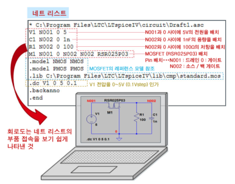

techweb​

SPICE 시뮬레이터가 지닌 대표적인 기능을 하기 표로 정리하였습니다.

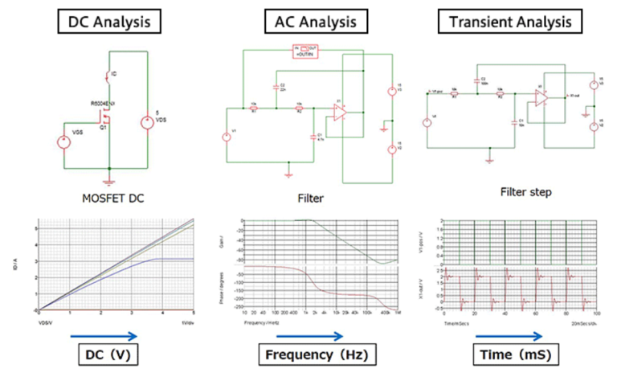

​

​

​

몬테카를로에 대해 더 자세히 살펴볼 것인데, "특성 편차" 개념을 먼저 살펴보겠습니다.

특성편차, 특성오차란?

실제로 회로를 구성하는 저항, 콘덴서, 인덕터, 다이오드, 트랜지스터, IC 등은 특성 편차를 가지고 있습니다.

예를 들어 resistor에서는 허용차가 있어, ±5% 정밀도의 100Ω 저항기의 저항치는 95Ω~105Ω 사이입니다. 편차는 각 부품에 존재하고, 각 부품의 편차 합계가 구성한 회로의 특성 편차가 됩니다.

저항기의 오차​

몬테카를로에 대해 더 자세히 알아보자

몬테카를로란, 시뮬레이션 및 수치 계산 시, 난수(Random number)를 사용하는 방법을 총칭합니다.

몬테카를로 시뮬레이션은 각 회로 요소의 편차를 반영하여 여러 번 시뮬레이션을 실행함으로써, 전체 특성의 편차를 평가할 수 있습니다. 

​

우리가 테스트해볼 회로는 아래 회로입니다.

(a)100Ω의 resistor에 전압을 인가하여

(b)저항값을 (전압 / 전류) 시뮬레이션할거에요.

(c)저항값은 {100*(1+tol)}로 기술합니다. 이는 저항 값 설정 시, 저항값 란에 직접 기입합니다. 몬테카를로 시뮬레이션에서 핵심이 되는 난수 값은 "tol"이 됩니다. 이 값이 편차를 발생시킬거에요.

(d)최대 오차 값은 5%로 만들거라, tol 변수에는 0.05값을 입력합니다.

(e) 300회의 시뮬레이션을 실행합니다.

​

​

​

아래 그림을 보면 두가지 방법이 있습니다. (복잡해보일 수 있는데, 하나씩 보면 쉬워요.)

(1) 균일분포 난수 (flat 분포)

(2) 정규분포 난수 (가우스 분포)

​

사실 전자회로가 이렇게 단순한 선형회로만 있으면, 아무나 다 하겠죠.

​

비선형모델의 예시를 들기 위해, "SPICE 모델에서 디바이스모델"에 대해 설명합니다.

SPICE Simulation을 개발하기 어려운(?) 이유중 하나가 비선형 회로 때문입니다. 대표적으로 다이오드가 그 예시입니다.

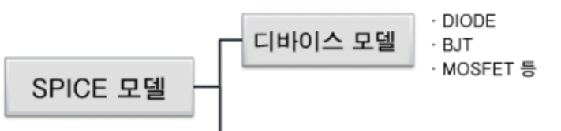

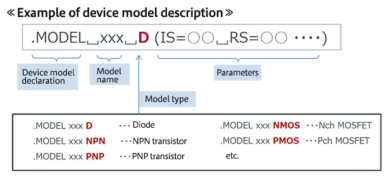

다이오드의 동작 원리에 대해 복습하겠습니다. 반도체의 이론에 대한 설명이지만, 포인트는 디바이스 모델이 어떤 파라미터로 구성되어 있는지를 아는 것이므로... 그냥 "아~ 다이오드 특성 계산 할 때 이런거 있었었지~" 하시면 됩니다.

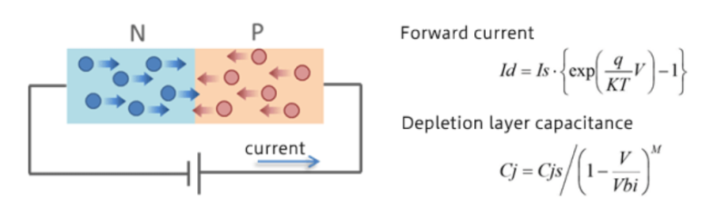

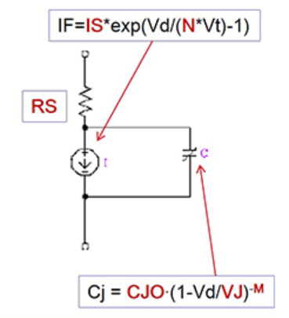

그러므로, 각 변수들에 대해 값에 대한 정의가 필요한데, 이는 아래처럼 파라미터, 라이브러리 형식으로 저장이 되어있습니다. 이 값들을 import해와서 특성곡선 그리는거에요.

​

파라미터 값을 수정하면, 아래처럼 특성 곡선을 바뀌어 나오겠지요.

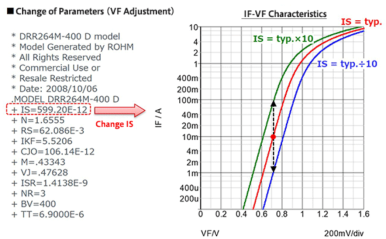

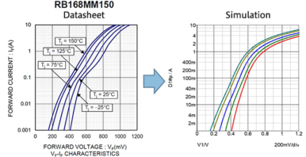

​

​

근데 다이오드는 식만 봐도 어지럽고, 딱 봐도 비선형회로잖아요? -> 이거 때문에 SPICE 신뢰성 + 안정성 문제가 발생합니다.

사용하는 다이오드의 비선형 특성 곡선이 비교적 단순하여 1차 함수로 바꿀 수 있으면 그렇게 하고,

그렇지 않은 경우에는.. 모델링 알고리즘을 바꿔보거나, 그래프의 axis를 단순하게 바꾸거나... 이런게 있겠습니다. 이런 것들이 쌓여서 SPICE Tool 간 성능 비교를 할 수 있는거죠.

​

​

이제 SPICE Model에서 Sub-circuit model을 알아보겠습니다.

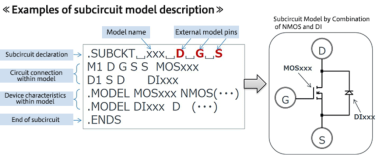

눈 좋으신 분들은 아시겠지만,

SPICE 모델 분류 가지친거 보면, 디바이스 모델에도 MOSFET이 있고, Sub-circuit 모델에도 MOSFET이 있습니다.

"MOSFET 디바이스 모델에 Parasitic RC 성분이나 온도 특성 등"을 추가한게 Sub-circuit 모델이라고 보시면 됩니다.

​

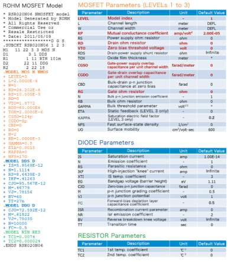

​

​

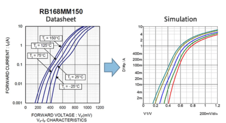

​

​

​

Thermal Model이란?

Thermal Model이란, 온도와 회로간의 특성화 모델입니다.

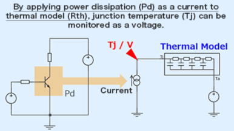

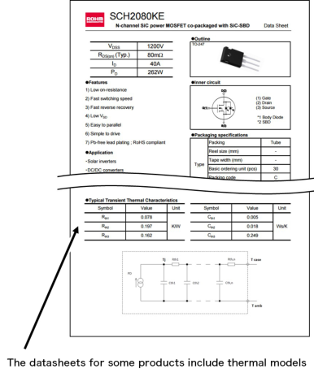

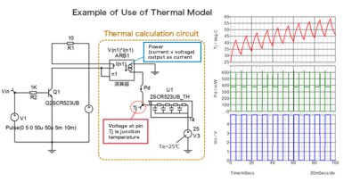

​

​

HSPICE에 대강 살펴봤습니다.

사실 제가 HSPICE에서 집중적으로 보고 있는부분은 SI 부분입니다.. 근데 SPICE Simulation 하시는 대부분이 SI는 안 보시니, SI 부분만 따로 포스팅을 올리겠습니다~~

 해시태그 : 