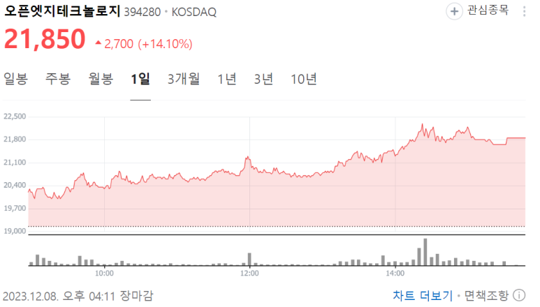
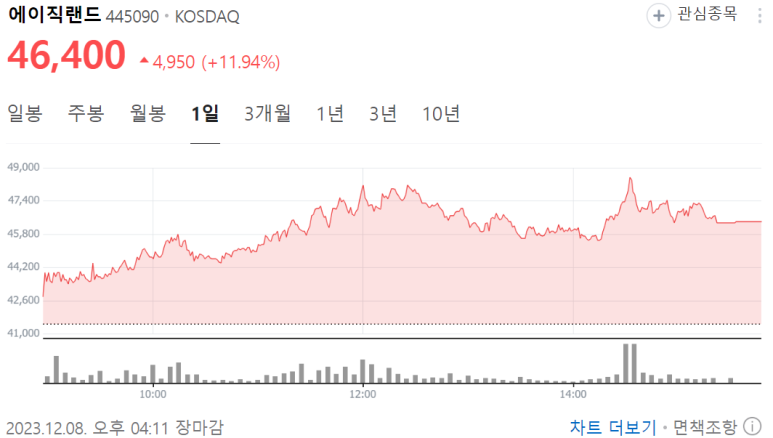
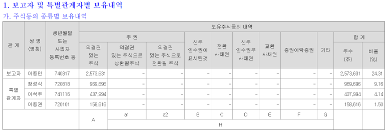
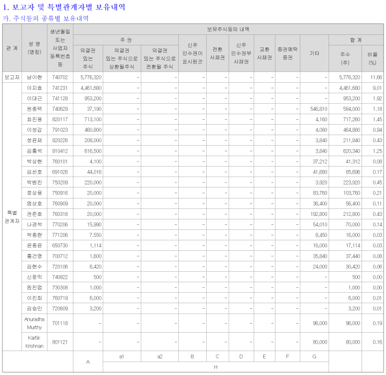
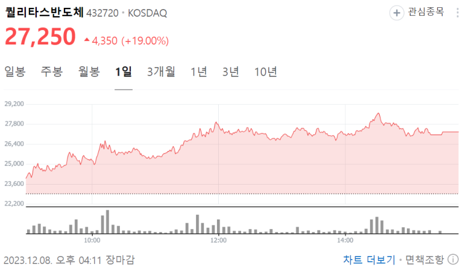

## 한국에서 반도체 스타트업을 상장하면 얼마를 벌 수 있을까? 가온칩스, 오픈엣지테크놀로지, 에이직랜드, 파두, 퀄리타스반도체 주주

2022~2023에 상장한 반도체 설계 스타트업의 "금융감독원 DART 전자공시"를 살펴보겠습니다.

아예 몰랐던 순수한 엔지니어라면... 근로소득과 종합소득이 다인줄 알았던 엔지니어라면...

이걸 보면, 정신이 좀 드실 수도?

​

대표자 및 특별관계자의 보유내역입니다.

Google이나 Linkedin에서 성명+회사명 이렇게만 검색해도 그 사람이 어떤 회사의 어떤 팀, 어떤 직책인지 대강 나옵니다.

​

주가 * 보유 주 = 평가금 입니다.

대부분 ?만원대 주가이고, 대표님들은 ?,000,000주 정도 갖고 있습니다..

1만원 * 1,000,000주 = 100억원이니까, 대강 이거 보고 계산하시면 됩니다.

​

가온칩스

2022.05 코스닥 상장

삼성전자 디자인 솔루션 파트너

​

​

​

오픈엣지테크놀로지

​

에이직랜드

​

​

​

파두

​

​

퀄리타스반도체

"아.. 이래서 그 똑똑하신 분이 그 좋은 곳 다니시다가 이 회사 가셨구나~" 싶지 않나요?

시간 날 때, 최근 코스닥에 상장된 반도체 스타트업들이 어떤 방식으로 상장을 했고~~ 매출 순익 구조가 어떤지도 작성을 해보겠습니다.

​

궁금한 것 있으시면 댓글 남겨주세요.

 해시태그 : 