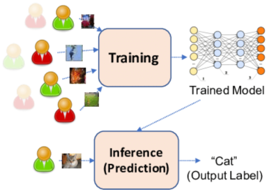
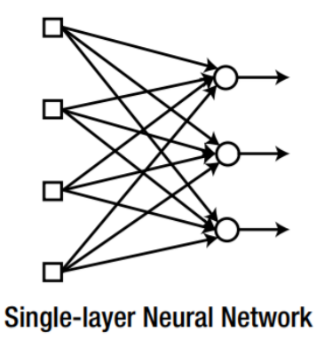
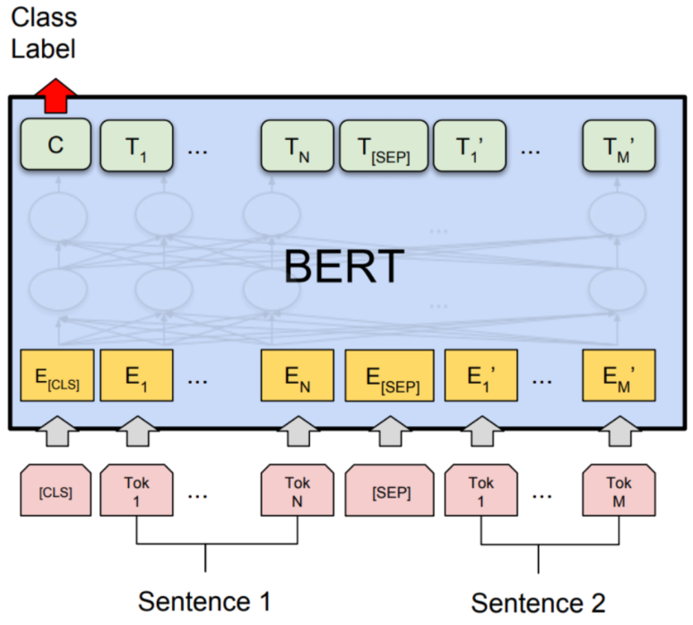
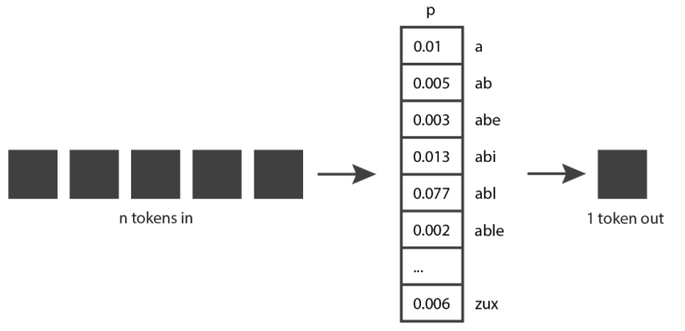

## 전세계 GPT 현황 및 비교, NVIDIA GPU부터 인공지능반도체 NPU ASIC까지.

GPT부터 AI, GPU와 ASIC 반도체까지 살펴보려고 합니다. 어렵습니다. 근데 남들이 어려워하는걸 알아야 돈 벌잖아요?

시작합니다.

​

좋은 소프트웨어를 동작시키려면, 당연히 좋은 반도체가 있어야 할 수 있습니다.

수십년동안 트랜지스터 집적도가 2년마다 두 배씩 증가했습니다. (반도체의 발전)

-> 이걸 "Moore's law, 무어의 법칙"이라고 부릅니다.

트랜지스터는 문을 여닫아서 신호가 나가고 못 나가게 할 수 있는 스위칭 소자입니다. (증폭 기능도 있는데, 여기선 다루지 않음.)

​

반도체 설계는 이 스위칭 성질을 이용해서, 간단한 덧셈기부터.. 복잡한 CPU까지 만드는거죠.

​

​

​

문을 작게 만들 수 있으니, 문을 여닫는 힘도 적게 들고 더 빨리 여닫을 수 있고, 집의 크기도 줄일 수 있게 되었죠.

-> 이걸 "Dennard scaling"이라고 부릅니다.

​

반도체 Chip의 개념에선 Power, Performance, Area라고해서 PPA라고 부릅니다.

근데 무어의법칙이 수십년 지속 되면서, 한계점에 다다릅니다.

​

문을 더이상 작게 만들기가 어렵습니다. 그래서 반도체의 발전이 더뎌지는가 싶은데요.

공정 난이도 + 양산 수율 문제 : 겨우 만들어도 대부분이 불량 -> 무어의 법칙 종말

어느정도 문 사이즈를 줄이니까, 더이상 PPA 효율이 좋아지지 않습니다. -> 데나드 스케일링 종말 

​

무어의 법칙이 끝났다, 반도체 공정 기술 개발의 한계에 오고 있다고 하는데, 왜 AI는 발전하고 반도체 회사들의 주가는 오를까요?

​

대기업들이 GPU로 하는거 엄청 많지만, GPT 현황만 정리했습니다. 이거보다 훨~씬 많은데, 진짜 대강 정리했습니다.

그리고 많은 회사들이 GPT 모델을 만들어서 소스를 공개하였고, 이 소스를 갖고 활용하는 회사들도 정말 많습니다. SKT에서 얼마전에 아이폰 통화녹음 서비스를 출시 할 수 있게 만든 "에이닷" 서비스에도 OpenAI의 GPT-3 기술이 있습니다.

일단 GPT를 이해하기 전에 AI에 정말 간단히 요약해드리겠습니다.

왼쪽아래 그림이 교과서 스타일. Phil Kim 서적에 있는거고, 오른쪽에 있는게 예시를 든건데요.

AI 학습 방식에는 크게 두가지로 나눌 수 있습니다. 지도학습(Supervised Learing)과 비지도학습(Unsupervised Learning).

현재 가장 핫한 기술은 Supervised Learning입니다. 주로 이 방법론은, Artificial Neural Network (인공신경망)의 Back propagation 방법을 이용합니다.

1) "입력과 출력" 데이터 셋을 엄청나게 많이 주고, 컴퓨터는 이 입력과 출력 사이 관계를 계산합니다.

주로 입력과 출력 사이 Layer가 2개 이상이 경우를 DeepLearning이라고 부릅니다.

2) 이런식으로 Learning rate를 높이며 Training 하다가, 설계 목표에 도달하면 Model이 되었다고 할 수 있습니다.

3) 이 Model은 이제 입력값을 넣으면, 그동안 트레이닝된 데이터를 통해 출력을 만들어줍니다. 이걸 추론(Inference) 한다고 합니다.

-> ChatGPT한테 메세지 보내고, 메세지 받는것도 추론이라고 볼 수 있죠.

​

다른건 다 잊더라도, Training, Model, Inference는 꼭 기억해주세요!

​

Foundation model

파운데이션 모델은 사전 학습된 AI 모델로, 특정 작업을 위해 추가 학습 없이 바로 사용할 수 있습니다.

GPT가 대표적인 파운데이션 모델로, 대규모 텍스트 데이터를 사용하여 사전 학습되었습니다. GPT라는 Model을 갖고 챗봇 서비스, 번역 등을 만들 수 있죠.

주요 모델만 살펴보면, 아래와 같습니다.

- OpenAI: GPT- series, DAL series, Codex

- Microsoft: Turing NLG, MEB

- Google: BERT, LaMDA, Switch

- Meta: OPT serires

- Alibaba: M series

- Baidu: ERNIE series

- Tencent: Hunyuan

- Huawei: PanGu

​

Training에서는 대부분 기업들이 NVIDIA의 GPU를 사용했습니다.

NPU를 설계부터 양산하려고 하면, 수백억원이 우습게 쓰이고, 칩 1개만 개발 하려고 해도 최소 2년이 걸리게 됩니다.

IT 기업들은 대부분 수백억원을 전용반도체에 쓸 수도 없거니와, 반도체 설계경험이 없고, 2년이나 기다릴 수 없습니다.

Google정도 사이즈가 되는 회사들은 수백 수천억 투자하여 진작에 TPU라는 자사 클라우드 및 Training system에 사용할 전용 반도체를 설계했지만,

대부분의 기업은 NVIDIA의 GPU를 수십억 수백억씩 주고 사용했습니다. 자사 클라우드 구축을 할 수 없는 경우엔, Amazon의 AWS나 MS, Google의 Cloud를 사용하구요. (국내에도 카카오, 네이버 클라우드가 있습니다.)

​

IT공룡들이 이걸 수백억원씩 내면서 왜 만들었냐?

-> 이 모델으로 일반인 고객들이게 직접 서비스를 제공하는 B2C 비즈니스와 이 모델을 갖고 기업들이 새로운 서비스를 만들 수 있는 B2B 비즈니스를 하려고 만든겁니다.

어떤식으로 금액 부과를 하냐? 토큰이라는 개념을 사용합니다. GPT를 엄청나게 많이 써보신 분들은 아실겁니다. 어느정도 많이 사용하면 오늘 사용량이 다 되어서 못 쓴다고 하거나, 속도가 엄청 느려진다는 것을요.

​

토큰(Token)이란?

GPT에서 토큰이란? 사람이 사용하는 자연어에서 우리가 사용하는 단어나 문장 부호와 같은 것을 생각하면 됩니다. GPT 모델에서는 이러한 단어나 문장 부호를 더 작은 단위로 쪼갠 것을 토큰이라고 부릅니다. 이 토큰 단위로 금액을 부과합니다.

​

​

Inference

지금까지는 각 대기업들이 AI Training에 집중해왔습니다. 아마 2025년 정도부터는 AI Inference가 본격적으로 시작 될 것으로 보입니다. 추론은 수십억 인구가 사용할 시스템이기 때문에, Training보다 훨씬 더 많은 컴퓨팅 시스템이 필요합니다.

​

현재 국내 반도체 스타트업들은 대부분 Inference 전용 반도체를 만들고 있습니다. Inference가 앞으로 훨씬 큰 돈이 될 것이고, 아직 최강자가 결정되지 않았으며, 고객이 많습니다. 통신3사, 네카라쿠배당토, 의료회사들 전

​

근데 인공지능 전용반도체, 특히 추론작업에 특화 NPU를 만들려면 뭘 고려해야할까요?

바로 Model입니다. 어떤 Model을 사용 할 수 있는 반도체를 만들지 딱 정하고 가야해요.

"나는 A Application에만 집중해서, 칩 가격도 싸게 만들고.. 전력과 성능도 최고로 높일거야. B, C는 지원 안 하더라도, NVIDIA GPU보단 더 전성비가 우수해야돼!" 이런 목표를 가져야 합니다.

-> 근데 소프트웨어 시장, AI Model 시장의 대세는 몇 주마다 몇 달마다 바뀌는데, 반도체 칩은 설계를 시작하면 공정까지 2년이 걸리니... 이걸 잘 예견해서 해야합니다. 근데 너무 범용성을 넓히면 NVDIA GPU 대비 장점이 부족해지구요.

​

​

아무튼,  무어의 법칙이 끝났다고 하지만, 여전히 반도체의 성능은 나날이 좋아지고 있습니다. 반도체 시장은 계속 성장하고 있습니다.

​

과거엔 작은 순차작업을 최대 속도로 작업하는게 관건이었는데, 요즘은 큰 병렬작업을 처리하는게 Chip의 관건이 되었습니다.

그래서 공정에서는 위로 쌓고, 패키징을 붙이고 이런 방법론이 뜨는거죠.

​

​

Examples

아직 ChatGPT에 회의감도 있으실거고, 이 Model이라는걸 채팅에서만 쓸거라고 생각하시는 분들도 계실겁니다.

처음엔 그러겠죠. 그런데, 앞으로 여러분의 스마트워치에서 받아온 정보를 토대로 AI가 여러분의 암 발병도 예측할 것이고, X-RAY 사진도 추론하고, 새로운 피자 메뉴에 대한 레시피도 만들고,

고객사에서 온 E-mail을 읽고 엑셀로 데이터를 정리해서, 물류팀 로봇에 포장 요청을 보내고, 포장된 제품의 예상시간을 고려하여 배송팀에 메일을 보내고.... 이런 자동화가 이뤄질 것입니다.

​

개념 자체가 어려운건 아닙니다. 대학교 전자과 졸업작품만 봐도 이런게 이미 나오고 있어요, 다만 아직은 가성비가 나오지 않고, 가끔 GPT가 실수수를 하고... 이러니까 아직 사람이 많은 부분을 맡고 있는거죠.

​

아래는 생성형 AI (Generated AI)가 지금 어떻게 쓰이고 있는지 보여드리겠습니다. 이건 앞으로 나올 기술은 아니고, 이미 service를 하고 있는 기술입니다.

​

설명 : Adobe Firefly is Adobe’s family of new creative generative AI models. It is initially focused on the generation of images and text effects, but looking forwa...

설명 : March 16, 2023, we introduced Microsoft 365 Copilot—your copilot for work. It combines large language models with your data in the Microsoft Graph and the Mi...

​

 해시태그 : 