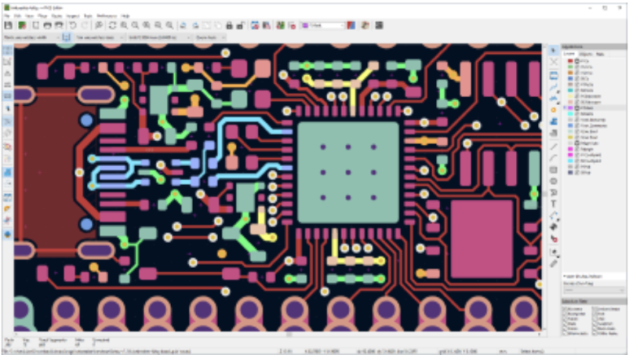
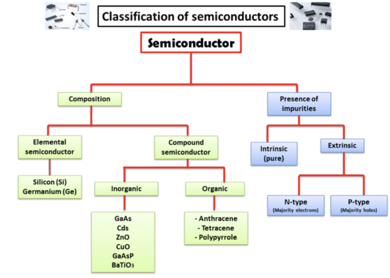
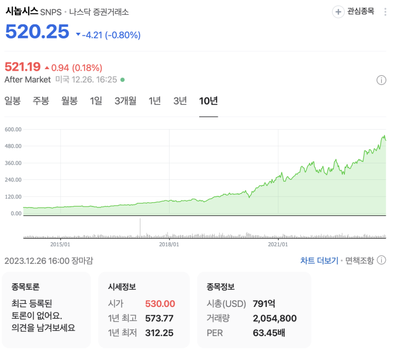

## Big3 EDA란? EDA 시장 분석: Synopsys, Cadence 주식을 중심으로.

EDA(Electronic Design Automation, 이하 EDA)란,

전자제품을 설계 및 검증할 때 사용되는 Tool을 통칭합니다. EDA 혹은 EDA Tool이라고 부릅니다.

예전엔 엔지니어들이 머릿속 아이디어를 손으로 공식을 쓰면서 회로도를 그렸지만,

현재는 EDA라는 tool을 통해 반복작업을 줄이고, 복잡한 계산도 단숨에 할 수 있도록 바뀌었고, 인간이 만든 회로의 기능을 유지하면서 성능, 전력, 칩 크기에 대한 최적화에 대한 다양한 AI 알고리즘이 EDA에 입력되는 추세입니다.

인류가 돌을 집어든 순간부터 도구와 인연이 시작되었습니다. 얼마나 좋은 도구를 쓰냐에 따라 구석기, 신석기, 청동기시대가 갈립니다. 돌을 들어야 큰 짐승을 잡고, 곡식을 빨리 캘 간석기가 있어야 농경사회가 시작되는거죠. 

EDA Tool도 마찬가지입니다. EDA를 쓰냐 안쓰냐, 처음부터 다 설계를 해야하냐 재사용이 가능한 IP가 있냐, 어떤 기능이 있는 EDA를 쓰냐에 따라 인류 문명의 생산성 척도가 달라집니다.

반도체 크기를 줄이고, 성능 개선을 시켜야 사람들이 손바닥 위에서 인터넷을 하고, 거기서 더 성능 개선을 시켜야 동영상을 볼 수 있는 정도가 되는거죠. Software를 사람들이 쓰려면, 반도체라는 기반 산업이 받쳐줘야 하는 상황입니다.

​

EDA 회사는 하드웨어 엔지니어들이 사용할 Tool을 만든다고 보시면 됩니다.

​

EDA Tool은 Digital Application으로 하냐.. Analog application으로 하냐..에 따라 달라지고,

그 중에서 반도체의 트랜지스터 레벨로 하냐.. 보드 레벨에서 하냐.. 이런 것들에 따라 달라지게 됩니다.

반도체 전자 레벨에서 설계 검증

반도체 트랜지스터 레벨 회로 설계 및 검증

반도체 IP Level 설계 및 검증

반도체 Chip Level 설계 및 검증

반도체 Board Level 설계 및 검증

통칭해서 이런거 하는 사람을 "하드웨어 엔지니어"라고 부르죠.

다시 강조하면,

과거 EDA Tool이 없을 때는 종이 위에서 사람이 설계도를 그리고, 수학적인 계산을 사람이 하나씩 했지만, CAD(Computer Aid Design) 기술의 발전으로 자동화가 되었다고 보시면 됩니다.

​

"시장에 필요한 아이디어를 Fab에 전달 할 마스크를 효율적으로 처리 하기 위해" EDA를 쓴다고 보시면 됩니다.

​

과거의 EDA는 단순히 사람의 작업들을 더 빨리 처리해주기 위해 계산+검증 자동화 정도였지만,

현재의 EDA는 다양한 알고리즘으로 인간이 처리하지 못한 최적화 작업을 대신 해줍니다.

​

EDA는 이렇게 변화하고 있습니다.

사용자가 더 사용하기 쉽도록 (과거에는 칩 설계를 해보려면 수십년의 전공 지식이 있어야 했지만, 지금은 몇 년 정도의 전공지식만으로도 한 분야를 담당 할 수 있음.)

더 다양한 분야에 적용 될 알고리즘 (특히 AI를 중심으로)

​

​

한 칩 내에 1조개 가까이 되어가는 트랜지스터가 있으니 계산해야 할 변수가 정말 많고,

맥가이버칼처럼 모든 경우에서 사용 할 수 있는 알고리즘이 존재하지 않습니다.

그래서 다양한 알고리즘을 갖고 있으면서 가벼워야 많은 설계를 EDA가 대응 할 수 있습니다.

-> 대부분의 시장은 미국이 주도하고 있습니다. Synopsys와 Cadence입니다. Digital 시장은 Synopsys 비중이 더 크고, 아날로그 시장은 Cadence가 더 큽니다.

​

Big3 EDA란?

전체 시장은 아래와 같습니다.

보통 EDA 3사라고 부르는데, Synopsys, Cadence, Siemens입니다.

EDA 업종을 타 회사들이 접근하기 어려운 이유가,

1) A 회사가 특출난 기술 하나를 만들면 EDA 3사가 인수합병하면서 계속 점유율을 높여오고 있습니다. 

2) EDA를 하려면 반도체공학, 전자공학, 컴퓨터공학, 수학에 대한 이해가 있어야하고,

3) EDA는 AutoCAD나 Photoshop이 아닙니다. 비교가 안 되게 훨씬 더 많은 알고리즘이 있고 크기도 훨씬 큽니다. 인풋, 아웃풋 파일이 수백기가~수 테라바이트 단위입니다. 맥가이버 칼 같은 알고리즘이 없고, 기존 EDA 3사가 특허로 내놓은 알고리즘을 회피해서 개발해야합니다.

4) 공개된 정보가 많지 않습니다.

5) 칩을 만드려면 수십억~수조원이 필요하므로, 설계회사들은 이미 수십년 동안 검증된 EDA를 사용하고 싶어합니다.

​

이런 이유로 EDA 시장을 진입하기가 쉽지 않습니다.

그러나 Google을 비롯해서 많은 회사들이 저가용, 오픈소스 EDA로 진출하고 있습니다. 특히 AI를 반영해서요.

​

Awesome AI for EDA라는 유명한 프로젝트입니다.

https://ai4eda.github.io

[Awesome AI for EDA](https://ai4eda.github.io) : High Level Synthesis 1. Correlated Multi-Objective Multi-Fidelity Optimization for HLS Directives Design [ paper ] Qi Sun, Tinghuan Chen, Siting Liu, Jianli Chen, Hao Yu, and Bei Yu TODAES 2022 2. Machine Learning Based Routing Congestion Prediction in FPGA High-Level Synthesis [ paper ] Jieru Zhao,...

​

 각 EDA Tool Vendor의 시장점유율을은 아래처럼 진행 될 것으로 보입니다만....

(최근 미중 무역분쟁 동안 NVIDIA 뿐만 아니라, EDA Tool도 타격을 받고 있긴합니다. 중국 본토에서도 EDA에 대한 개발을 계속 하고 있긴 하지만, 대부분의 매출이 나오는 분야에 대해서는 아직 큰 성과는 없습니다.)

​

현대의 반도체 공정 기술은 매우 미세화되고, 매우 빠른 속도, 매우 빽빽한 회로도, 매우 낮은 전압에서 동작하게 됩니다. 그 때문에 동작 조건이 매우 까다로워졌습니다.

최근 양산되는 칩들의 경우, 트랜지스터 개수가 칩당 수천억개를 돌파하고 있습니다. Big O(n)이 높다는 의미인데요. 그 때문에 "빠르고 정확하게 최적화 및 검증"을 할 수 있는 EDA Tool이 중요해지고 있습니다. 이제는 EDA Tool 을 사용하지 않고는 각종 전자 장치들과 제어 시스템들이 개발되기 어려운 상황입니다.

​

하나의 반도체 칩의 설계과정을 요약하면, "Specification - Design - Verification - Signoff" 입니다. 그리고 이 4단계는 수십단계의 세부 단계로 이루어져있습니다.(검증만 하더라도 기능검증, 타이밍검증, 파워검증, ...) 이 수십단계의 툴은 수십개의 EDA Tool이 각각 담당한다고 보시면 됩니다.

​

https://youtu.be/iDhpKq09XIo?si=1YnSGgvdpydmkhHz

설명 : 0:00 What is Electronic Design Automation (EDA)?0:12 The History of EDA0:21 The Importance of EDA1:03 What does EDA enable?1:23 EDA and SynopsysLearn more ab...

​

EDA 업계는 가장 선진 공정에서 최적의 설계를 하는 것을 목표로하고 있습니다. 이전 공정은 이미 반영되어있구요.

반도체 공정 회사와 EDA 회사 간 협업을 하며 계속 매년 새로운 EDA Tool을 릴리즈하고, 반도체 설계회사들은 검증된 버전으로 공정에 맞게 칩 설계를 하는거죠.

​

EDA tool을 사용하려면, B2B로 계약을 해야합니다. 반도체 칩 하나를 설계부터 Signoff까지 하려면, EDA 3사 외의 저렴한 EDA Tool을 쓰려고 해도 수 억원이라고 보시면 됩니다. 1인 사용자 기준이고, 여러명이 쓴다, EDA 3사의 Golden Standard tool을 쓴다고 하면 그보다 훨씬 높은 금액이 나옵니다. 자세한건, 삼성전자나 tsmc가 발표하는 재무제표에서 EDA Vendor에 사용하시는 비용을 보시면 되는데, 수백억원~수천억원 수준입니다.

(참고로 EDA Vendor는 EDA 뿐만 아니라, 설계 IP도 판매합니다.)

참고로 OpenROAD 등 Opensource EDA도 개발되고 있습니다.

->

중국에서는 고성능, 저전력 같은 프리미엄 제품 보다는.. 보급형으로 설계와 검증 오차가 커도 공정이 가능한 제품에 사용 할 EDA의 경우 자급자족이 되고 있습니다.

​

​

​

반도체가 우리가 삶에서 정말 다양하게 쓰이다보니,

공정도 종류가 다양하고 설계도 종류가 다양합니다.

FPGA에서만 쓰이는 EDA, ASIC에서만 쓰이는 EDA, 모든 곳에서 쓰이는 EDA 이렇게 종류가 나눠집니다. 시장 매출 점유율의 대부분은 ASIC입니다. FPGA는 아래 2개 회사에서도 하고 있습니다.

​

회로 설계의 분류는 가장먼저 "디지털향? 아날로그향?"으로 나눠집니다.

Intel의 경우 (Quartus라는 FPGA향 EDA Vendor를 인수합병), AMD의 경우 (Vivado product를 보유한 Xilinx EDA Vendor를 인수합병)하였습니다.

​

EDA Market share가 가장 높은 Synopsys를 기준으로 짧게 설명 하려고합니다.

아래 설명한 EDA가 전부가 아닙니다. 특정 스텝에서 최적화를 추가하는 방법? 특정 스텝에서 양산을 위한 검증을 하는 방법? IP RTL Generation하는 방법? 이런 방법들을 추가하려면, EDA Tool을 추가해야합니다. 

제가 쓴 것들은, Chip 동작을 위한 EDA라고 보시면 됩니다. 조금이라도 더 최적화하고, 조금이라도 더 수율을 높이려면 훨씬 많은 EDA Tool이 필요합니다.

VCS: RTL & Gate level simulation, Analog Mixed Signal analysis

VERDI: RTL & GLS debug

Synplify premier: Logic synthesis (FPGA)

Design compiler: Logic synthesis (ASIC)

Formality: Formal verification

Primetime: Static "Timing, Power, Noise, SI" Analysis

IC Compiler: Auto Place and Route(이하 P&R)

StarRC: RC Parasitic extraction

IC Validator: Physical Verification (DRC, LVS)

Fusion Compiler: Logic synthesis, Auto P&R

Laker: Physical Layout design

HSPICE: SPICE Tool

Custom Waveview: Analog Wave Verification

PrimeLib: Library cell characterization

TCAD: Process & Device simultor

Virtualizer: SoC SW Development tool

Saver: Multi domain multi signal simulator

Zebu: Emulator

​

최근 추세:

AI를 이용한 설계 검증

https://news.synopsys.com/2021-11-29-Synopsys-Expands-Use-of-AI-to-Optimize-Samsungs-Latest-Mobile-Designs

[Synopsys Expands Use of AI to Optimize Samsung's Latest Mobile Designs](https://news.synopsys.com/2021-11-29-Synopsys-Expands-Use-of-AI-to-Optimize-Samsungs-Latest-Mobile-Designs) : Highlights of this announcement: Synopsys' groundbreaking AI-based system (DSO.ai) autonomously achieved highest frequency and lowest power consumption for Samsung's advanced mobile designs DSO.ai...

2. Synopsys에서 각 팀이 AtoZ로 EDA Tool을 설계 개발하는 경우도 있고, 아예 Tool vendor를 인수하는 경우도 있습니다.

3. 주로 여러개의 EDA Tool이 하나의 Tool로 합쳐집니다. (예를들어 Design Compiler + IC Compiler = Fusion Compiler 이런식으로....)

4. IP와 결합된 설계 검증

​

​

​

요약하면,

1. EDA는 반도체 개발을 위한 도구이다. B2B 서비스이고, 구독 라이센스 비용을 청구하고 받음.

2. EDA의 진입장벽은 매우 높음.

3. 공정 발전, 새로운 알고리즘 업데이트로 인해 계속 새로운 버전이 출시 되고

4. 현대의 반도체 설계자들은 EDA 없이 설계, 검증 할 수 없다.

5. 점점 더 반도체가 복잡해지고, 각각 application specific 반도체가 나오면서 Foundry와 함께 EDA 시장도 성장하고 있다.

 해시태그 : 