## 첫 덴마크 여행: 크리스티아니아, 뉘하운, 휘게, 물가, 크리스마스 마켓

덴마크 다녀왔습니다. 어땠냐구요?

앞으로 매년 크리스마스는 덴마크에서 보내려고 합니다.

​

여러분도 얼른 여유 만들어서 덴마크 가세요.

1) 자원도 없고, 빈부격차도 아주 작은 덴마크가 국민 평균 행복도 1~2위를 유지하는지 알 수 있습니다.

정말 스마트하고, 여유롭고, 예쁘고, 엄청나게 친절해요. (근데 행정처리가 한국처럼 시스템화가 잘 되어있진 않음)

2) 덴마크 사람들이 지금 대한민국에 대한 우호도가 엄청 높아요. 그리고 덴마크 사람들이 완전 외향적이라 이것저것 많이 챙겨줍니다.

3) 나이 먹고 가기는 체력적으로 힘들어요

​

참고로 덴마크는 독일 위에 위치한 북유럽 국가입니다. 대표 관광지는 "코펜하겐(쾨벤하운)"이라는 항구 도시입니다.

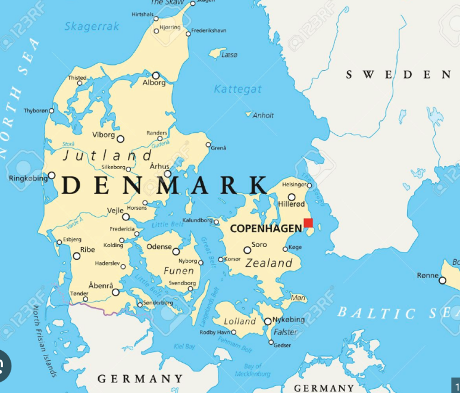

​

제 성격을 아시는 분들은 알겠지만, 덴마크 여행도 철저하게 계획 세워서 갔습니다.

이것도 엑셀로 만들긴했는데, 필요한 사람 있으려나? 카타르 여행에서 사용한 양식 그대로 썼습니다.

​

하루에 주요 도시+대학교에서만 2~30km씩 걸어서 걷는 것만 5일동안 150km 였고, 방문 도시는 "코펜하겐, 오르후스, 오덴세, 코이에" 4개 다녀왔어요. 00시에 잠들고, 05시에 일어나서 계속 움직였습니당.

https://blog.naver.com/gc_na/223297945531

[카타르 여행 일정 추천: 공대, ESTJ, 엔지니어 여행 스타일](https://blog.naver.com/gc_na/223297945531) : 제가 카타르 여행 간다고 하니까, "카타르라는 나라에 가는 것도 신기하고," "제가 뭐할지&...

​

덴마크에서 느낀 몇가지가 있습니다. 일단 차이점 먼저 보시죠.

​

​

코펜하겐 공항 입국 :

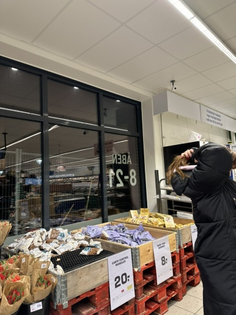

1) 식료품 물가(특히 과일)는 우리나라보다 저렴하다: 덴마크는 농업, 낙농업이 발전해있고.. 모종도 자국 모종을 사용하기 때문에 식료품 가격이 저렴. 근데 플라스틱이 있는 제품의 경우 환경비용이 붙습니다.

2) 대중교통이 매우 편리하지만, 가격이 너무 비싸다: "보행자의 도시"로 불리는 코펜하겐 답게, 대중교통이 매우 잘 되어있다. 버스도 지하철도 한국보다 훨씬 쾌적하고 편리하다. 근데 가격이 미쳤다. 몇 정거장만 가려해도 5000원(24DKK), 1시간 이상 간다면 우습게 1~1.5만원 정도 나온다.

사과 한 개에 450원 정도. 한국거보다 작고 달다​

덴마크 국민이라면 교통비는 연말정산에서 공제를 꽤 받을 수 있긴한데,,, 그래도 비싸다.

하지만 시설이 정말 쾌적해서 또 이용하고 싶네요. 그냥 지하철 타는 것만으로도 힐링입니다.

의자도 되게 편안하고, 늘 앉을 자리 있고, 조용하고,,, 가라앉는 그 분위기가 좋아요

​

​

아무튼 카스트럽이라고 불리는 코펜하겐 공항을 떠나 마트에서 장을 봤습니다.

덴마크 마켓의 점유율은 아래와 같습니다. 근데 SAILING Group, COOP은 여러 종류의 소매 업체를 갖고 있습니다.

덴마크에서 가장 쉽게 볼 수 있는 가게는 REMA1000입니다. 가격은 비슷비슷해보여요. 편의점은 SEVENELEVEN만 있습니다.

마트 물가 자체는 우리나라보다 저렴합니다. (고기, 채소, 과일, 빵 이런건 우리나라보다 싼데.. 신라면 이런건 3~4천원)

​

아무튼 REMA1000에서 만원어치 장 봐와서 대강 밥 해먹고~~

(근데 덴마크 쌀은 찰기 없는 쌀이다… 이거로 김밥했다가 한번 망함. 주먹밥도 안되더라 이건.)

​

근데 덴마크는 빵이 진짜 맛있습니다. 저는 밥을 좋아하는 사람인데도 매일 빵만 먹었습니당.

세븐일레븐 빵조차도 되게 맛있습니다.

(덴마크 크로네 환율이 1DKK=200원 정도라.. 500미리 콜라 하나 마시면 5000원 정도 나오면 된다. 카페에서 마시면 만원 넘는다.)

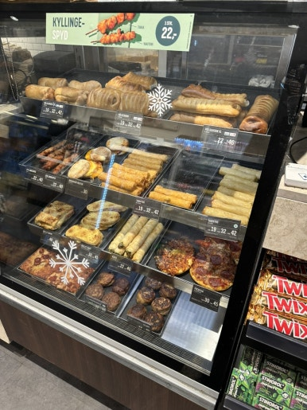

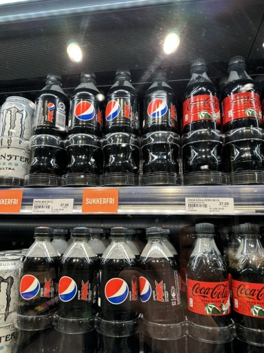

덴마트 오면 아래 3가지 카페를 많이 보실거고, 스타벅스가 생각보다 인기 없다는 것을 아실겁니다.

​

- LAGKAGEHUSET(락케후셋)은 베이커리 중심입니다. 여기서 베이커리 드세요.

- COPENHAGEN COFFEE LAB은 이름처럼 커피 중심이구,

- ESPRESSO HOUSE는 북유럽에 많이 있는 커피 체인입니다. 맛은 쏘쏘

북유럽 커피가 바이킹들의 커피 답게 꽤 진한편이고, 덴마크는 낙농업 국가답게 우유 들어간 음료들이 매우 맛있습니다. 그리고 대부분 커피는 아이스 메뉴가 없습니다.

제 원픽은 "페스츄리&카페라떼"입니다.

​

그러나 대부분의 덴마크 사람들은 카페 자주 안 가요~~ 너무 비싸거든요. 커피 한잔에 빵 한조각 먹으면 1.5~2만원 나옵니다.

대부분 모든 집에, 심지어 원룸에도 커다란 오븐이 있습니다. 덴마크 사람들은 "처음부터 끝까지" 홈쿠킹하는걸 좋아하고, 음식 나눠주는 문화가 잘 되어있습니다. 빵, 과자, 아이스크림 이런것도 다 처음부터 끝까지 만들어요.

​

우리가 할머니 집 다녀오면, 김치도 받고 전도 받고 그러잖아요? 여기는 쿠키 받고, 초콜릿 받고, 빵 받고 그래요 ㅋㅋ

우리가 먹는 덴마크 쿠키랑 진짜 똑같은걸 덴마크에선 직접 만들어 먹습니다. 조선호텔 김치, 종갓집 김치도 맛있지만 엄마가 만든 김치가 최고잖아요? 여기도 그런것 같아요.

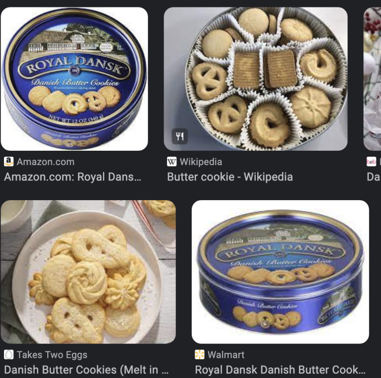

코펜하겐 대표 관광지는 "뉘하운"입니다. 여긴 뭐 사진이랑 다른게 없어서 안 신기했지만, 멋있긴합니다.

​

코펜하겐이 수도이다보니 부동산이 비쌉니다. 그러나 높은 건물이 없는데요. 정부에서 허가를 안 해준다고 합니다. 그리고 이 집 외관을 유지하는 조건으로 정부에서 보조금 지원을 받는다고 해요.

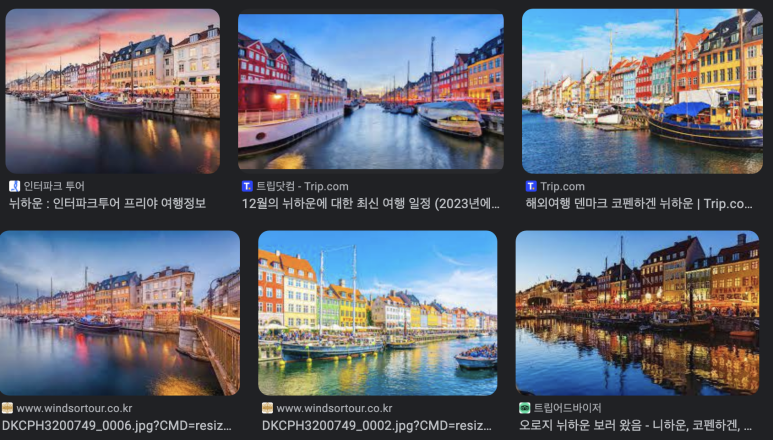

​

"뉘하운"이 참 로맨틱합니다.

0) 가는 길마다 쓰레기통, 재활용 통이 있습니다. 진짜 이렇게 많은 곳은 처음 봤습니다. 싱가폴이 범칙금 때문에 깨끗하다면, 덴마크는 세금 때문에 깨끗한 것 같습니다.

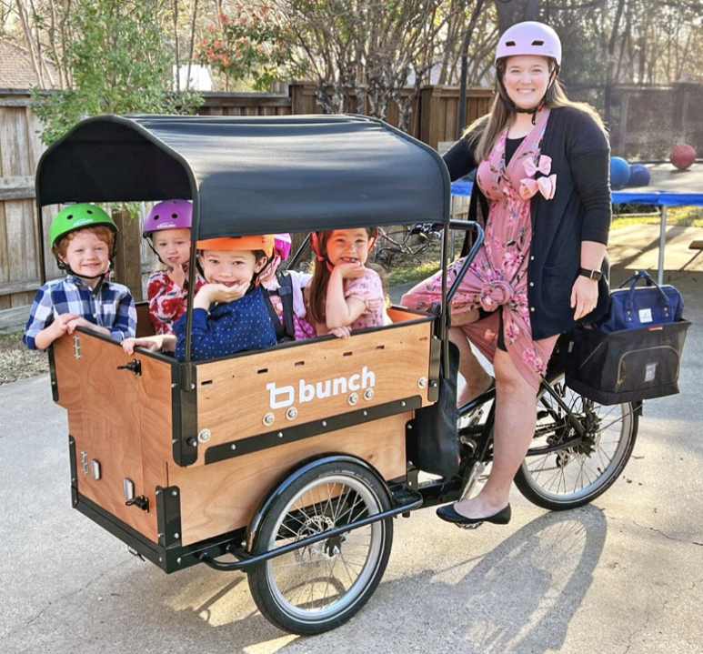

1) 코펜하겐이라는 지역 전체에 언덕이 없고, 산은 완전히 없습니다. 완전 탁 트여있어요.

2) 자전거를 타고 있는 사람이 차를 탄 사람보다 많습니다. 자동차 도로보다 자전거 도로가 잘 되어있습니다. 자동차 주차장은 없는데, 자전거 주차장은 모든 곳에 있습니다. 대부분 전기 자전거입니다.

도심 거주자들은 자가 자전거로 출퇴근하고, 외곽 거주자들이 차를 타고 들어오거나 대중교통 타고 들어와서 공유 자전거를 탑니다.

3) 흡연자가 매우 많습니다. 세금이 비싸다보니, 카페에 가면 직접 담배를 말고 있는 사람들이 있습니다.

제목 : 덴마크 여행중 (1), 설명 : None

해시태그 : 

Hygge

북유럽국가와 북유럽이 아닌 국가들이 "Hygge"문화 차이가 있는데요. 

북유럽은 해 뜨는 시간이 짧습니다. 11시쯤 해가 떠서 4시쯤이면 해가 지는데, 이 시간 조차도 어둡습니다.

오후 3시에 찍은 사진인데, 이미 어둑어둑하죠.

​

많은 시간을 가족, 애인, 절친과 실내에서 보냅니다.

소세지, 치즈, 콜라, 와인 같은 것들을  사와서 요즘 자기가 어떤 고민이 있는지? 어떤걸 축하할지? 소박한 식사 하면서 하루 종일 얘기하는거죠.

​

이 시간동안 각자 요즘 얘기하고싶은 자랑, 고민 얘기하면서 미래 설계를 합니다. 그렇기 때문에 서로 진심으로 돕습니다!

(전부 100% 홈메이드로 만들어먹음.)

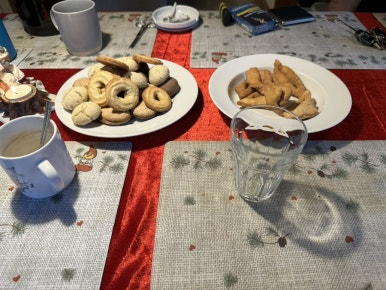

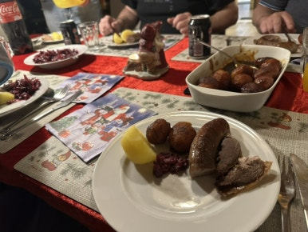

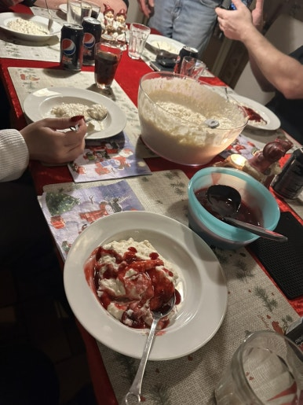

아무튼 크리스마스 이브에는 Hygge 했습니다.

온가족 손잡고 크리스마스 트리 빙글빙글 돌면서 크리스마스 노래도 불렀는데 영상을 안 찍었어요...

​

마침 성당 앞에서 비슷한걸 하길래 사진 찍었습니다.

제목 : 덴마크 여행중 (2), 설명 : None

해시태그 : 

아, 그리고 북유럽은 현재 "마약, 난민"문제가 꽤 큰 편이에요... 지하철 낙서를 보든 상가 벽에 붙은 스티커를 보면 팔레스타인, 마약, 난민 관련 이슈가 많습니다.

​

그중 가장 대표적인 크리스티아니아를 갔습니다.

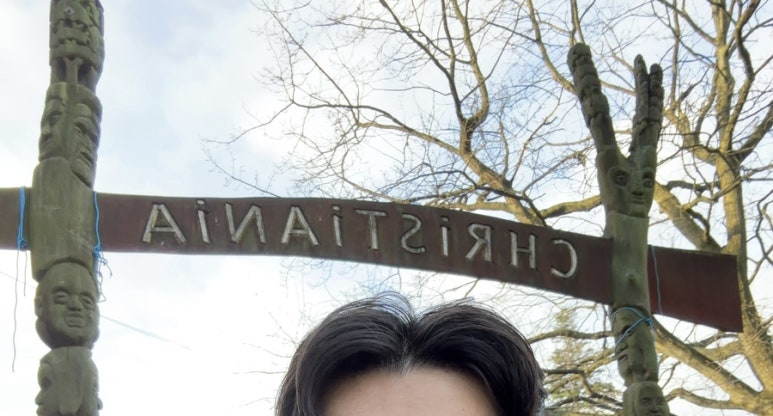

원래는 군사기지였던 지역인데, 정부, 군이 철수를 하며 빈 땅이 되었을 때 히피들이 이곳에 들어와 판자촌을 지었고, 현재까지 온겁니다. 크리스티아니아는

1) 덴마크에 속해있긴하지만, 자기들만의 법을 사용합니다.

2) 마약은 불법이지만, 마약 기준에 마리화나는 포함되어있지 않아 가게에서 손쉽게 마약을 구할 수 있습니다.

3) 이곳에는 세금이 없어 타지역 대비 2~50%싼 가격에 음식을 먹을 수 있기도 합니다.

4) 입구부터는 자동차, 사진 촬영은 엄격히 통제됩니다.

​

이 곳 사람들 정말 친절합니다. 많은 사람들이 마리화나를 피우지만 멀쩡하구요. 서울에 달동네와 비슷한 분위기인데, 경찰이 주둔하지 않다보니 조심해야합니다.

​

아무튼~~

크리스마스 당일에는 선물 나눠주고 맛있는거 만들어 먹고~~~ 크리스마켓 갔습니다.

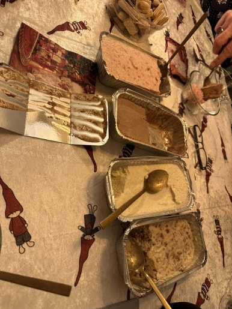

선물은 사진에 보이는것 뿐만 아니라, 다락방에 더 있음.ㅋㅋㅋ

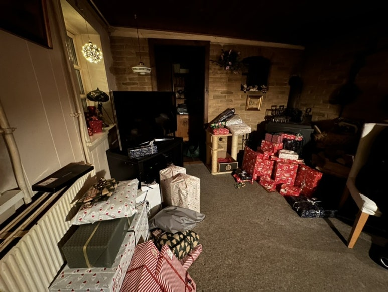

다음엔 휘게 할 때 제가 한국 음식을 해주려구요ㅎㅎ

집에서 간단히 만들어본 떡볶이, 김밥+불고기랑 잡채 배워가야겠어요.

그리고 어지간한 한국과자들은 여기 팔고 있어서 안 사가도 되는데, 맛이랑 질감이 좀 다르다는건 고려하셔야 됨.

​

그리고 여기 사람들이 정말 작은 선물에도 큰 감동을 받는걸 봤습니다…

캐릭터 양말만 선물해줘도 그 마음에 엄청 고마워하더라구요. 리액션 보는 재미가 있슴다. 가방 무거워지니까 작고 가벼운 선물 ㄱㄱ

​

Tivoli

Tivoli는 세계에서 가장 오래된 놀이동산이에요.

여기 밤에 정말 예쁩니다. 가격도 2.5만원 정도였던 것 같아요.

덴마크 사람들이 여기 홍보 할 때 “세계에서 가장 오래된, 아직 한명도 안 죽은 놀이공원”이라고 소개하더라구요.

놀이기구들이 엄청 삐그덕 거리고, 체감속도가 빨라요

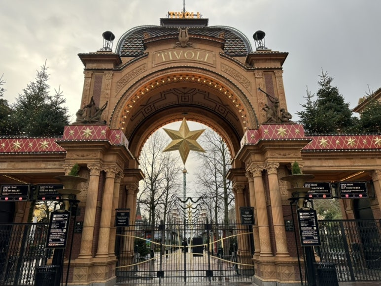

길거리에 한국 스타일로 꾸며놓은 곳이 많아요!

저는 태극기 달린 가방을 매고 갔는데, 사람들이 다 "안녕하세요~~~ Welcome to Denmark!" 해줌 ㅋㅋ

​

근데 아래 사진처럼, 한글이 위아래가 뒤집혀있는 곳이 종종 있음. 알려주고싶다.

뉘하운 운하가 얼면 애기고 노인이고 다들 스케이트 탑니다.

제가 갔을 때는 샤넬에서 스케이트 무료로 빌려주던데, 계속 그런건지는 모르겠네요.

​

그리고 덴마크는 군주제입니다. 지금도 여왕님이 계십니당. 그래서 왕립 건물이 굉장히 많습니다.

King's garden, King's library 등 다 무료개방 되어있으니 꼭 방문해보시길 바랍니다.

아시아권 국가의 궁, 성이 워낙 크다보니.. 그것에 비해 크기는 작지만, 짧은 거리동안 볼거리 많고 사람이 북적이지 않습니다.

중국이나 우리나라는 궁전들이 완전히 관광지화 되어있지만, 덴마크에서는 여전히 실무를 보기 위해 사용되고 있습니당. 

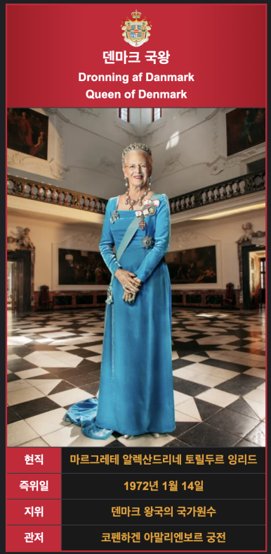

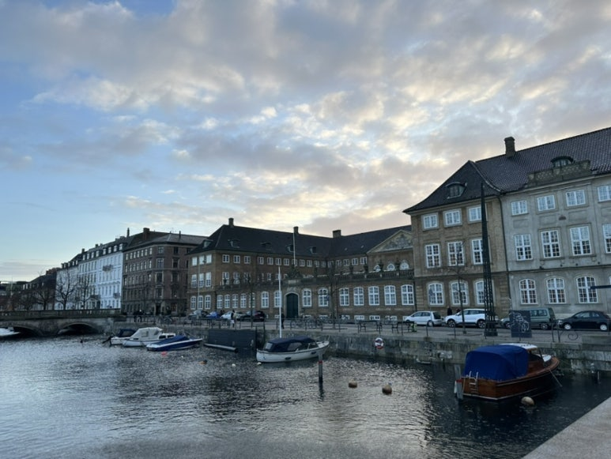

아 그리고 덴마크가 노르웨이처럼 연어, 고등어, 참치 맛있는게 많은데… 통조림의 경우 오프너가 없는 경우가 많으니 주의하세여.

이거 까려고 5분동안 낑낑거림.ㅋㅋㅋ

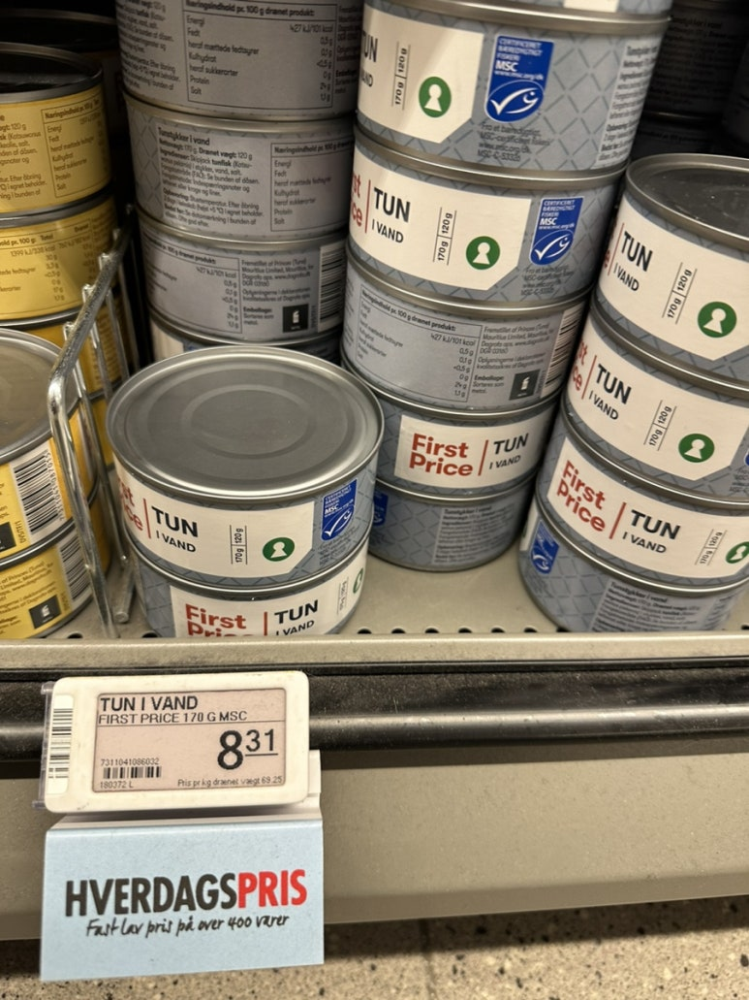

여기는 그냥 주택가인데 예뻐서 찍어봤어요.

제목 : 첫 덴마크 여행: 크리스티아니아, 뉘하운, 휘게, 물가, 크리스마스 마켓, 설명 : None

해시태그 : 

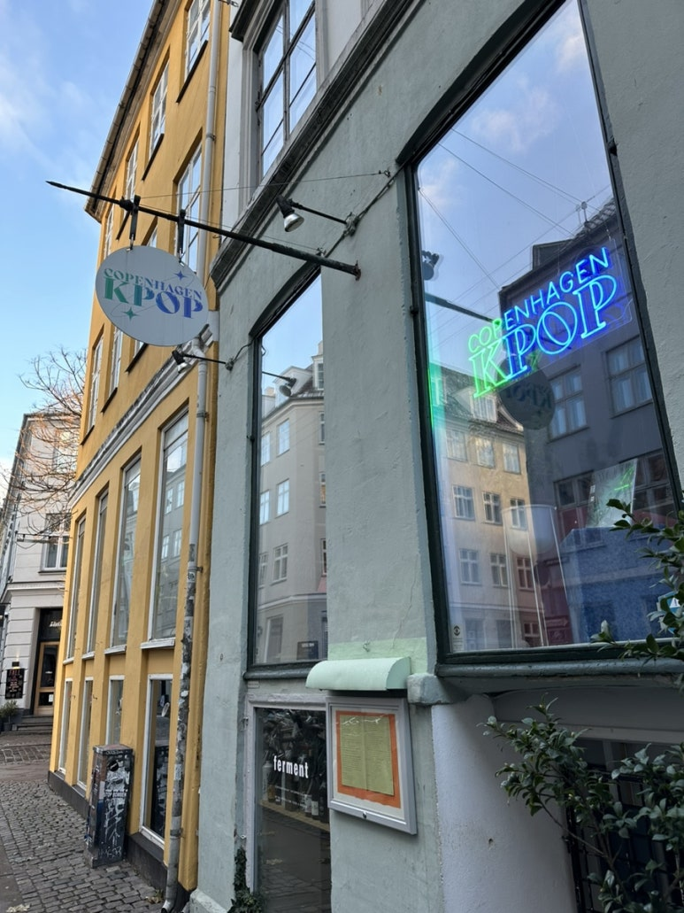

사장님이 정말 친절했던 샌드위치 가게.

사장님이 덴마크 가게에서 음식 주문하는 방법, 덴마크에서 꼭 먹어야하는 것, 크리스마스 인사 방법 알려줌!

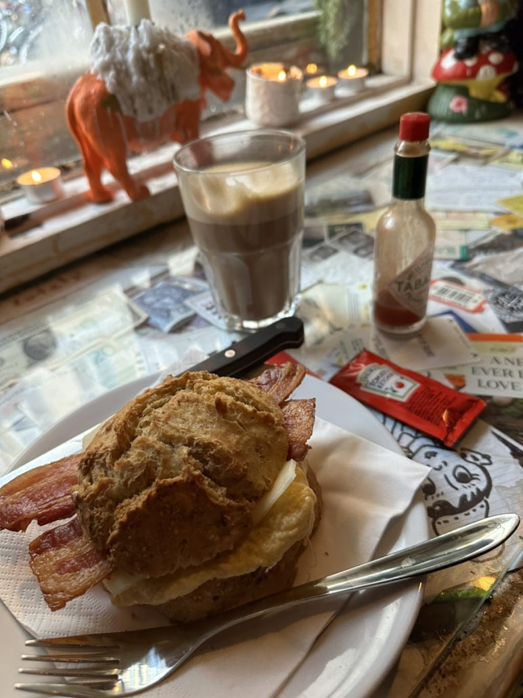

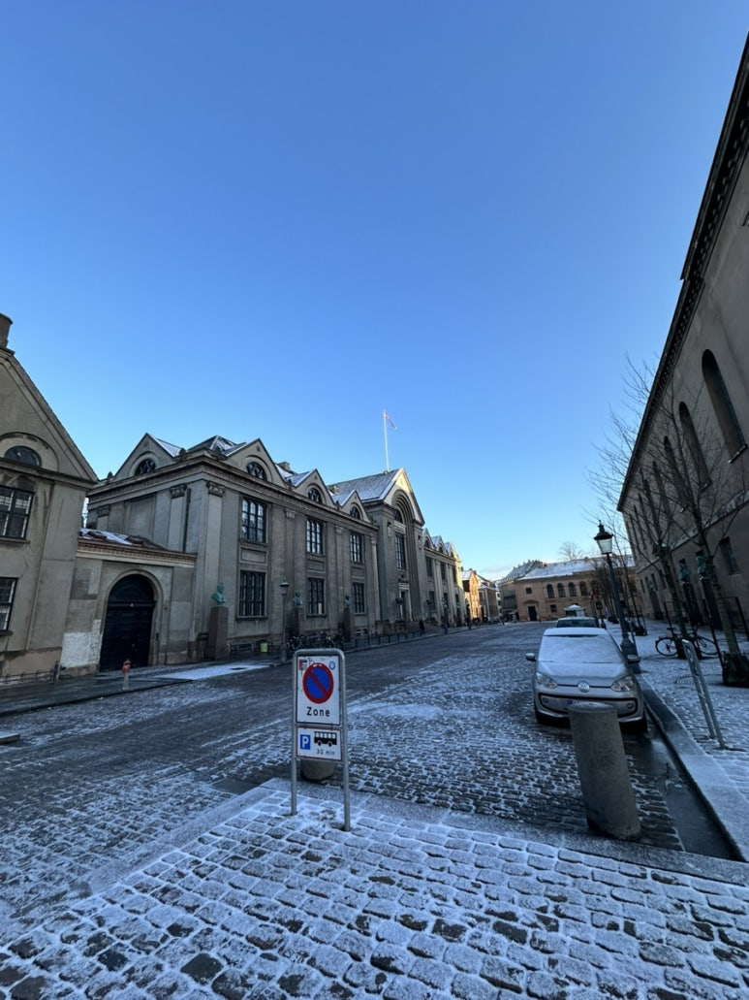

코펜하겐 대학교에 왔어요. 캠퍼스 겁나 작은데, 닐스 보어도 여기 출신이고… 노벨상 수상자들+유명한 과학자 동문이 많습니다.

근데 학교 건물이 한 캠퍼스에 모여있지 않고, 코펜하겐 전역에 흩어져있습니다.

​

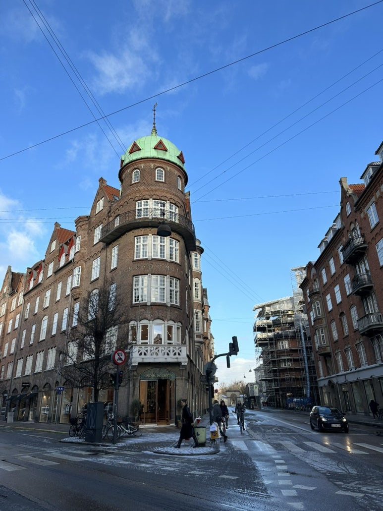

여기는 그냥 흔한 코펜하겐 골목입니다.​

여기가 킹스가든!아, 그리고 우리나라에서 김밥처럼 먹는 간단한 식사는 "Fransk hotdog"입니다.

빵 안에 소스 발라넣고 소세지 꽂아서 먹는 초패스트푸드입니다.

근데 빵이랑 소세지가 보통이 아닌 친구들이라 맛있네요.

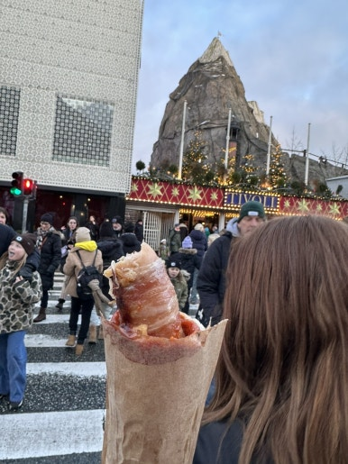

유럽에 오시면 꼭 Fransk를 드셔보세요!

유럽에 오시면 꼭 Fransk를 드셔보세요!

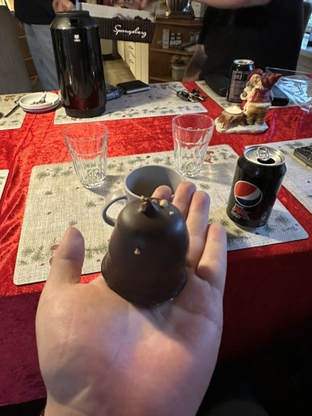

이건 크리스마스에 먹는 크림이 담긴 초콜릿인데 이거 먹을때 조심하세요.

덴마크인들 다들 장난꾸러기라, 이거 먹을때 툭 쳐서 코에 묻게함 ㅋㅋㅋ ㅜㅜ

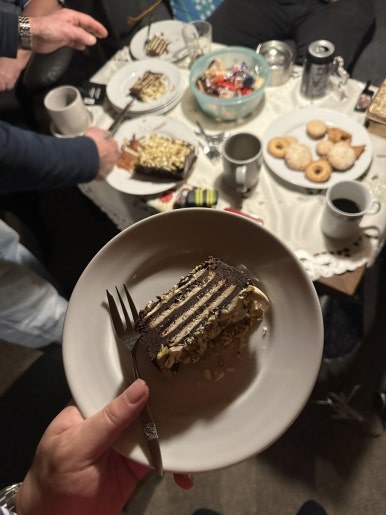

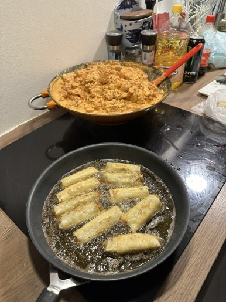

덴마크 여행 끄읏. 내년에 보자 마크야

 해시태그 : 