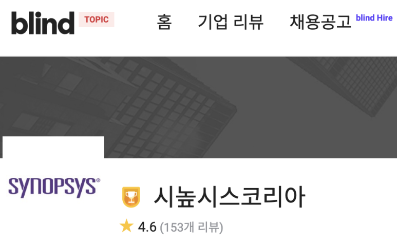

## 반도체 회로 설계 직군으로 국내에서 취직 할 수 있는 대기업: 전자공학과 컴퓨터공학과 회로설계 취업 대기업 취업

반도체 회로 설계는 첨단 기술 분야로서 높은 전문성과 역량을 요구하는 직군입니다.

한국에는 세계적인 반도체 회사들이 많아, 해당 분야에 대한 높은 수요가 존재합니다.

우리나라에서 반도체 회로 설계 직군으로 취업할 수 있는 대기업들을 소개하고, 각 회사의 특징을 간단히 살펴보려고 합니다.

​

1. Synopsys

전세계 전자 회로 설계 자동화 분야 시총 1위, 점유율 1위, IP 점유율 2위.

그리고 채용 사이트가 매우 편리하다. ESPP라고 불리는 복지가 매우 좋다.

https://careers.synopsys.com/search-jobs/South%20Korea/44408/2/1835841/36x5/127x75/50/2

[Search our Job Opportunities at Synopsys](https://careers.synopsys.com/search-jobs/South%20Korea/44408/2/1835841/36x5/127x75/50/2) : Search for available job openings at Synopsys

퀄컴과 시높시스는 블라인드 트로피 (블라인드 직업만족도 조사 TOP10)

​

2. Samsung

대한민국 1위  시가총액을 가진 삼성전자 답게, 가장 많은 인원을 채용.

LSI, Foundry, Memory 사업부 모두 회로 설계 직군 채용하고, 몇 년전에 인수된 Harman과 삼성디스플레이도 있음.

본인 직업 설명 할 때 "삼성에서 설계 연구원으로 일해요" 이거 하나로 끝남. 캬;;;

[SAMSUNG CAREERS](https://www.samsungcareers.com/hr/) : 채용공고 삭제 관계사 선택 인재 유형 최신순 마감순

3. SK Hynix

올해 가장 잘 나가는 반도체 대기업인듯. 인기도 많고.

복지 자체는 여기 나열한 회사들 중에 가장 좋은듯. HBM 성장세도 너무 좋고.

https://recruit.skhynix.com/servlet/reap_rcrtSearchForm.view

[SK하이닉스 채용](https://recruit.skhynix.com/servlet/reap_rcrtSearchForm.view) : 진행중인 공고 SK하이닉스 채용에 지원하세요 홈 지원하기 회사소개 직무소개 채용소식 채용소식 채용절차 FAQ QnA 공지사항 전체 신입 경력 장학생 검색 tab1 tab2 tab3 tab4

4. Cadence

아날로그 회로 설계 자동화 프로그램의 강자. 디지털 설계 분야도 성장 중. 특히 P&R 툴인 Innovus가.

블라인드 이야기들 들어보면, 케이던스가 타 EDA에 비해 Layoff를 덜 한다고 한다.

https://cadence.wd1.myworkdayjobs.com/External_Careers

[No Title](https://cadence.wd1.myworkdayjobs.com/External_Careers) : Additional Jobs Cadence plays a critical role in creating the technologies that modern life depends on. We are a global electronic design automation company, providing software, hardware, and intellectual property to design advanced semiconductor chips that enable our customers create revolutionary ...

5. SIEMENS EDA

구 Mentor를 인수한 지멘스.

DFT Tool과 PV tool을 중심으로 잘 나가는듯.

https://jobs.sw.siemens.com/business-structure/eda/jobs/

[Siemens Digital Industries Software Jobs](https://jobs.sw.siemens.com/business-structure/eda/jobs/) : Jobs at Siemens Digital Industries Software

6. LG, 7. LX

LG도 마찬가지로 팀 내 다양한 사업부에서 ASIC 채용. LG Display도 있고..

마찬가지로 LX도 Display 관련 모듈 설계가 많다.

https://careers.lg.com/main/Index.rpi

[LG Careers](https://careers.lg.com/main/Index.rpi) : 함께 만드는 미래가치

https://apply.lxcareers.com/app/job/RetrieveJobNotices.rpi

[채용공고](https://apply.lxcareers.com/app/job/RetrieveJobNotices.rpi) : LX Careers 전체메뉴 로그인 채용공고 나의 지원현황 채용공고 전체채용 신입채용 경력채용 인턴채용 채용문의 자주 묻는 질문 1:1 질문하기 나의채용 나의 지원현황 나의 채용공고 나의 정보관리 채용공고 당신의 뜨거운 도전이 새로운 미래를 만듭니다 Apply 채용공고 전체 전체 신입 경력 인턴 전체 ♡ 를 클릭하여 관심채용으로 등록하세요. 관심채용으로 등록하면 '나의 채용>나의 채용공고' 메뉴에서 확인 하실 수 있으며, 마감 임박 시 SMS를 통해 알림 을 받을 수 있습니다. 전체 0 개 채용이 진행 중입니다. 검색 맨위로 이동 ...

​

8. Naver Cloud

네이버-삼성전자 이런식으로 서버향 반도체를 만든다. 네이버 데이터센터라는 수요자가 있으니,,, 이것을 시작으로 전세계로 뻗어나갈 수도?

아직은 ASIC Level로 Mass production 들어간 것은 없긴한데, 기대가 됨.

참고로, 카카오 클라우드의 일부는 "퓨리오사 AI"의 반도체로 구동

[202309_NAVERCLOUD_EfficientAI팀_소개](https://docs.google.com/presentation/d/1JFd83B21I5Hjej3FxPFZ3keuVzTMq6yqn_ZEJpBLY-w/edit?fbclid=IwAR2MAfEFMrUEP6-f6VF7da2i7THD5kUWFxIDmUExenjodTIbfoyjTf89rRM#slide=id.p1) : Hyperscale AI Efficiency (구 Efficient AI) 채용 소개 (정규직/인턴) NAVER CLOUD 2024.01.16 Revised

9. SAPEON

SKT 자회사. NPU를 설계한다. 그리고 여긴 TSMC 공정을 사용한다. 대부분 국내 대기업들은 Samsung 공정을 사용함.

참고로 KT의 데이터센터의 일부는 "Rebellions" 반도체로 구동

https://thecareers.sktelecom.com/Recruit?corp=22

[the Careers](https://thecareers.sktelecom.com/Recruit?corp=22) : SK ICT Family사 통합 인재영입 사이트. 채용공고, Family사 등 안내

​

10. Qualcomm

고성능 통신칩이랑 모바일칩 때문에 많이들 들어보셨을 것 같다.

ETRI와도 긴밀한 관계를 갖고 있어서 그런가? 한국에서도 꽤 많이 채용한다.

여긴 회사 위치가 특이하게도, 서울 용산에 있다. 대부분 반도체 회사는 "분당/기흥/동탄"인데.

https://careers.qualcomm.com/careers

[Qualcomm Careers | Engineering Jobs and More | Qualcomm](https://careers.qualcomm.com/careers) : Search open positions at Qualcomm. Learn more about how our culture of collaboration and robust benefits program allow our employees to live well and exceed their potential.

11. MediaTek

스마트폰 AP 점유율의 거의 절반을 갖고있는 미디어텍.

https://careers.mediatek.com/eREC/JobSearch?sortBy=&order=&page=1&searchKey=&category=&workExp=&branch=&program=

[MediaTek - Jobs at MediaTek](https://careers.mediatek.com/eREC/JobSearch?sortBy=&order=&page=1&searchKey=&category=&workExp=&branch=&program=) : Register Sign In Language Job Search © 2024 MediaTek Inc. All Rights Reserved.

​

12. NXP / 13. Texas Instruments / Infineon

자동차 반도체 1~3위를 서로 다투는 회사들.

​

https://nxp.wd3.myworkdayjobs.com/careers

[Job Listings](https://nxp.wd3.myworkdayjobs.com/careers) : NXP Semiconductors N.V. (NASDAQ: NXPI) enables a smarter, safer, and more sustainable world through innovation. As the world leader in secure connectivity solutions for embedded applications, NXP is pushing boundaries in the automotive, industrial & IoT, mobile, and communication infrastructure ...

https://careers.ti.com/search-jobs/

[Search jobs | Careers | TI.com](https://careers.ti.com/search-jobs/) : Search for jobs at Texas Instruments. Find available career opportunities and apply at Texas Instruments.

https://www.infineon.com/cms/en/careers/jobsearch/jobsearch/

[Job Search - Infineon Technologies](https://www.infineon.com/cms/en/careers/jobsearch/jobsearch/) : Are you interesented in a specific area? Looking for a specific country? Here an overview of the available infineon jobs in your area...Find the job that suits you the most!

​

14. Hyundai Motors

원래 현대가 반도체 엔지니어를 뽑았던가? 싶을정도로 몰랐는데, 수년 전부터 많은 인원 뽑기 시작함.

https://talent.hyundai.com/apply/applyList.hc?nfGubnC=ac85892205b92e8cecdc87185a3fbf039f04b2a7751ccf0e8a1f547d53b9945a

[No Title](https://talent.hyundai.com/apply/applyList.hc?nfGubnC=ac85892205b92e8cecdc87185a3fbf039f04b2a7751ccf0e8a1f547d53b9945a) : 

​

15. 한화 비전넥스트 / 16. 뉴블라

비전넥스트는 한화테크윈(방산)에서, 뉴블라는 한화임팩트(에너지, 투자)에서.. 같은 한화 집안이지만 출발도 다르고, 칩 설계 목적도 다름.

비전넥스트는 Computer Vision 관련 반도체, 뉴블라는 데이터센터용 인공지능 반도체를 설계함.

https://www.hanwhain.com/web/meet/detail_job/list.do

[한화인 - 직무소개 목록](https://www.hanwhain.com/web/meet/detail_job/list.do) : 한화인 직무소개 리스트입니다.

​

또 어디가 있을까요? ARM, Broadcom은 국내에 얼마나 엔지니어들이 있는지 잘 모르겠어서 추가 안 했습니다.ㅎㅎ

댓글로 남겨주시면 계속 추가하겠습니다.

 해시태그 : https://docs.google.com/presentation/d/1JFd83B21I5Hjej3FxPFZ3keuVzTMq6yqn_ZEJpBLY-w/edit?fbclid=IwAR2MAfEFMrUEP6-f6VF7da2i7THD5kUWFxIDmUExenjodTIbfoyjTf89rRM#slide=id.p1