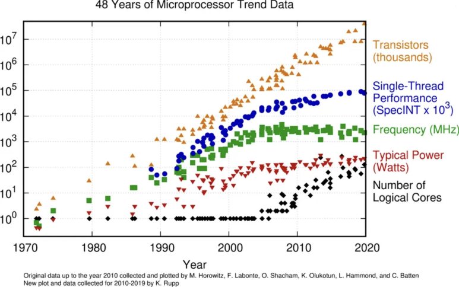
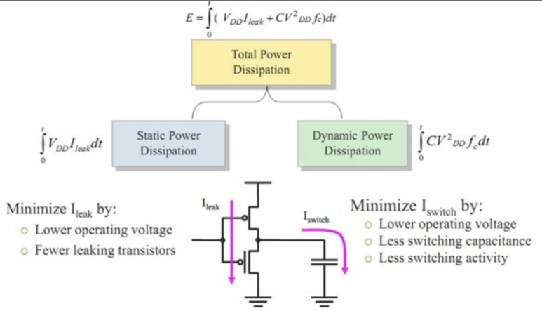
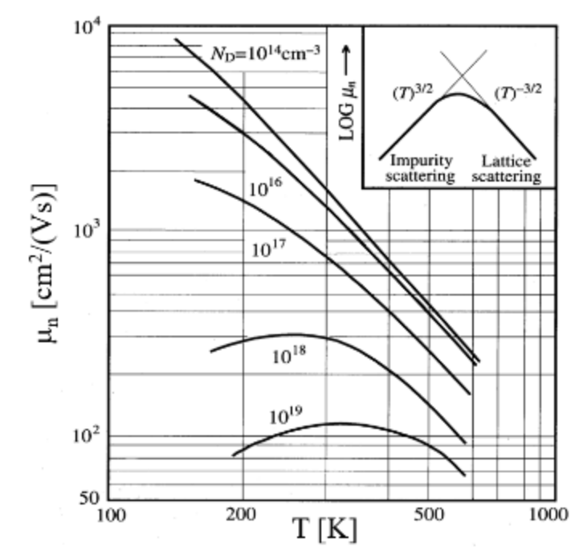
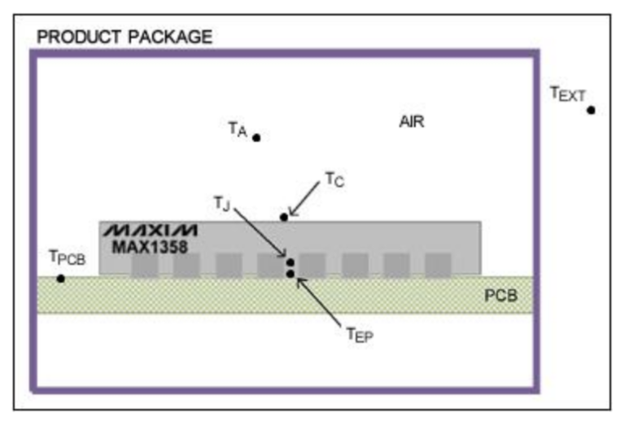

## 전용 저전력 반도체: “저전력 반도체가 더 고성능이다?” 반도체 PPA, 데이터센터와 온디바이스 반도체 시점에서. ASIC, NPU, GPU, VLSI

저전력 반도체에 대한 이야기를 할건데, 이 글에선 "환경"에 대한 이야기를 거의 안 할 것입니다.

당연히 저전력 반도체를 쓰면 환경에 좋을 것이고, 현재 반도체의 전력소모가 엄청나게 크다는 것은 누구나 알고 있는 사실이니까요.

​

각 데이터센터들이 1년에 얼마만큼의 전력을 사용하는지는 공개를 하고 있지 않지만,

열을 식히려고 강가에 짓고, 추운 지역에 짓고, 그런데도 전력난이 심각합니다. (데이터센터 지방 분산화가 필요!!)

이런 에너지 측면의 문제를 제외하고도, 다양한 문제들이 존재하기 때문에, 그것들에 대해  알아보려고합니다.

​

저전력 반도체란,

최적 성능을 유지하면서 최소한의 전력 소비로 작동하도록 "설계"된 반도체입니다.

성능을 우선시하는 반도체와 달리 저전력 반도체는 "전력 대비 성능, 전성비"를 높이도록 설계되었습니다.

슬립모드, 저전력 동작 모드, 고성능 모드 이런식으로 모드를 나누기도합니다.

참고로, 전력 소비는 "성능과 배터리 수명"에도 영향을 끼칩니다.

​

우선, 반도체 설계 및 공정 역사를 보기 위해 몇가지 법칙으로 소개해보겠습니다.

무어의 법칙

Intel의 창업자인 Moore가 창안한 무어의 법칙은 "반도체 칩의 트랜지스터 수가 약 2년마다 두 배로 증가한다"고 가정합니다. 어떤 산업도 수십년 동안 2년마다 2배씩 발전한 사업이 없을 것입니다.

반도체는 대부분 신호 제어를 위해 사용합니다. 이 신호 제어 장치들을 모아서 컴퓨터도 만들고 하는거구요. 그런데 이 컴퓨터 성능이 2년마다 2배씩 좋아지니... 인공지능도 나오고 자율주행도 나오는겁니다.

그런데, 이러한 법칙이 깨지고 있습니다. 반도체 공정 수준이 2nm 정도로 매우 미세해졌고, 결국 더이상 공정을 미세화하기가 쉽지 않은거죠. 하더라도 비용이 너무 비싸구요.

​

​

데나드 스케일링

IBM의 엔지니어인 Dennard는 무어의 법칙을 보완하는 법칙인 Dennard's Scailing을 설명했습니다. 이 법칙은 "트랜지스터 크기가 줄어들어도, 단위 면적당 성능과 전력은 그대로이다." 그러므로 트랜지스터 크기가 줄어들면, 전력 소모는 줄고 성능은 더 좋아지게 되는거죠. 

그런데 이마저도, 10nm 이하 공정 정도로 오게되니까, 누설전류, 열 문제 등 때문에 전력과 성능 개선 수치가 어느정도 포화영역에 들어오게 되었습니다.

​

정리하면, 무어의 법칙과 데나드의 법칙은 수십 년 동안 반도체 성능 혁신을 주도했고, 나비효과로 SW로 넘어오면서 인공지능과 자율주행의 시대가 왔지만, 현재는 이러한 법칙을 유지하는 것이 어렵게 되었습니다.

​

https://www.youtube.com/watch?v=Fk77pBV2w8Q&ab_channel=%EB%94%94%EC%9D%BC%EB%A0%89THEELEC

설명 : 반도체 패러다임 변화의 시작 '무어의 법칙'과 지능형 반도체01:12 한국 반도체 산업, 미래를 그리다02:06 서울대학교 박영준 명예교수 소개04:20 '무어의 법칙'에 대해서06:51 '무어의 법칙'의 한계와 새로운 대안14:14 팬아웃패키지 기술과 ToF 기술18:36 라이팩...

​

반도체 전력과 성능의 연관성

우선 반도체 전력 공식은 아래 식을 따릅니다.

Total power = Dynamic Power + Static Power입니다.

과거 공정의 비교적 덜 단순한 반도체에서는 보통 Total power는 Dynamic power의 비중이 큰데, 미세공정에서 인공지능 칩들은 대부분 Static Power의 영향이 큰 편입니다.

​

미세공정에서는,

Transistor level에서 공정설계 자체에서도 누설전류 값이 커졌고,

Chip level에서의 회로설계에서도 인공지능 칩 자체가 커지면서 중간 중간 Sleep과 hibernation되는 회로가 많다보니 Static power 비중이 커질 수 밖에 없습니다.

Kushan Shah, lecture slide전력 소비는 성능에도 영향을 미칩니다. 왜냐하면 전력 소비가 높을수록 열 발생이 증가하거든요.

​

​

전력과 열, 반도체 성능

반도체는 원자 속의 전자와 홀 같은 "Carrier"를 갖고 전기적인 제어를 하는 것이라고 보면 되는데요.

열에 따라 Carrier's mobility. 즉, 이동도가 감소합니다.

​

Charge carriere의 운동 원인은 크게 2가지로 Drift와 Diffusion으로 볼 수 있습니다.

더 자세히 보면 4가지로 Thermal motion과 Recombination까지 볼 수 있구요.

더 궁금하신 분들이 있으면 댓글 남겨주세요. 이후 포스팅에서 더 파고들어 설명드리겠습니다.

3단 논법으로 정리하면,

반도체는 캐리어를 통해 신호 제어를 한다.

캐리어는 열 받으면 느려진다.

전력 소모는 열을 발생시킨다.

큰 전력 소모 -> 반도체 느려짐.

​

이뿐만 아니라, 온도가 높아지면,

- Saturation current에 영향.

- 비저항 / 저항 / 전도도에 영향

- PN Juction의 전위장에도 영향

​

아이러니하게도, 성능을 높이려면 전력도 줄여야하는 상황이 되어버렸습니다.

반도체 설계 뿐만 아니라, 반도체 재료부터 이런 것들을 신경써야합니다.

설계 레벨에서는 제가 위에서 작성한, "동적 전압과 정적 전압"을 낮출 방법을 고려하여 설계하여야 하구요.

​

열 분석

​

패키징 레벨에서는 방열판, 방열재대한 고민이 필요하고,

애플리케이션 레벨에서는, 데이터센터를 어디에 짓고.. 냉각 시스템을 어떤식으로 구현하고.. 온도 모니터링과 시스템 제어는 어떻게 할지.. 이런 열관리 정책들이 필요합니다.

이런 것들이 시스템 성능에만 영향을 주는게 아니라, 반도체 수명에도 영향을 줍니다.

​

글로벌적으로는 아마존과 구글이 잘 하고 있고, 우리나라에선 네이버 데이터센터 각이 유명한 것 같습니다.

https://datacenter.navercorp.com/

[DATA CENTER GAK](https://datacenter.navercorp.com/) : 다양한 사람들의 삶의 기록인 데이터를 손쉽게 사용할 수 있도록 기술 플랫폼으로의 변화를 추구하며, 현재를 넘어 다음 세대를 위한 지식의 토대를 제공하겠습니다.

​

반도체 PVT Variation

똑같은 반도체 장비로 웨이퍼를 굽더라도, 웨이퍼 1번과 2번의 특성차이가 존재합니다. 항상 완벽하게 똑같이 나오질 못합니다.

 반도체 제조 공정에서는 본질적으로 "트랜지스터 임계 전압', "채널 길이", "도펀트 농도" 등 반도체 물리적 특성 파라미터에 영향을 주는 것들에 대한 공정 변수가 존재합니다.

이러한 변화는 Process Variation, Transition Delay Fault Defect로도 발생시키고, 이런 것들로 인해 설계 단계에서 견적을 낸 "파워와 성능"과 실제 "파워와 성능"이 달라질 수 있습니다.

근데 이런 오차가 미세공정으로 가면서 꽤나 값이 커지게 됩니다. 이런것들을 다 고려해서 최악의 경우에서도 동작 할 수 있게 설계해야합니다.

​

통계적으로 확인 할 수 있는 "반도체 Process variation"을 최소화하려고 파운드리와 장비업체, EDA 업체, 설계회사들이 머리 맞대고 노력하고 있습니다.

Robustness DTCO, Robustness DFM 등을 찾아보면 관련 자료를 볼 수 있습니다.

​

Hotspot analysis​

기술적동향

삼성은 3nm로 진입하며, GAA라는 트랜지스터 설계를 사용하겠다고 발표하였습니다.

GAA는 기존 FinFET보다 공정 난이도는 높지만,,, GAA 트랜지스터는 채널 영역을 모든 면에서 게이트 재료로 둘러싸서 ESD와 Leakage current로부터 개선된 수치를 보여주거든요.

​

그리고 3D Pacakaging, TFET, Spintronics, TMD, 그래핀, 나노 와이어 같은 공정 기술이 한창 발전되고 있습니다.

설계에서는 제가 이전 포스팅에서 글으로 담은적 있으니 찾아보시면 좋을 것 같습니다.

​

참고로 여기에 나열한 기술들은 완전 새롭게 나온 기술들은 아니고, 이미 수년/수십년 전에 발표되었던 기술입니다.

그 당시엔 경제성이 없어서 사용되지 빛을 못 봤던 기술들이죠.

그리고 저전력 반도체도 그렇습니다. 저전력? -> 저성능, 느린 주파수, 임베디드용 이런 인식이었는데, 시대가 바뀌었어요.

​

전력 소모를 고려하여, "최적의 트랜지스터 개수, 최적의 클럭 스피드, 최적의 설계, 최적의 공정, 최적의 패키징, 최적의 사용 환경"을 모두 고려해야합니다.

-> Q: 이거 제일 잘하는 회사가 어디냐? A: NVIDIA...

​

> 저전력 반도체는 "에너지" 뿐만 아니라, "성능"에도 좋은 영향을 준다.

출처 : No Site

​

 해시태그 : 