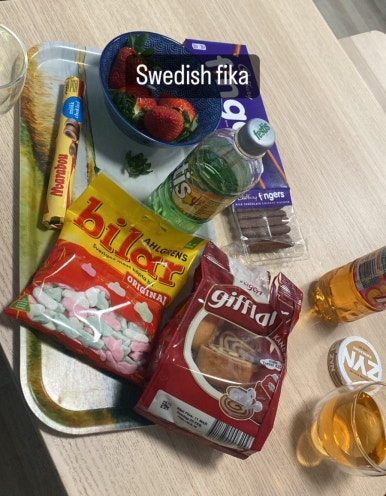
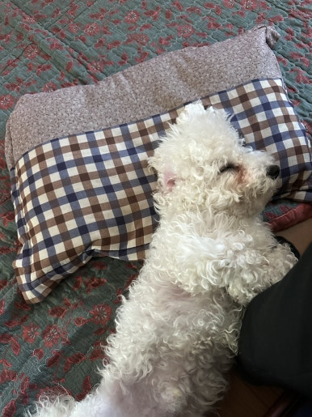
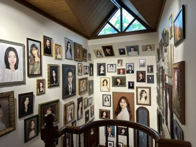
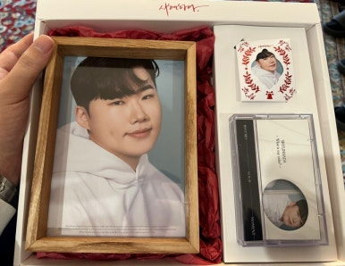

## [공대생 일상] 엔지니어는 휴무일때 뭐할까.log

회로설계 / 반도체 설계 / VLSI설계 / ASIC 설계 / EDA 등... 이런 엔지니어들이 쉬는 날에는 뭐 하고 사나 궁금하지 않나요?

저는 그랬어요 ㅎㅎ

​

다행이게도(?) 설계 엔지니어라서 교대 근무는 하지 않습니다.

주 5일 근무가 기본이긴하지만, 이 시간은 코어타임이라고 보면 됩니다.

​

9시~18시까지는 코드 작성을 해놓고, 작업 하나 돌려놓고...

집에 와서 결과 확인하고.. 그 다음 작업 돌려놓고.. 자기 전에 결과 확인하고...

그래서 노트북을 항상 가까이 들고 다닙니다. 왜냐하면 그냥 작업 한 번 실행시키는게 몇 시간~며칠 걸리거든요.

나는 사실 밥 자체는 별로 좋아하지 않는데,

반찬과 간식을 진짜 좋아한다. 막상 밥 먹을 때 되면, 밥은 거의 안 먹고, 맛있는 것만 골라 먹는다.

​

제일 좋아하는 과자는 sorlands chip 좋아하고 ~~ 초콜렛은 sorlands chip 좋아한다. 비요뜨도 좋아하고 이것저것 좋아하는데, 건강 때문에 덜 먹으려고 합니다.ㅎㅎ 소소하지만 확실한 행복,,

엔지니어 직업 특성상..... "서울"에 직장 잡기가 어렵다. 나도 지방 근무이다. 그렇다고 집 값이 싸지도 않다;;; 회사 근처는 비싸다.

특히 회사 근처에 재밌는 무언가가 딱히 없고, 회사만 있으니까... 재미없다. 

여러가지 요인들로 나는 주말에 서울 가는게 좋다. 서울 살고싶다...

​

을지로, 성수, 왕십리 분위기 좋아합니다.

평일엔 SNS를 많이 보면서 하고싶은것.list를 만들어놓고, 네이버지도 여기저기에 핀을 꽂아놓고,

그리고 캘린더에 계획을 해놓고, 일단 지릅니다. 아직도 하고싶은 것 리스트가 진짜 한가득;;;;

​

주말에 좋아하는 사람들 만나고,

평일엔 좋은 사람들과 좋은 일 하고.

​

 해시태그 : 