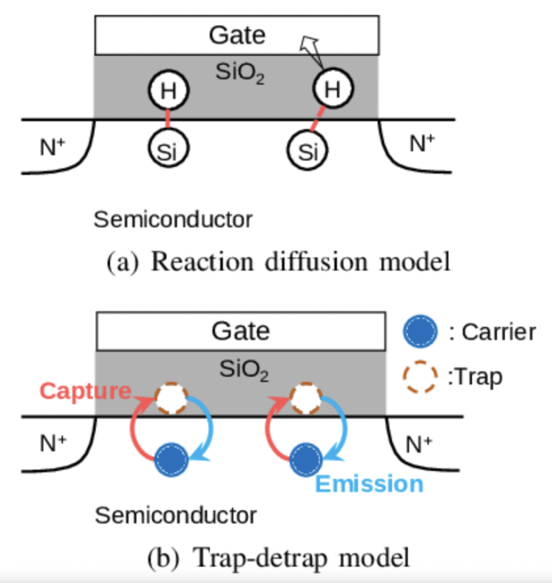
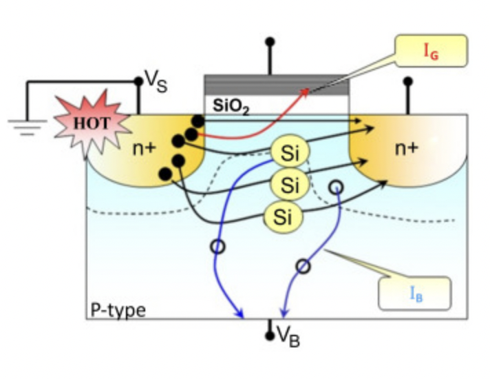
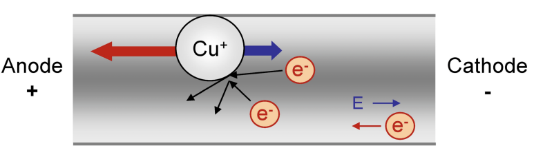
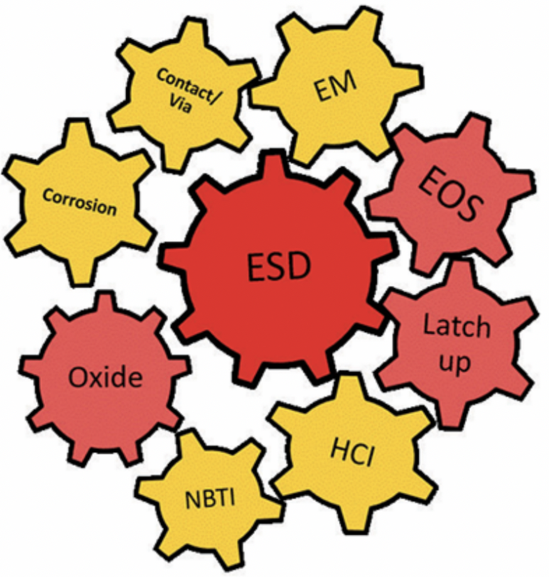

## 반도체 Reliability란?: BTI, HCI, TDDB, EM

현대 반도체 회로는 지속적인 스케일링을 통해 높은 집적도와 성능을 구현해 왔습니다.

과거에는 일본이 우리나라보다 반도체 공정 기술이 우리나라보다 훨씬 뛰어났는데, 어느순간 우리나라가 반도체 규모의 시장에서 일본을 넘어섰죠.

​

제가 반도체 공정 수업에서 교수님께 들은 내용으로는.. (농담으로한걸지도 모르겠지만.)

일본이 그 기간동안 놀았냐?

그건 아니고, 일본은 선행기술, 기초과학을 토대로 장인(?) 정신처럼... 일본은 반도체 수명에 대한 연구를 했고, 예를들어 10년 20년 동안 쓸 수 있는 "반도체 칩"을 만드는걸 목표로 했다고 합니다.

우리나라는 양산, 미세공정 이런 것들에 집중을 했구요.

2000년대 반도체 시장을 생각해보면, 2년마다 무어의법칙을 따라 사람들은 2년마다 휴대폰을 바꿨고.. 각종 전자장비도 10년 20년 쓰는 경우는 드물죠.

결국 지금처럼 된 것 같습니다. 일본 반도체는 전자재료공학 분야에서 잘 나가고, 한국은 설계 및 공정에서 잘 나가고.

​

하지만 이런 "반도체 수명 관리" 기술, 즉 Reliability가 계속 각광을 받아오고 있는데요.

이런 초미세 공정에서 FEOL과 BEOL에는 여러 Aging Effect로 회로의 성능과 전력 소모에 영향을 주게 됩니다.

​

Reliability에 위험을 가하는 요소는 대표적으로, 아래 4가지가 있습니다.

BTI

HCI

TDDB

Electro Migration

​

BTI란,

BTI (Bias Temperature Instability)는 트랜지스터에 인가되는 전압과 높은 온도 스트레스에 의해 게이트 절연막 계면, 트랩에 발생하여 트랜지스터의 Vth가 변하는 현상입니다. PMOS와 NMOS 트랜지스터에서 각각 NBTI와 PBTI 현상이 관측됩니다.

​

HCI란,

HCI(Hot Carrier Injection)는 트랜지스터의 고전계 영역에서 높은 에너지의 캐리어가 게이트 절연막을 넘어 계면 트랩을 발생시켜 트랜지스터 특성이 열화되는 메커니즘입니다. HCI로 인해 트랜지스터의 전류 구동 능력이 저하되고, 누설 전류가 증가합니다.

​

TDDB란,

TDDB(Time Dependent Dielectric Breakdown)는 게이트 절연막에 전기적 스트레스가 가해지면 절연막을 통해 터널링 전류가 증가하고, 결국 게이트 누설 전류가 급증하여 회로가 제 기능을 못하게 되는 파괴 메커니즘입니다.

​

EM이란,

EM(Electromigration)은 높은 전류 밀도에 의해 금속 배선 내 원자들의 이동이 발생하여 배선이 파괴되는 aging입니다.

​

이처럼 BTI, HCI, TDDB, EM 등 여러 aging 메커니즘이 복합적으로 작용하여, 반도체 회로의 성능과 전력에 영향을 끼치고, 결국 이런 것들이 커지면 기존의 전력공급으로는 동작을 안 할 수도 있고, 칩 성능이 기존보다 느려져서 기존 소프트웨어를 동작시킬 수 없게되는거죠.

데이터센터에 들어갈 반도체들의 가격을 생각해보면 H100 같은 경우, 가격이 4~6,000만원입니다.

그리고 자율주행에서 반도체들은 더 험준한 환경에 있을텐데... 갑자기 동작을 안 한다면, 끔찍하잖아요.

그래서 칩 공정 설계 엔지니어들은 반도체 디바이스 레벨에서 Reliablity 정보를 특성화해내고, 칩 설계 엔지니어들은 설계 레벨에서 이런 것들을 고려하여.. 만들어야합니다.

소프트웨어 엔지니어들은 실제 사용자들이 이 반도체 수명을 체크 할 수 있도록 만들어야하구요.

Aging 모델링 기법은 크게 두가지 modeling이 있다고 보시면 됩니다. 이 이름은 회사마다 다를 수 있구요. Physical-based와 Emprical-based modeling.

현재 물리학에서 증명된 이론들을 토대로, TCAD 및 SPICE Simulation해서 만든게 Physical-based model

실제 실리콘에서 만들어진 실험 결과물을 토대로, 분석해서 만든게 Emprical based model

​

1. Physical based model으로 처음 실험을 하고,

2. 실제로 간단한 Chip을 반도체 제조 공정하고,

3. 이 결과 값을 분석하여 Emprical based model으로 만들고,

4. 1에서 만든 공식 및 파라미터를 교정하고

1~4를 반복하고 나서, 전압 / 온도 / 각종 스트레스 조건을 넣었을 때 X-sigma 수준으로 들어오는 공정 Variation이 되면 본격적으로 PDK 배포 준비를 하죠.

​

그리고 PDK에 이렇게 만들어 놓는겁니다.

이게 5년의 Reliability일 때는 X%의 변동이 있으니까, (X+5)%의 마진을 회로 설계자들이 넣도록 하고,

이게 10년의 Reliability일 때는 Y%니까, (Y+5)%의 마진을 회로 설계자들에게 넣도록 하자..

​

이런 마진으로 설계하는 방법 외에도,

- SRAM 설계시에 데이터 유지시 게이트 바이어스를 낮춰 BTI stress를 줄이는 방법도 있고

- 거대 IP 설계에서는 NBTI/PBTI 센서를 이용해 Vth 변화를 모니터링하고 적응적으로 게이트 바이어스를 보상하는 기술도 있습니다.

- HCI에 대해서는 회로 토폴로지 자체를 최적화하여 고전계 영역을 피하도록 설계하는 기술이 사용됩니다. 또한 클럭/파워 게이팅과 같이 불필요한 스위칭을 줄여 HCI 스트레스 자체를 줄이는 방식도 있습니다.

- 근본적으로, 실리콘 옥사이드 대신 높은 유전율을 가진 게이트 유전체로 바꾼다던가.. 이런 전자재료적인 해결 방법도 연구되고 있구요. (참고로, 이런 전자재료공학적인 것들은 일본이 잘 하고 있음!)

- 설계 레벨에서 회로의 Aging 수준을 모니터링하고, 이에 따라 주파수/전력/등 물리적 파라미터를 적응적으로 조절하여 성능을 보상해 정상작동을 유지시키는 기술들이 연구되고 있습니다.

 해시태그 : 