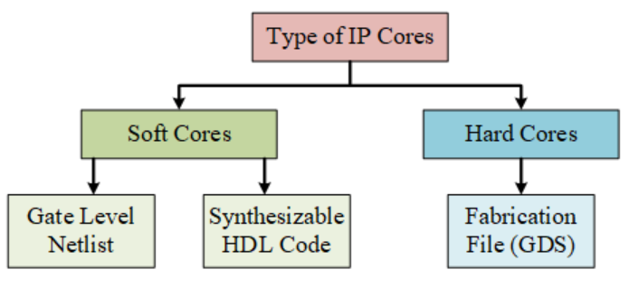
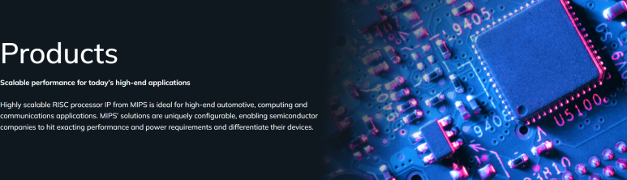

## 오픈소스 반도체 IP의 현황과 전망: OpenSource IP, RISC-V

아두이노, 라즈베리 파이 등 오픈소스 하드웨어 플랫폼이 등장하면서, 오픈소스 하드웨어는 점차 반도체 영역으로 확장되었습니다. 이 글에서는 반도체 설계에서의 오픈소스를 살펴봅니다.

오픈소스 반도체 IP는 반도체 산업에서 계속 주목받고 있는 패러다임입니다.

소프트웨어 분야에서는 일찍이 오픈소스가 리눅스 등으로 산업 혁신을 가져왔고, 하드웨어 분야에서는 최근들어 급격하게 커지는 것 같습니다.

​

반도체 설계는 결국 위와 같은 Code로 된 RTL 설계로 시작하게 됩니다.

결국 이것을 IP(Intellectual Property)라는 지적재산권으로 만들고, 다양한 칩에서 재사용 가능한 설계 블록을 의미합니다.

스마트폰만 보더라도, USB-C는 USB-C에 대한 IP가 있고, 내부 통신 칩에도 다양한 IP가 있죠. IP 설계 회사들은 이런거 잘 만들어놓으면, 다양한 반도체 회사에 자신들의 USB IP를 판매 할 수 있는거구요.

​

Soft IP와 Hard IP

Soft IP란 HDL(Hardware Description Language) 코드 형태로 제공되는 IP를 말합니다.

RTL(Register-Transfer Level) 수준에서 설계된 코드이며, 이 IP를 구매한 고객은 직접 합성(Logic Synthesis)과 배치&배선(Place&Route) 과정을 통해 반도체 칩에 구현됩니다.

Soft IP는 공정 기술에 독립적이어서 여러 공정에 사용할 수 있고 기능 수정이 비교적 용이하다는 장점이 있습니다. 하지만 성능, 면적, 전력 소모 등을 최적화하기 위해서는 설계자의 능력이 중요합니다.

​

Hard IP란 이미 물리적인 설계(Physical Design)까지 완료된 IP를 말합니다. 즉, 레이아웃(Layout) 형태로 제공되는 검증된 IP 블록입니다. Hard IP는 특정 공정 기술에 종속적이며 수정이 어렵습니다. 하지만 이미 최적화와 검증이 완료되어 성능, 면적, 전력 효율 등에서 예측 가능한 결과를 보장한다는 장점이 있습니다. 아날로그 블록, 메모리, PLL 등이 주로 Hard IP로 제공됩니다.

​

IP의 종류

CPU Core, Memory Controller, Interface 등 범용적으로 사용 될 수 있고 다양한 기능을 수행하는 IP들이 SoC(System-on-Chip)를 구성하는 핵심 요소로 자리잡았습니다.

이런 기술이 너무 복잡하고, 반도체 IP 라이선싱 모델은 높은 비용, 제한적인 사용 권한, 벤더 종속성 등의 문제를 안고 있었습니다. 이는 특히 중소규모 기업이나 스타트업의 반도체 설계 진입 장벽으로 작용해 왔습니다. 그러다보니, 대기업들만 반도체를 설계 할 수 있었죠.

반도체 산업이 커지면서, 범용적으로 사용 될 수 있는 기술을 "표준화"하는 집단이 생겨나고, 이런 라이센스 기술로 먹고 사는 기업들이 생겼습니다. 대표적으로 ARM이라는 회사죠.

​

이 IP라는게 결국 실제적인 Chip으로 만들어져야 검증이 완료되는데 Chip 제조비용이 너무 높고, 이걸 부담하는 회사는 없다보니 선진공정에서 OpenSource IP는 크게 발전을 하지 못했었습니다.

​

​

RISC-V

​

최근에는 오픈소스 CPU 아키텍처인 RISC-V를 시작으로 다양한 오픈소스 반도체 IP 프로젝트가 나타나기 시작했습니다. 오픈소스 반도체 IP는 설계 비용 절감, 커스터마이징 용이성, 벤더 종속성 탈피 등의 이점을 제공하면서 차세대 반도체 설계의 새로운 대안으로 부상하고 있습니다.

​

RISC-V는 버클리 대학의 연구팀이 개발한 오픈소스 명령어 집합 아키텍처(ISA)입니다. 모듈화되고 확장 가능한 설계, 로열티 없는 라이선스 정책, 활발한 커뮤니티 활동 등의 장점으로 학계와 업계의 큰 관심을 받고 있습니다.

RISC-V를 기반으로 한 다양한 프로세서 코어 IP들이 개발되고 있으며, Western Digital, Nvidia, Alibaba 등 글로벌 기업들도 RISC-V 생태계에 적극 참여하고 있습니다.

​

ISA와 프로세서 코어는 지금까지 미국과 영국에서 대부분의 점유율을 갖고 있었고,

RISC-V라는 오픈소스 코어가 나오면서 중국이 이쪽 연구 개발에 엄청난 투자를 하고 있습니다. 오픈소스로 만들면 누군가 처음 설계와 검증을 하며 많은 돈을 쓰기 꺼려지는데, 중국에선 반도체 굴기를 위해 국가에서 밀어주고 있으니 문제가 없죠.

https://jamestown.org/program/examining-chinas-grand-strategy-for-risc-v/

[Examining China’s Grand Strategy For RISC-V](https://jamestown.org/program/examining-chinas-grand-strategy-for-risc-v/) : On November 24, 2023, DAMO Academy (達摩院; literally “Dharma”), Alibaba’s research division, unveiled three ground-breaking processors rooted in the open-source RISC-V architecture. The Xuantie (玄铁) C920, Xuantie C907, and Xuantie R910 processors promise to accelerate application of RISC-V technology ...

MIPS

MIPS는 1980년대부터 사용되어 온 전통적인 ISA 중 하나입니다. Wave Computing은 2019년 MIPS Open 이니셔티브를 통해 MIPS ISA와 관련 IP를 오픈소스로 공개했습니다. 이는 기존 상용 ISA가 오픈소스 전략을 채택한 대표적인 사례로, MIPS 기반 설계의 진입 장벽을 낮추고 생태계 확장을 도모하고 있고, RISC-V와도 많은 협업을 하고 있습니다.

​

OpenPower

OpenPOWER는 IBM의 POWER ISA 아키텍처를 기반으로 한 오픈소스 프로젝트입니다. 고성능 서버 및 데이터센터용 프로세서 설계를 오픈소스화하여 Power ISA기반 칩 개발을 활성화하는 것이 목표입니다.

기타 오픈소스 IP 프로젝트

Nvidia의 NVDLA(Deep Learning Accelerator)

LowRISC의 OpenTitan

​

​

개인 의견

오픈소스 반도체 IP는 잘 만들어놓으면, 여기서 조금씩 맞춤형으로 수정하면서 유저들이 계속 발전시키고, 회사에선 이것을 사용합니다. 이미 RISC-V로 만들어진 저렴하고 고성능의 반도체가 시장에 많습니다.

오픈소스라는게 무료지만, 결국 이것을 통해 시장과 경제는 커지죠. 스타트업도 쉽게 생길 수 있는 구조가 되구요.

그리고 소스코드가 다 공개되어있다보니, 많은 사람들이 코드에 직접 접근하여 디버깅이 가능하니 더 맞춤화하기가 쉽구요.

​

그런데 아직은 품질과 성능 면에서 상용 IP에 미치지 못하고 있고,

테스트 커버리지, 검증 수준, 문서화 수준도 상대적으로 부족합니다.

지속적인 유지보수와 기술 지원도 보장되지 않고, 이런 오픈소스를 쓰게되면 상용 IP 회사와 관계에 대한 우려도 생기게 됩니다.

또한, 상용 IP 회사들은 실제 Silicon으로 구현을 하여 검증을 하는데, Open Source는 그렇지 않죠. 누군가 총대 매고 먼저 설계하고, 먼저 MPW까지 나가야합니다.

그래서 현실적으로 모든 IP를 오픈소스로 대체하기는 어렵습니다.

최신 공정 기술이 필요한 IP는 상용 IP에 의존할 수밖에 없는 경우가 많습니다.

근데 사실 이것도 중국은 반도체 굴기 + 반도체 자립을 위해 국가 차원에서 투자를 하니.. RISC-V를 시작으로 시장 전체가 커지고 있어요.

​

https://cset.georgetown.edu/article/risc-v-what-it-is-and-why-it-matters/

[RISC-V: What it is and Why it Matters | Center for Security and Emerging Technology](https://cset.georgetown.edu/article/risc-v-what-it-is-and-why-it-matters/) : As the U.S. government tightens its controls on China’s semiconductor ecosystem, a new dimension is increasingly worrying Congress: the open-source chip architecture known as RISC-V (pronounced “risk-five”). This blog post provides an introduction to the RISC-V architecture and an explanation of wha...

​

오픈소스 반도체 IP는 설계 혁신의 새로운 동력으로 작용하고 있지만, 동시에 해결해야 할 과제들도 계속 남아있습니다.

​

 해시태그 : 