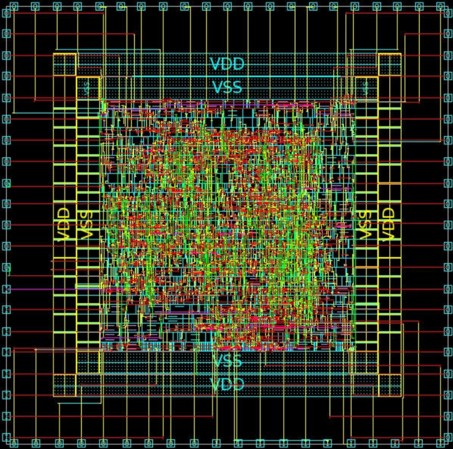
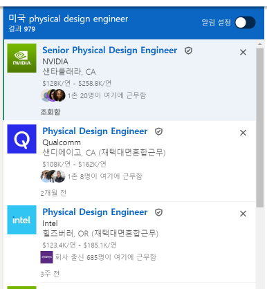
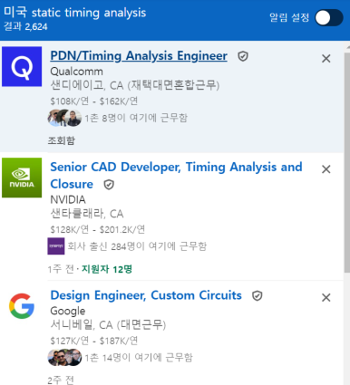
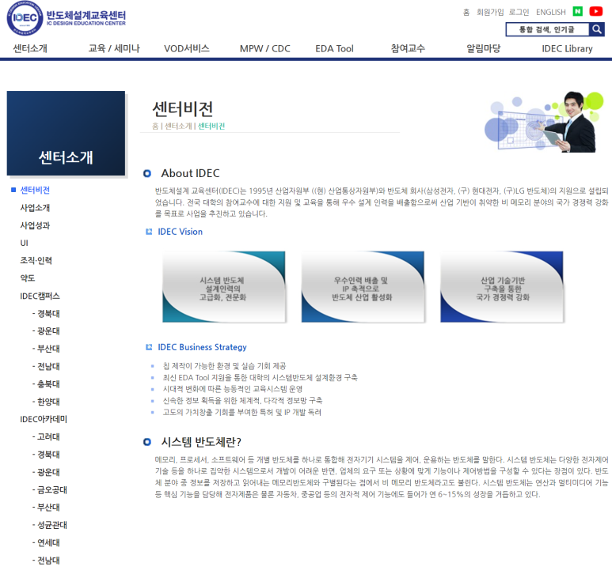

## Physical Implementation / Physical Design Engineer 되는법 : 취업 및 이직의 필수 역량과 커리어 개발 전

최근 글로벌 반도체 산업이 급성장하면서 관련 인재에 대한 수요도 크게 증가하고 있습니다.

칩 설계 분야에서 Physical Design 분야가 Pool이 계속 커지고 있습니다.

미세공정으로 들어가고, 3D Packaging을 하면서 물리적으로 고려해야 할 것들이 너무 많아졌고, Physical Design Engineer가 반도체 칩의 성능, 전력 효율성, 수율 등을 결정짓는 핵심 요소들을 다루기 때문에 그만큼 전문성과 숙련도가 요구되는 직무입니다.

​

​

실제로 많은 반도체 기업에서는 우수한 Physical Design Engineer 확보에 사활을 걸고 있습니다. 덕분에 경력과 실력을 갖춘 엔지니어라면 업계 내에서 높은 처우와 다양한 기회를 얻을 수 있죠.

​

이에 본 글에서는 Physical Design Engineer가 되기 위해 갖추어야 할 역량은 무엇이고, 대학 시절부터 신입 엔지니어로 성장하기까지 어떤 로드맵을 그려야 할지 살펴보겠습니다. 나아가 경력 개발을 위한 노하우도 함께 공유하고자 합니다.

​

우리나라에서는 Physical Implementation, Physical Design이라고 부르지만,

미국에서는 Synthesis Engineer, STA Engineer, CAD Engineer, SPICE Engineer 등 세부 분야로 부르고, 이를 통칭하는 직업이 Physical Design Engineer입니다.

​

그래서 Linkedin에 올라온 미국 Physical Design Engineer를 몇개 종합ㅎ

JD(Job Description)들을 분석해보면, 반도체 물리적 설계 엔지니어들에게 요구되는 주요 역량과 자격요건은 다음과 같이 정리할 수 있습니다.

주요 역량 및 자격요건 정리

한 번 이거 읽어보면서, 저는 뭐 할 수 있는지 한 번 체크해봐야겠어요.

전공: 전기/전자공학, 컴퓨터공학 등 관련 분야 학사 이상 / 석사 또는 박사 학위 우대

Logic Synthesis, Floorplanning, Placement & Routing(PnR), Clock Tree Synthesis(CTS) 경험

Library characterization 경험

TCAD, SPICE 기반 분석 경험

Timing Closure, 전력 최적화 수행 능력

DFT(Design for Test), BIST(Built In Self Test), SCAN

PV(Physical Verification), DRC(Design Rule Check), LVS(Layout Versus Schematic) 경험

첨단 공정 노드 경험: 5, 4, 3nm 이하 공정에서의 설계 경험 보유

대규모 설계 프로젝트 수행 경력

EDA 툴 사용 능력: Synopsys 툴체인, Cadence 툴체인, SIEMENS 툴체인

STA(Static Timing Analysis) 전문성

Constraint 생성 및 디버깅, 타이밍 분석 리포트 활용 능력

On-Chip Variation(OCV) 모델링, 노이즈 분석 등 고급 STA 개념 이해

프로그래밍 및 스크립트 작성 능력: Perl, Python, Shell, TCL 등 스크립트 언어 숙련도

주요 디자인 경험 (인공지능 반도체, 자율주행 반도체)

주요 IP 경험 (ARM Cortex, DDR, HBM, PCIe, USB)

RTL Code 이해 능력

포스트 실리콘 디버깅 경험

기생 값 출력 경험

SVP 경험

하드웨어 에뮬레이션 경험

스펙 결정 경험

글로벌 팀 환경에서 협업할 수 있는 영어 커뮤니케이션 스킬

유관부서(설계, DFT, SoC 통합 등)와의 원활한 협업 능력

​

위에 있는 것들 중 절반 이상이 "학부 연구실, IDEC 참여"로 다 할 수 있는 것들이고, 나머지 절반중의 절반은 석사 과정 중에 할 수 있고, 나머지는 산업 현장에 들어서야 쌓을 수 있는 경력들입니다.

​

결국 이력서에는 설계 역량과 함께 EDA 툴 사용 능력, 프로그래밍 스킬, 실리콘 디버깅 경험, 리더십 및 소프트 스킬 등을 두루 갖추었음을 강조하는 것이 효과적일 것 같습니다.

​

로드맵

엔지니어의 생애주기를 3단계로 나눠 설명해보겠습니다.

​

1. 우선 대학 과정에서는 관련 학과 선택이 중요합니다.

전기전자공학과, 반도체공학과, 컴퓨터공학과 등 물리적 설계와 직결되는 학과에 진학하는 것이 유리하겠죠. 물론 (회사에는 물리학, 기계공학 다양한 사람이 있긴합니다.)

해당 학과에서는 반도체 소자 물리학, 집적회로 설계, EDA 등 물리적 설계의 기본기를 닦을 수 있는 커리큘럼이 마련되어 있습니다.

이때 수업 내용에 충실하되, 학점 관리에만 몰두하기보다는 IDEC 같은 외부 교육도 들어보고, 관련 프로젝트나 인턴십 등 실무 경험을 쌓는 데에도 힘써야 합니다.

예를 들어 설계 프로젝트에 참여하거나, 관심 있는 교수님 연구실에서 인턴으로 활동해보는 거죠. 산학 프로젝트  등의 기회도 적극 노려볼 만합니다.

​

학교에서 연구실 들어가는 것과 IDEC 강의 수강은 정말 추천합니다.

신청 과정이 좀 귀찮을 수 있는데, 투자 대비 높은 대가를 받을 수 있는 것들입니다. 대부분 강의가 무료구요. (대신에 오픈런 해야 됨.)

​

2. 대학을 졸업하고 신입 엔지니어로 입사했다면, 초기 성장 전략을 잘 세워야 합니다. 가장 중요한 것은 팀 적응인데요. Libraries, Design Rule 등 팀 내 설계 환경을 빨리 익히고, 선배 엔지니어들의 노하우를 흡수하는 것이 중요합니다.

이때 멘토를 만나는 것도 큰 도움이 됩니다. 경험 많은 선배에게 기술적인 조언뿐만 아니라 커리어 개발 노하우까지 배울 수 있거든요. 회사에서 제공하는 교육 프로그램도 적극 활용해야겠죠. EDA 툴 사용법, 설계 방법론 등을 체계적으로 배울 수 있는 좋은 기회입니다.

​

3. 신입 시절을 지나 어느 정도 경력을 쌓았다면, 프로젝트를 주도하는 역할도 맡아볼 때입니다. 핵심 설계의Block Owner나, Project Leader를 맡아 설계 전반을 이끌어보는 거죠. 단순히 주어진 일을 하는 것이 아니라, 해당 프로젝트의 목표를 분석하고 달성 방안을 고민하는 과정이 필요합니다.

회사에서 고이지 않으려면, 최신 기술 트렌드를 놓치지 않는 것도 중요한데요. SNUG (Synopsys User Group)같은 대형 기술 세미나 등에 참석하여 첨단 기술 동향을 파악하고, "다른 회사의 유관 부서 엔지니어들과 대화하는 것이 무엇보다 도움 됩니다."

​

Career path

지금까지 Physical Design Engineer가 되기 위해 필요한 역량과 커리어 개발 전략에 대해 살펴보았습니다. 이제 Physical Design Engineer로서 어떤 커리어 패스를 그려볼 수 있을지 봅시다.

​

Technical Leader

경력을 쌓아감에 따라 점차 높은 난이도의 Block을 맡게 되고, 나중엔 Project까지 Lead하게 됩니다. 설계 품질과 효율성 향상을 주도하는 역할을 하게 되죠. 나아가 팀 내 best practice를 만들어가고, 문제가 있는 Block에 액션아이템을 구상하고, 후배 엔지니어들을 육성하는 테크니컬 리더로 발돋움할 수 있습니다.

이를 위해서는 특정 공정 노드와 특정 제품군에 대한 깊이 있는 전문성을 갖추는 것이 중요합니다.

그리고 팀원들의 역량을 끌어올리고 협업을 이끌어가는 리더십도 갖춰야 하죠. 테크니컬 리더로 인정받기 위해서는 엔지니어로서의 하드 스킬과 함께 소프트 스킬도 균형있게 성장시켜 나가야 합니다.

​

2. Project Manager

Tech leader는 연구개발을 기술적으로 리드 하는 사람이고,

Project Manager는 연규개발의 일정, 리소스, 커뮤니케이션 등을 관리합니다.

프로젝트 매니저가 되기 위해서는 스케줄링, 리스크 관리 등의 역량이 필요합니다. 뿐만 아니라 유관부서와의 조율, 외부 벤더와의 커뮤니케이션 등 대인관계 스킬도 중요하죠. 프로젝트라는 하나의 유기체를 운영하는 통찰력과 리더십이 요구되는 자리라고 할 수 있습니다. 대부분 책임은 Project Manager가 지니까요.

​

Phyiscal Design에서 직군을 약간 이동 할 수 있는 방법도 있습니다.

미세공정과 3D-IC로 진화하면서 Packaging, DFT, 검증 엔지니어들이 다양한 경험들이 필요해졌거든요.

​

​

​

 해시태그 : 