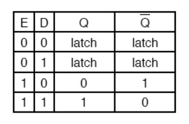
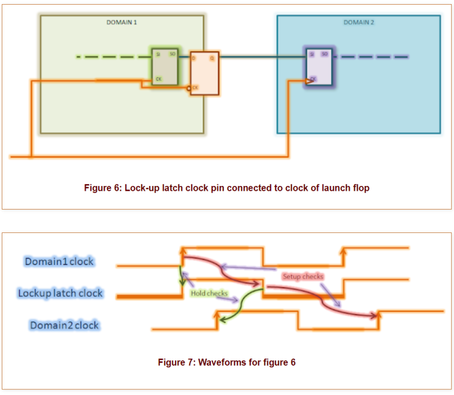

## Lockup latch란? #DFT #SCAN #VLSI

D Latch란?

D Latch는 디지털 회로에서 사용되는 설계입니다.

Flip flop은 Level triggering (1->0, 0->1)에 따라 변하는 반면, 

Enable Signal의 Level(1, 0)에 따라, Input Data 신호에 의해 동작합니다.

​

​

Lockup Latch는 다양한 곳에서 사용 될 수 있지만,

DFT에서 특히 많이 사용됩니다.

​

우선 간단한 Timing path를 보겠습니다.

credit: https://vlsitutorials.com/constraining-timing-paths-in-synthesis-part-1/STA 할 때 Timing path는 CK -> D의 Timing path가 보입니다.

Physical design을 할 때에도 CTS는 위 register끼리 알맞게 CTS가 될겁니다.

이런 기본적인 Timing mode를 Function mode 혹은 Mission mode라고 부릅니다.

​

여기서 DFT를 추가해보겠습니다.

DFT 기법 중 하나인 SCAN을 사용 할 때, SCAN Insertion 과정 동안 D Flipflop을 SCAN Flip Flop으로 변환하고,

SCAN Stitching과정동안 SE, SI, SO pin을 엮습니다.

credit: https://www.design-reuse.com/articles/48331/scan-chains-pnr-outlook.html

credit: https://www.design-reuse.com/articles/48331/scan-chains-pnr-outlook.html그러면 Timing path가 훨씬 복잡해지겠죠?

기존 Timing path는 CK -> D만 있었죠?

SCAN Insertion이 되면, CK -> SI Timing path가 추가됩니다.

​

1) 그러면 CTS point도 늘어나게 되는거고,

2) DFT하면서 다른 Clock domain끼리 엮일 수도 있고,

3) DFT하면서 register 크기 자체가 커지고, routing congestion이 복잡해지기에 이에따른 여러가지 문제가 발생합니다.

​

결국 DFT 넣고나면 STA engineer들에게 Burden이 생기고,

위에서 언급한 사항들 때문에 Hold Time을 MET 시키기 어렵게 됩니다.

​

그래서 이런 경우에 DFT Engineer들이 Lockup latch를 넣는데요.

Credit: https://vlsiuniverse.blogspot.com/2013/06/lockup-latches-soul-mate-of-scan-based.html1) Domain1 끝단에 Lockup latch를 넣습니다. 이 때 Lockup latch는 Flipflop과 반대 clock 에서 동작하도록 Negative Lockup latch를 넣는게 포인트입니다.

2) 이렇게 되면 Domain1 끝단에서 Clock Level이 0 -> 1(rising edge)일 때 Data가 Domain2로 가는게 아니라 Lockup D까지만 전파됩니다.

3) Clock이 Low-level로 접어들면, Lockup latch는 그때서야 Domain2로 전파시킵니다.

그러면 Clock Period의 Half Cycle만큼 늦게 Domain2에 도달하게 됩니다.

결국 Hold Time을 만족시키기 유리해지는거죠.

​

잘 이해가 안 되시면, 아래 영상 하나 참고하시면 도움 될 것 같습니다. :)

https://www.youtube.com/watch?v=c0shalxrcEU

설명 : This video describes the reason behind using lockup latches for connecting scan chains together and how it resolves hold violation. This video also tries to ...

​

​

 해시태그 : 