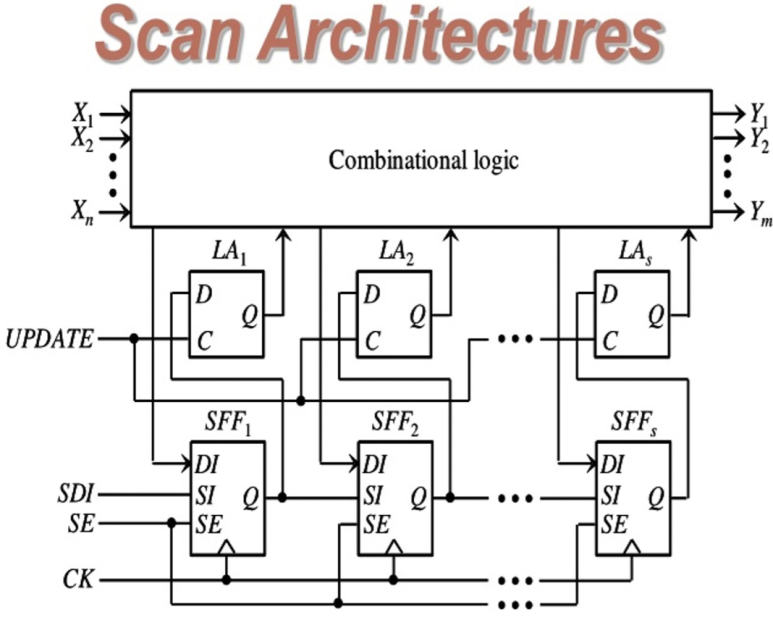

## On Chip Clock Controller란? OCC란?

On Chip Clock Controller는 디지털 회로 설계에서 Design For Testability에서 사용됩니다.

​

SCAN 구조는 간단히 아래처럼 설계를 하잖아요?

그런데 그림을 보면 CK Port가 각 CK Pin에 입력됩니다.

이 CK에 Clock은 ATE Clock과 Mission Clock을 Muxing해서 넣게 되죠.

​

SCAN에서 그냥 기본적인 Stuck-At Fault Test의 경우, ATE Clock으로 Slow clock만 인가하지만,

Transition Delay fault Test의 경우, On Chip Clock의 실제 Clock Frequency로 Chip Test를 해야합니다.

​

Physical 문제로, PAD에 대한 스펙 한계로, Test coverage로

Foundry에서는 ?Hz 이상 Clock인 경우, Transition Delay Fault Test 검증을 위해선 OCC를 삽입할 것을 권장합니다.

​

OCCC란?

On-Chip Clock Controller (OCCC)는 현대 DFT에서 클록 관리를 위한 핵심 컴포넌트로, IC 내부에서 클록 신호를 생성, 제어, 분배하는 역할을 담당합니다.

위 그림에서 보이는 것처럼, Muxing 뿐만 아니라 Synchronizer와 Clock Gating Cell이 추가됩니다.

- Synchronizer

- Clock Gating

- Clock Muxing

위 세 개가 가장 기본적인 OCC 구조라고 보시면 됩니다.

​

SDC로 위 OCC 관계를 정해놓고, STA의 Mode를 잡고 STA해야합니다. 안 그러면 안 봐도 될 타이밍들이 보이니까요

​

아래 논문 보면 OCC 개념에 대해 좀 더 자세히 볼 수 있습니다.

https://www.scientific.net/AMM.347-350.724

[An On-Chip Clock Controller for Testing Fault in System on Chip | Scientific.Net](https://www.scientific.net/AMM.347-350.724) : Registration Log In Distribution & Access For Publication Downloads News About Us Contact Us Search Paper Titles The Characteristic Parameter Estimation of Low Temperature Target Weak Signal Based on VanderPol-Duffing System p.706 The Design of an Miniature Underwater Robot for Hazardous Environment...

​

근데 실제로 대부분의 회사들이 OCC는 IP 형태로 instance화하여 사용할텐데, 실제 산업에서 쓰이는 OCC는 이것보다는 좀 더 복잡합니다.

아래 특허 참고:

https://patents.google.com/patent/KR20140076074A/en

[KR20140076074A - On-Chip Clock Controller circuits in SoC(system on chip) - Google Patents](https://patents.google.com/patent/KR20140076074A/en) : Other languages Korean ( ko ) Other versions KR101992205B1 ( en Inventor 김대웅 Original Assignee 삼성전자주식회사 Priority date (The priority date is an assumption and is not a legal conclusion. Google has not performed a legal analysis and makes no representation as to the accuracy of the date listed.) 2012-...

​

 해시태그 : 