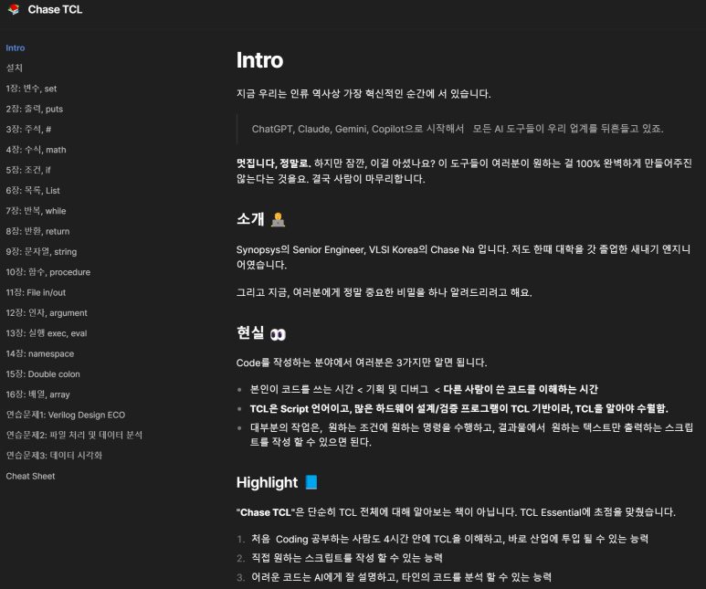

## Chase TCL : Tool Command Language, TCL 언어 공부 + 책

여름 감기가 와서 하루 종일 집에서 앓았네요.

그동안 미뤄왔던 첫 무료 E-Book을 Publish했습니다.

아직 Version 0.5 정도이고, 피드백 받고 1.0이 나오면 PDF 버전으로 공유드리겠습니다.

​

ABSTRACT

반도체 설계를 위해 꼭 필요한 언어 중 하나가 TCL입니다.

그런데 어디에서도 TCL을 교육하는 기관이 없고, 막상 공부하고 나면 그렇게 어려운 언어도 아닙니다.

"어떻게해야 모든 사람이 3~4시간만에 TCL에 대해 알 수 있을까?"를 고민하면서 출간하였습니다.

​

추가로,

TCL 언어로 본인이 생각하는 필수 명령들을 작성하는 방법,

AI에게 TCL Code를 작성해달라고 요청한 후, 그 코드를 이해하고 + 수정 할 수 있는 능력

기본을 넘어, 하드웨어 리소스 측면에서 + 코드 가독성 측면에서 좋은 코드를 작성하는 능력

​

TCL 책은 아래 페이지에서 무료로 보실 수 있습니다.

https://vlsi-korea.gitbook.io/chase-tcl

[Intro | Chase TCL](https://vlsi-korea.gitbook.io/chase-tcl) : Intro 지금 우리는 인류 역사상 가장 혁신적인 순간에 서 있습니다. ChatGPT, Claude, Gemini, Copilot으로 시작해서 모든 AI 도구들이 우리 업계를 뒤흔들고 있죠. 멋집니다, 정말로. 하지만 잠깐, 이걸 아셨나요? 이 도구들이 여러분이 원하는 걸 100% 완벽하게 만들어주진 않는다는 것을요. 결국 사람이 마무리합니다. 소개 🧑‍💻 Synopsys의 Senior Engineer, VLSI Korea의 Chase Na 입니다. 저도 한때 대학을 갓 졸업한 새내기 엔지니어였습니다. 그리고 지금, 여러분에...

아직 Version 1.0이 아니라서, 궁금하신 내용들은 메일로 보내주시면 좋겠습니다 :)

 해시태그 : 