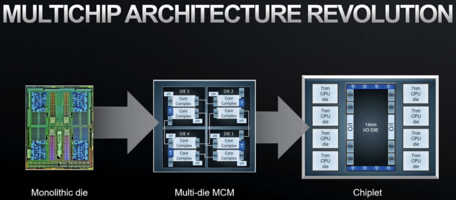
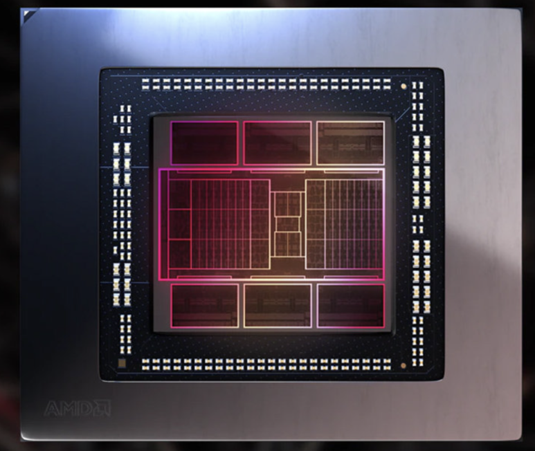
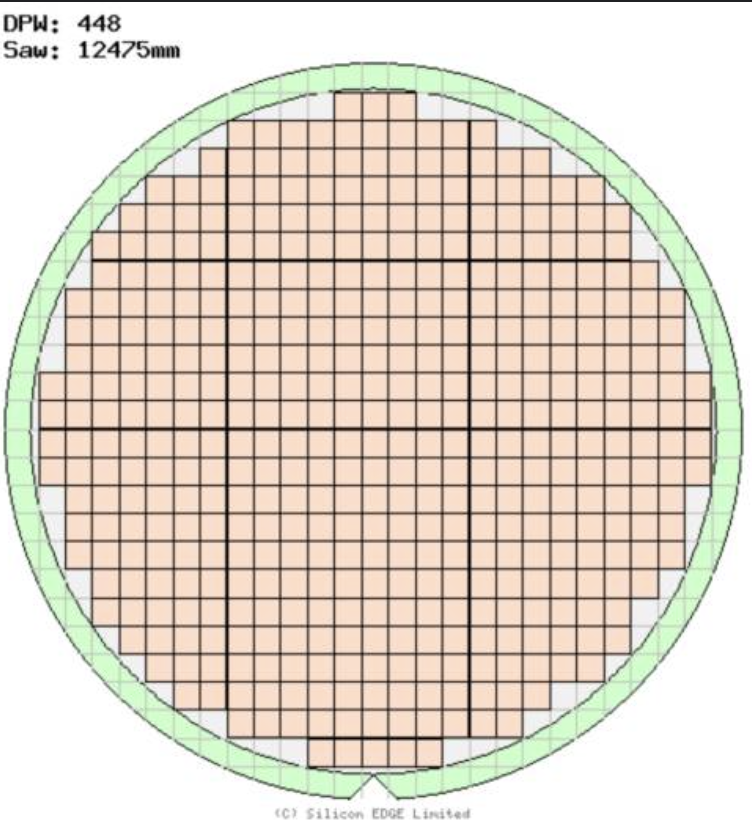

## Chiplet이란? 칩렛 vs 모놀리SoC: 핵심기술 UCIe, IEEE1838, interconnect, TSV

반도체 산업은 수십 년간 Moore의 법칙에 따라 발전해 왔지만, 최근 미세공정 스케일링의 한계에 도달하면서 새로운 패러다임의 필요성이 대두되고 있습니다. 

(*무어의 법칙: 반도체 공정은 2년마다 2배씩 집적도 기술이 좋아지는 산업적 경향이 있어왔다. 이에따라 더 많은 연산을 더 빠르고 저전력으로 할 수 있었음.)

​

미세공정으로 가고, 칩의 집적도가 계속 커지면서 수율은 점점 더 낮아지게 되었습니다.

대형 모놀리식 시스템 온 칩(SoC)의 설계와 제조는 복잡성과 비용 면에서 한계를 보이고 있으며, 이는 특히 VLSI(Very Large Scale Integration) 및 반도체 소자 분야에서 Challenge가 되고 있습니다.

Source: AMD이러한 상황에서 Chiplet 기술은 혁신적인 해결책으로 부상하고 있습니다. Chiplet은 특정 기능을 수행하는 작은 칩으로, 다양한 Chiplet을 조합하여 하나의 시스템을 구성함으로써 비용 효율성과 성능 향상을 동시에 추구합니다. 본 글에서는 Chiplet 기술의 핵심인 인터커넥트 기술의 혁신과 테스트 프로토콜의 표준화 및 최적화에 대해 심도 있게 논의하고자 합니다.

​

Source: AMD​

모놀리식 SoC에서 Chiplet으로의 전환

2.1 모놀리식 SoC의 한계성

과거에는 모든 기능을 단일 칩에 통합하는 모놀리식 SoC 설계가 주류를 이루었습니다.

이 방법은 회로간 거리를 가장 짧게 할 수 있어 최고의 효율을 뽑을 수 있는 방법입니다. Power, Performance, Area, Cost를 다 잡을 수 있는 공략법이죠.

이는 모바일 폰과 같은 소비자 전자제품에서 큰 성공을 거두었지만, 칩 크기의 증가와 함께 복잡성, 비용, 수율 등의 문제가 발생했습니다. 특히 최신 공정 노드로 갈수록 이러한 문제는 더욱 두드러집니다.

​

이해를 돕기 위해, 가정을 해보겠습니다.

가정1: 웨이퍼 1장마다 15개의 결함이 통계적으로 발생한다고 합시다.

가정2: 과거 공정의 반도체 칩은 칩 사이즈가 비교적 작아서 한 웨이퍼에는 100개의 칩이 제조됩니다.

가정3: 현재 공정의 반도체 칩은 칩 사이즈가 비교적 커서 한 웨이퍼에는 20개의 칩이 제조됩니다.

​

이렇게 되면, 과거 공정으로 만든 반도체의 수율은 85%, 현재 공정으로 만든 반도체 수율은 25%입니다.

이것 뿐만 아니라, 과거 공정은 ***um 수준의 공정인데, 요즘은 *nm 공정입니다.

그래서 더 공정이 복잡하고, 과거의 Legacy 반도체 공정보다, Advanced node 반도체에서 결함이 더 많이 발생합니다. 그래서 15개의 결함보다 더 많이 나올 수 있는거죠.

-> Transistor의 집적도는 높여야되는데 수율은 낮춰야한다면, Chip 사이즈를 줄여야 수율이 더 나오겠죠.

23 사람이 있는 경우, 생일이 겹치는 사람이 있을 확률은 50%! 수율도 마찬가지.​

무어의법칙은 2년마다 Transistord의 집적도가 2배씩 좋아진다는 것인데,

수율이 나빠지면 집적도가 좋아진다고 한들 양산이 불가합니다.

​

2.2 Chiplet 기반 설계의 부상

Chiplet 기반 설계는 대형 SoC를 기능별로 분할하여 작은 모듈로 구성합니다. 이러한 접근 방식은 다음과 같은 이점을 제공합니다.

비용 절감: 작은 칩의 제조는 수율이 높고 비용이 낮습니다.

유연성: 다양한 기능의 Chiplet을 조합하여 특정 응용 분야에 맞는 시스템을 구성할 수 있습니다.

개발 시간 단축: 모듈화된 설계로 인해 부분적인 업그레이드나 변경이 용이합니다.

​

​

자, 근데 생각해보면 chiplet은, 미세공정에서  수율을 위해 모놀리 칩을 여러개의 칩으로 나눠놓았다고 볼 수 있습니다.

그러면 이것들을 다시 연결해야하는데, 가장 물리적 거리를 최소화하려면 어떻게하는걸까요?

Chip을 2D 평면으로 붙이는게 아니라, 수직으로 쌓는겁니다.

그런데 3D 방식이 설계, 검증, 공정이 정말 어렵습니다.

그래서 현재는 3D공정은 쉽지 않고... 현재는 컨셉적으로 3D와 유사하게 만듭니다., 2.2D, 2.5D. 2.*D

아무튼 이렇게 3D로 데이터가 오가려면, 데이터를 오가는 엘레베이터가 필요한데, 이를 Inter-connect라고합니다. 

​

3. Chiplet 인터커넥트 기술의 혁신

Chiplet 기술의 성공은 Interconnect 기술에 크게 의존합니다. 빠르고 안정적인 Chiplet 간 연결을 위해서는 미세 Pitch의 고밀도 인터커넥트가 필수적입니다. 이에 대한 두 가지 주요 접근 방식은 2.5D Integration과 3D SoC Integration입니다.

​

3.1 2.5D 통합 기술

3.1.1 실리콘 인터포저

실리콘 인터포저는 Chiplet을 나란히 배치하고 미세한 금속 배선을 통해 연결하는 기술입니다. 장점으로는 다음과 같습니다.

미세한 피치 Pitch: 마이크로미터 및 서브마이크로미터 수준의 피치 구현

우수한 전기적 특성: 낮은 신호 지연과 높은 신뢰성

하지만 높은 비용과 복잡성으로 인해 대안 기술에 대한 연구가 진행되고 있습니다.

3.1.2 RDL

유기 폴리머를 사용하는 RDL 기술은 비용 효율적인 대안으로 주목받고 있습니다.

Pitch 목표: 현재 대부분의 산업들은 *µm 피치 양산을 목표로 하며, 장기적으로는 서브마이크로미터 피치를 지향

호환성 개선: 실리콘과의 열 팽창 계수 차이를 극복하기 위한 소재 및 공정 개발

3.1.3 Silicon bridge

실리콘 브리지는 Chiplet의 가장자리를 연결하는 작은 실리콘 조각으로, 인터포저의 기능을 수행하면서도 비용과 복잡성을 줄일 수 있는 방법입니다.

​

3.2 3D SoC 통합과 Hybrid bonding

3.2.1 Wafer-Wafer Hybrid bonding

3D SoC 통합에서는 Chiplet을 수직으로 쌓아 연결합니다. 웨이퍼-웨이퍼 하이브리드 본딩은 두 개의 실리콘 웨이퍼를 낮은 온도에서 결합하는 기술로, 주요 특징은 다음과 같습니다.

초미세 피치 구현: 본딩 절연체를 사용하여 인터커넥트 피치를 *00nm까지 축소

3.2.2 기술적 도전 과제

본딩 정확도

열 관리 및 전력 공급: 칩을 쌓을수록 열 발생이 증가하며, 이를 효과적으로 관리하기 위한 솔루션이 필요합니다.

3.3 인터커넥트 피치 감소의 기술적 도전

3.3.1 Micro bump

사용 분야: 2.5D 통합에서 Chiplet을 인터포저에 장착할 때 주로 사용

현재 피치 한계: 산업계에서는 일반적으로 50µm에서 30µm 사이이며, 이를 10µm 및 5µm까지 줄이기 위해 연구 중

3.3.2 Hybrid bonding

장점: 마이크로범프에 비해 훨씬 더 작은 피치를 구현 가능

제약 사항: 추가적인 표면 활성화 및 정렬 단계로 인해 제조 비용 증가

​

4. Chiplet 테스트 프로토콜의 표준화 및 최적화

Chiplet 기술의 복잡성 증가는 테스트의 중요성을 더욱 부각시킵니다. 특히, 다양한 출처의 Chiplet을 통합할 때 신뢰성과 품질을 확보하기 위한 테스트 프로토콜의 표준화가 필수적입니다.

4.1 테스트의 중요성과 도전 과제

Test escape: 엄격한 테스트에도 불구하고 발견되지 않는 결함이 발생할 수 있으며, 이는 제품의 신뢰성을 저하시킵니다.

품질 기준 강화: 자동차 산업과 같은 분야에서는 한 자릿수 dppm의 매우 낮은 결함 허용 범위를 요구합니다.

이기종 통합의 복잡성: 다양한 벤더의 Chiplet을 통합할 때 테스트 접근성과 호환성이 중요한 이슈가 됩니다.

4.2 IEEE Std 1838™과 imec의 역할

4.2.1 설계-포-테스트(DfT) 구조의 필요성

테스트 접근성 확보: 각 Chiplet이 테스트 신호를 주고받을 수 있도록 DfT 구조를 구현해야 합니다.

표준화의 중요성: 다양한 벤더 간의 호환성을 위해 DfT 구조의 표준화가 필요합니다.

4.3 인터커넥트 테스트의 개선

4.3.1 기존 테스트 방법의 한계

테스트 패턴 수 증가: 기존 방법은 인터커넥트 수(k)에 따라 테스트 패턴 수가 증가하여 효율성이 낮습니다.

결함 커버리지 제한: 주로 Short 및 Open 결함만을 대상으로 하여 weakness 결함 변형을 놓칠 수 있습니다.

​

​

​

 Citation

IEEE Std 1838™: 3D-DfT를 위한 테스트 액세스 표준.

Chuang, P.-Y., Lorenzelli, F., & Marinissen, E. J. (2023): "Generating Test Patterns for Chiplet Interconnects: Achieving Optimal Effectiveness and Efficiency". IEEE International Test Conference in Asia.

imec

UCIe Standard

 해시태그 : #운양동안경 #운양역안경 #운양동다초점안경 #운양동노인안경 #운양동돋보기안경 #누진다초점안경렌즈 #선글라스 #시력검사 #브랜드안경 #어린이안경