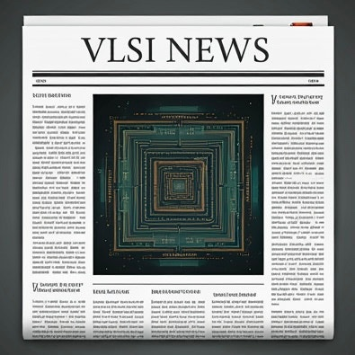

## 2024년 9월 29일 반도체 뉴스 정리 요약

갤럭시 S25의 AP Chip은 퀄컴으로 전량 채택

삼성도 난관이고,

삼성 협력사들, 패키징이나 테스팅 협력사들에게 추운 겨울이 될 듯.

https://www.thebell.co.kr/free/Content/ArticleView.asp?key=202409241558590520102435

[삼성 '엑시노스2500' 탈락 후폭풍, 불똥 튄 협력사](https://www.thebell.co.kr/free/Content/ArticleView.asp?key=202409241558590520102435) : 국내 최고 자본시장 미디어 thebell이 정보서비스의 새 지평을 엽니다.

캐논이 첫 나노급 노광장비로 intel, 삼성, DARPA에 공급함.

https://www.tomshardware.com/tech-industry/canon-delivers-first-nanoimprint-lithography-tool-to-us-institute-backed-by-intel-samsung-darpa

[Canon delivers first nanoimprint lithography tool to US institute backed by Intel, Samsung, DARPA](https://www.tomshardware.com/tech-industry/canon-delivers-first-nanoimprint-lithography-tool-to-us-institute-backed-by-intel-samsung-darpa) : Aims to sell 20 such tools over the next few years.

​

​

일본의 반도체 장비 판매매출이 역대 최고

https://www.trendforce.com/news/2024/09/26/news-japans-semiconductor-equipment-sales-boom-hit-record-high-for-january-august-this-year/

[[News] Japan’s Semiconductor Equipment Sales Boom, Hit Record High for January-August This Year | TrendForce News](https://www.trendforce.com/news/2024/09/26/news-japans-semiconductor-equipment-sales-boom-hit-record-high-for-january-august-this-year/) : According to a Money DJ report, Japan's semiconductor manufacturing equipment sales continued to surge, with August sales jumping 20%, marking five co...

인도에서 총리부터 테크 CEO까지 다같이 모여서 반도체에 대해 논의함.

미국 | 대만 | 한국 | 네덜란드 | 일본 형태의 반도체 체제에서 인도가 합류할듯.

엔지니어풀은 정말 넓고.. 정부에서 이렇게 적극적으로 투자하니.

https://www.indiatoday.in/india/story/pm-narendra-modi-in-us-emerging-technology-collaboration-tech-leaders-2604648-2024-09-23

[PM discusses AI, semiconductors with tech CEOs, Google's Sundar Pichai present](https://www.indiatoday.in/india/story/pm-narendra-modi-in-us-emerging-technology-collaboration-tech-leaders-2604648-2024-09-23) : PM Narendra Modi met with some of the leading American innovators and industry leaders from various sectors, including biotechnology, semiconductors and electronics, to discuss what potential for innovation India might have to offer.

인텔에서 구체적인 구조조정안을 발표함.

전세계의 몇 없는 팹리스+파운드리인 종합 반도체 회사가 이렇게 될 줄이야.

이제는 정말 남 일이 아니게 되었다.

https://theedgemalaysia.com/node/727589

[Condivergence: Intel’s headwinds amid a buoyant semiconductor industry](https://theedgemalaysia.com/node/727589) : On Sept 16, Intel CEO Pat Gelsinger wrote to his staff on how to meet the headwinds facing Intel, including specific comments on Intel Malaysia operations. The key moves involved: (a) spinning off its foundry business which incurred losses of US$2.8 billion (RM11.8 billion) in the second quarter ...

인텔에서 AI칩 출시함. intel GaUDI

지표만 보았을 때는 NVIDIA의 H100 대항마가 될 수 있겠는데, 반도체는 사실 지표만 봐서는 정확히 알기 어렵다.

미세공정에서 발생하는 예측이 매우 어려운 현상들이 많아서.

https://www.mk.co.kr/news/business/11127483

[“한 때 반도체 제왕이었는데”…인텔 살릴 구세주라는 이녀석의 정체 - 매일경제](https://www.mk.co.kr/news/business/11127483) : ‘반도체 제왕’으로 불렸던 인텔이 최근 실적 부진으로 창립 이래 역대급 경영난에 몰린 가운데 차세대 인공지능(AI) 가속기 ‘가우디3’를 공개했다. 28일 관련 업계에 따르면 인텔코리아는 지난 26일 서울 전경련회관에서 데이터센터용 신제품 출시 기자간담회를 열고 제온 6 P-코어와 가우디3 신제품의 상세한 기술사항을 발표했다. 인텔 제온 6 P-코어는 컴퓨

반도체 업계 전체가 커지는게 아니라 정말 극히 일부 업체들이 다 해먹는 구조인 것 같다.

삼성이 잘 되야하는데…

 해시태그 : 