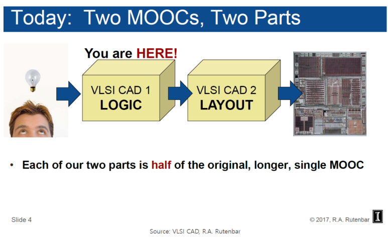
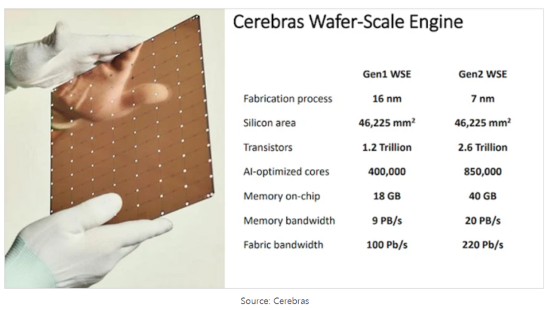
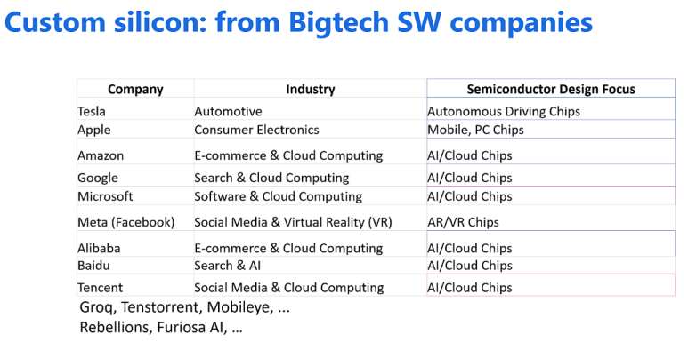

## EDA란? VLSI CAD란?

반도체 Fabrication에 사용될 Mask를 설계하기 위해, 많은 방법론들이 사용되었습니다.

반도체 업종 뿐만 아니라 다양한 분야의 사람들이 이해 할 수 있도록 글을 올립니다.

​

Open source EDA와 Commercial EDA의 현황, AI EDA... 등 이야기를 해보려고 합니다.

​

​

현대 시장에서 가장 지배적인 디지털 반도체 설계 방법은, 

(1) Hardware Description Lanugage 기반 Logical Design

(2) Electronic Design Automation Tool을 이용한 검증과 Physical Design

​

EDA란? VLSI CAD란?

컴퓨터를 이용한 설계를 CAD, Computer-Aided Design라고 부릅니다.

VLSI라고 불리는 Very Large Scale Integraed Circuit 같은 초대형 설계를 자동화 하는 SW는 VLSI CAD입니다.

CAD라는 용어는 기계, 건축, 예술 분야에서도 사용하니, 이 분야에 계시는 분들은 혼동을 방지하기 위해 EDA, Electronic Design Automation라고 부릅니다.

​

Synopsys에서 만든 설명을 봅시다.

https://www.youtube.com/watch?v=iDhpKq09XIo

설명 : 0:00 What is Electronic Design Automation (EDA)?0:12 The History of EDA0:21 The Importance of EDA1:03 What does EDA enable?1:23 EDA and SynopsysLearn more ab...

정리하면,

EDA는 Chip fabrication에 직접 관여하지는 않지만, "설계, 시뮬레이션, 검증"의 자동화 역할을 하고, 아래 세 가지 면에서 중요한 역할을 합니다.

1. TCAD: 반도체 제조 공정에 대한 설계 & 검증.

2. Design & Signoff: 설계/시뮬레이션/검증 자동화, 설계된 회로를 Foundry의 물리적 요구 사항과 비교.

3. Silicon Life Management: 칩 제조 후, 현장 배치까지 반도체의 신뢰성을 모니터링.

​

반도체는 아날로그 반도체용, 디지털 반도체용 등 다양한 분야가 있고,

Full custom, Semi custom 같은 가지로 또 나뉘어지고,

이 안에서도 더 세부적인 분야들이 있고, 그 세부적인 분야들에 대응되는 각 EDA Tool들이 있습니다.

https://www.youtube.com/watch?v=x07eJFVgNrM

설명 : APPLICATION SPECIFIC INTEGRATED CIRCUITS1. FULL CUSTOM DESIGN2. SEMI CUSTOM DESIGN👉👉👉Follow my Telegram Channel to access all PPTS and Notes which are dis...

> EDA Tool = Code2Code 자동화 + Code 검증

출처 : No Site

간단한 논리 회로 Code는 아래처럼 작성이 됩니다. 이 회로에는 XOR, AND 같은 논리적 정보만 담겨있고, XOR의 크기나 속도 같은 정보는 담겨있지 않습니다.

​

실제 반도체 소자에서는 XOR 회로에 대한 크기, 속도, 전력 같은 물리적 특성이 존재합니다.

(1) 이런 반도체 Device 엔지니어들이 SPICE code로 저장하고,

(2) Characterization 엔지니어들이 Library code로 저장하고

(3) Library 엔지니어들이 압축하여 DB Code로 저장합니다.

이 DB를 Process Design Kit, PDK에 담아 보내고,

Physical Design engineer들은 이 PDK에 담겨있는 디바이스의 물리적 정보를 갖고, Chip 설계를 합니다.

​

설계자들은 시장에서 경쟁력 있는 제품을 만들기 위해 좋은 PPA 특성을 갖는 반도체를 설계해야 합니다.

​

아래 설명은 Logic2Layout의 첫 시작인 Logic synthesis (논리 합성)의 유서깊은(?) 설명입니다.

(1) 반도체 설계를 논리적으로 담 Code를 input으로 받고

(2) Boolean형태의 code로 Translation하고,

(3) SDC, Library, PDK 등으로부터 실제 물리적인 정보들을 입력 받아 PDK에 존재하는 Cell들으로 Mapping하는 과정입니다.

​

이렇게 HDL + SDC + Library + PDK를 넣으면,

Foundry가 만들어준 Cell base로 되어있는 Gate Level Netlist가 나옵니다.

​

참고로, Synopsys의 Founder인 Aart de Geus 회장님은,

최초의 Constraint 기반의 Synthesis EDA tool "SOCRATES"를 만들었습니다.

그리고 Synopsys의 이름 어원은 "SYNthesis + OPtimization + SYSytem" 입니다.

​

Design Compiler, Fusion Compiler 같은 제품들이 대표적인 Logic synthesis tool입니다.

​

https://spectrum.ieee.org/aart-de-geus-profile

[The Maestro Behind Design-Software Behemoth Synopsys](https://spectrum.ieee.org/aart-de-geus-profile) : CEO Aart de Geus created logical synthesis, which transformed how ICs are designed

논리 합성을 통해 기본적인 Mapping과 Optimization이 끝나게 되면,

(1) 최초의 RTL code와 Gate Level Netlist의 Logical Equivalence Check

(2) Timing, Power 검증 및 Simulation

(3) Design for Testability

... 다양한 과정이 진행되고,

이제 Gate level netlist에 존재하는 Instance들에 대해 좌표를 지정하여 Place, Port와 Port 간의 Routing을 해주는 Place & Route 과정에 들어가게 됩니다.

​

​

그리고 Signoff 과정을 거치면 Tape-out되고..

GDS 혹은 oasis를 MDP하고...

이 Mask로 lithogrphy하고..

테스트와 패키징 하고나서 Fab-out히고..

SW 팀이 받아서 테스트하고.....

CES 같은 세계 전자제품 행사에 나가서 제품 홍보 후, 소비자들에게 제품이 전달되는 것입니다.

​

VLSI CAD 관련 추천 강의:

https://www.coursera.org/learn/vlsi-cad-logic

[VLSI CAD 파트 I: 로직](https://www.coursera.org/learn/vlsi-cad-logic) : University of Illinois Urbana-Champaign에서 제공합니다. 최신 VLSI 칩에는 로직, 제어, 메모리, 상호 연결 등 수많은 부품이 포함되어 있습니다. 이 복잡한 칩을 어떻게 설계할까요? 답은 CAD 소프트웨어 툴입니다. 구축 ... 무료로 등록하십시오.

https://www.coursera.org/learn/vlsi-cad-layout

[VLSI CAD 파트 II: 레이아웃](https://www.coursera.org/learn/vlsi-cad-layout) : University of Illinois Urbana-Champaign에서 제공합니다. 이 과정을 시작하기 전에 VLSI CAD 파트 I: 로직 과정을 완료해야 합니다. 최신 VLSI 칩은 수십억 개의 트랜지스터, 계산 및 제어를 위해 배치된 수백만 개의 로직 ... 무료로 등록하십시오.

​

정리하면,

반도체 칩은 엄청나게 복잡합니다. 아래 그림처럼 반도체 하나에 엄청나게 많은 트랜지스터들이 존재합니다.

작은 변화로 인해, 각 물리적 파라미터들이 미묘한 방식으로 서로 상호 작용할 수 있으며, 제조 공정의 변화는 물리적 특성 변화를 가져올 수 있습니다.

​

고려해야 할 것이 너무 많고, 정교한 자동화 없이는 이 수준의 복잡성을 관리할 방법이 없으며, EDA는 이 중요한 기술을 제공합니다. EDA가 없다면 오늘날 정도 수준의 반도체 장치를 설계하고 제조하는 것은 너무나도 큰 비용이 들게 될 것이고, 경제성이 없어 성공 불가능한 프로젝트가 될 것입니다. 그렇게 되면 산업계와 소비자들은 제한된 반도체만 사용 할 수 있을 것입니다.

​

​

​

다음 글은 Open-source EDA에 대한 글이 될 예정입니다. Fig들만 미리 보여드리면, 

https://www.linkedin.com/posts/kwantae-kim-930365141_ieee-sscs-python-activity-7210786988063444992-8Fkh?utm_source=share&utm_medium=member_desktop

[LinkedIn Kwantae Kim 페이지: #ieee #sscs #python #macos #m2 #windows #analog #open_source](https://www.linkedin.com/posts/kwantae-kim-930365141_ieee-sscs-python-activity-7210786988063444992-8Fkh?utm_source=share&utm_medium=member_desktop) : Interested in open-source IC designs, tools, PDKs? Ever searched for methods to automate your analog layouts instead of manual drawings? Looking for…

​

추천자료:

https://www.synopsys.com/glossary/what-is-electronic-design-automation.htmlhttps://www.synopsys.com/glossary/what-is-electronic-design-automation.html

 해시태그 : 