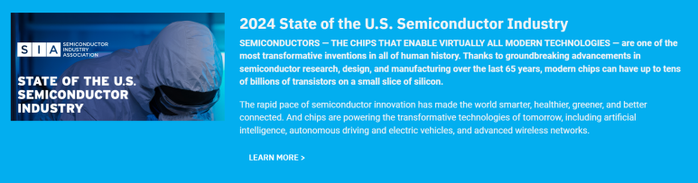

## 2024년 미국 반도체 산업의 현황과 미래 전망: SIA, STATE OF THE U.S. SEMICONDUCTOR INDUSTRY

Reference:

https://www.semiconductors.org/2024-state-of-the-u-s-semiconductor-industry/

[2024 State of the U.S. Semiconductor Industry](https://www.semiconductors.org/2024-state-of-the-u-s-semiconductor-industry/) : 

​

1줄 요약: 

인공지능의 핵심은 초미세공정 반도체 | 미국내 반도체 인력 부족 | 미국 Chips법과 산업 현황

​

CHIPS IMPLEMENTATION

CHIPS 법안의 실행은 미국의 반도체 생산능력을 대폭 확장하는 중요한 발판이 되었습니다. 이 법안을 통해 반도체 산업에 대한 대규모 투자가 이루어졌고, 다수의 제조시설이 미국 내에 신설.

https://www.nist.gov/chips/chips-implementation-strategies

[CHIPS Implementation Strategies](https://www.nist.gov/chips/chips-implementation-strategies) : President Biden signed the bipartisan Creating Helpful Incentives to Produce Semiconductors (CHIPS) Act of 2022 to tackle some of the big

​

 THE SEMICONDUCTOR WORKFORCE & EXPANDING THE TALENT PIPELINE

미국 내 반도체 인력은 다양한 역할에서 중요한 기술 인재를 필요로 하며, 현재와 미래의 성장을 지원할 수 있는 충분한 인력 확보 필요.

반도체 산업의 인재 풀 확대는 더 많은 STEM 교육 졸업생과 글로벌 인재의 유치 및 유지를 통해 이루어져야 합니다. 이는 기술적 진보와 산업의 지속 가능성에 필수적입니다.

현상태가 유지되는 경우, 2030년에는 ~70,000명의 인력 부족이 발생.

STEM(Science, Technology, Engineering, and Medicine)분야 석박사의 반도체 이민 열어둬야 할 것.

​

Source: McKinsey​

PROMOTING SUSTAINABILITY

반도체 산업은 환경 지속 가능성을 강조하며, 특히 생산 과정에서 유해 화학물질의 사용을 줄이는 것을 목표

​

SUPPLY CHAIN REBALANCING

글로벌 반도체 공급망의 균형 재조정은 더욱 다양하고 탄력적인 공급망 구축을 통해 이루어집니다. 이는 공급망의 안정성을 강화하고, 지정학적 리스크를 관리하기 위해 중요합니다.

반도체 무역은 글로벌 경제에서 중추적인 역할을 하며, 무역 정책과 협정은 반도체 산업의 글로벌 분포와 접근성에 직접적인 영향을 미칩니다.

반도체 산업은 지정학적 요인에 매우 민감하며, 국가 안보와 경제 안정성에 직접적인 영향을 받습니다.

미국에 생산기지를 구축 할 필요.

https://www.bcg.com/publications/2024/emerging-resilience-in-semiconductor-supply-chain

[Emerging Resilience in the Semiconductor Supply Chain](https://www.bcg.com/publications/2024/emerging-resilience-in-semiconductor-supply-chain) : A new report by the Semiconductor Industry Association and BCG details how geographic concentration in the chip making supply chain has created vulnerabilities.

​

THE GLOBAL SEMICONDUCTOR MARKET & SEMICONDUCTOR DEMAND DRIVERS

글로벌 반도체 시장은 AI, 자동차, 통신 등 다양한 분야에서의 수요 증가로 인해 지속적인 성장을 경험하고 있습니다.

반도체 수요는 기술 혁신과 전자기기의 보급 증가에 따라 증가하고 있으며, 이는 시장의 확장을 촉진합니다.

​

https://www.mckinsey.com/featured-insights/sustainable-inclusive-growth/charts/whats-driving-the-semiconductor-market

[What’s driving the semiconductor market](https://www.mckinsey.com/featured-insights/sustainable-inclusive-growth/charts/whats-driving-the-semiconductor-market) : With chip demand set to rise over the coming decade, the global semiconductor industry is poised to become a trillion-dollar industry by 2030.

​

GLOBAL MARKET SHARE & U.S. TECHNOLOGY COMPETITIVENESS

미국은 글로벌 반도체 시장에서 중요한 위치를 차지하고 있으며, 이는 R&D 투자와 기술 리더십에 기반한 것.

중국이 막대한 투자를 하고 있고,  빠른속도로 추격 중

반도체 산업은 미국 경제에 중요한 기여를 하고 있으며, 많은 간접 일자리 창출과 경제 활동을 촉진

정책 입안자들은 미국의 기술 리더십을 유지하고 강화하기 위해 다양한 혁신 정책을 개발하고 있습니다. 이러한 정책은 반도체 설계와 제조의 미래를 형성하는 데 중요한 역할을 합니다.

https://www.brookings.edu/articles/technology-competition-between-nations-views-from-industry-leaders/

[Technology competition between nations: Views from industry leaders](https://www.brookings.edu/articles/technology-competition-between-nations-views-from-industry-leaders/) : Technology competition has become a major fault line of geopolitics. The United States and its allies and partners have recently taken aggressive steps to manage that competition. Most notably, the U.S. and EU have each passed a “Chips Act” designed to bolster domestic semiconductor fabrication, whi...

​

 해시태그 : 