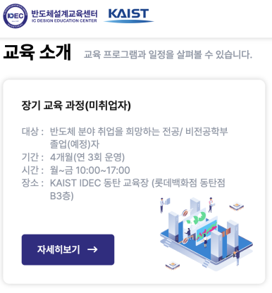
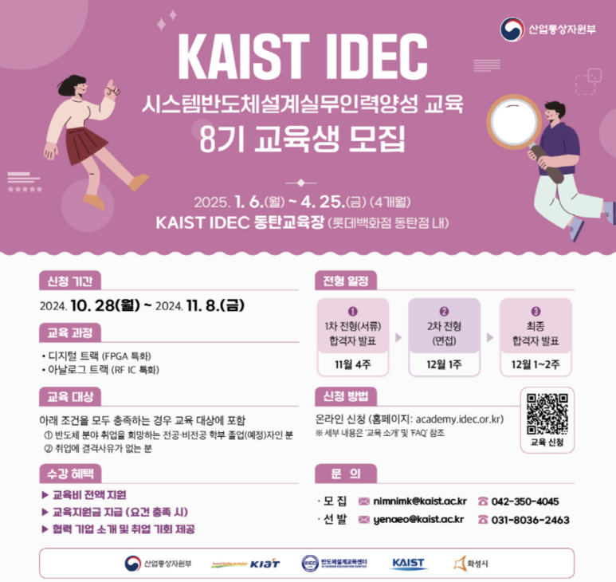
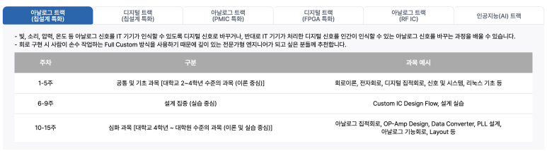

## KAIST IDEC 시스템반도체 설계실무인력양성 교육 8기 교육생 모집: 4개월과정+돈도 줌!

반도체 산업에 관심이 있는 취준생분들께 좋은 소식을 전해드립니다. KAIST IDEC에서 시스템반도체 설계실무인력양성 교육 8기 교육생을 모집하고 있습니다. 이번 기회는 반도체 설계 분야에서 커리어를 쌓고자 하는 분들께 매우 유익한 프로그램입니다.

​

KAIST/IDEC에서 수료증 나오고 + 교육비 무료 + 중식 제공 + 수료 후 지원금 지원 + 회사 취업 연계까지 해주는 것 같습니다.

​

대상

반도체 분야 취업을 희망하는 전공/비전공학부 졸업(예정)자

기간

4개월(연 3회 운영) 1월부터 4월까지니까, 3/4학년 학생들, 졸업자들이 신청하면 딱이네요.

시간

월~금 10:00~17:00

장소

KAIST IDEC 동탄 교육장(롯데백화점 동탄점 B3층)

개요

6개 트랙 중 수요에 따라 개설 및 운영

시스템반도체 설계에 필요한 기본적인 이론부터 산업 현장에서 바로 적용 가능한 실습까지 학습

현직 설계 기업 임원 및 엔지니어, 국내 우수 대학 교수들로 강사진 구성

과정

기술분야별 6개 트랙 운영

​

​

​

​

아날로그 칩 설계 트랙

디지털 칩 설계 트랙

​

아날로그 PMIC 트랙

디지털 FPGA 트랙

아날로그 RF IC 트랙

인공지능 AI 트랙

선발절차: 모집공고 -> 서류전형 -> 면접전형 -> 합격통보

교육특전 진짜 나랏돈이라 너무 좋군요.

- 교육비 100% 무료지원. 심지어 KAIST, IDEC 수료증 나오고

- 중식 지원

- 교육 수료시 지원금지급

- 협력업체 취업 연계

저는 안해봤지만, 제가 대학생 시절으로 돌아가면 해보고싶은 과정입니다.

트랙 어떤거로 하냐에 따라 취업 길이 바뀔 것 같으니 신중히 선택하셔야 할듯.

 해시태그 : 