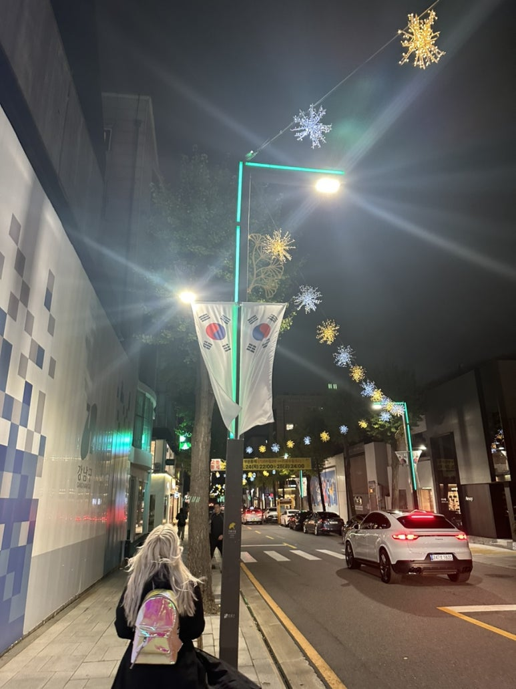
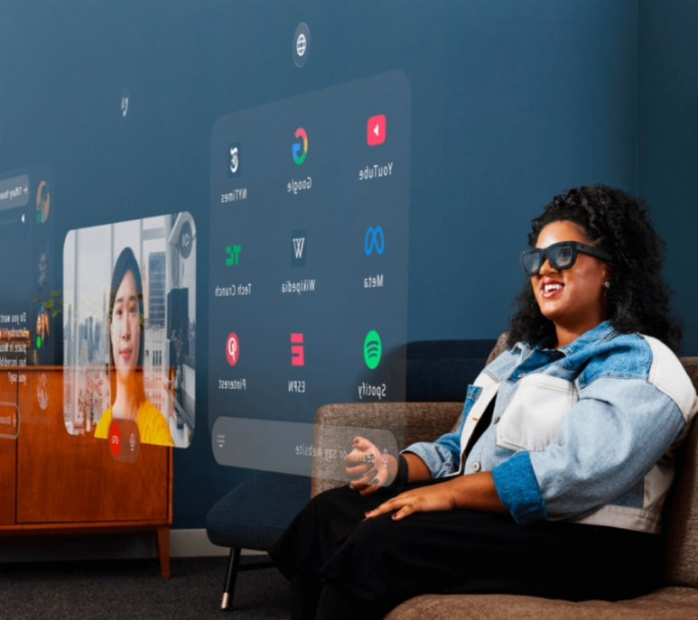
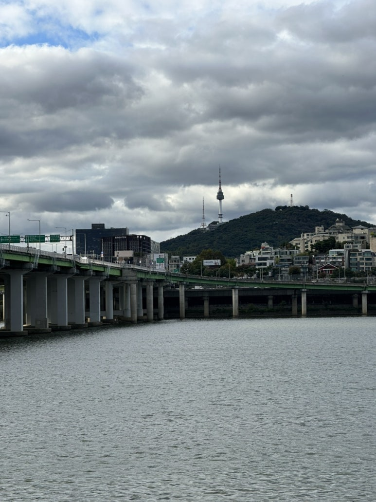
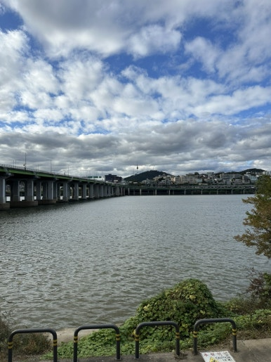
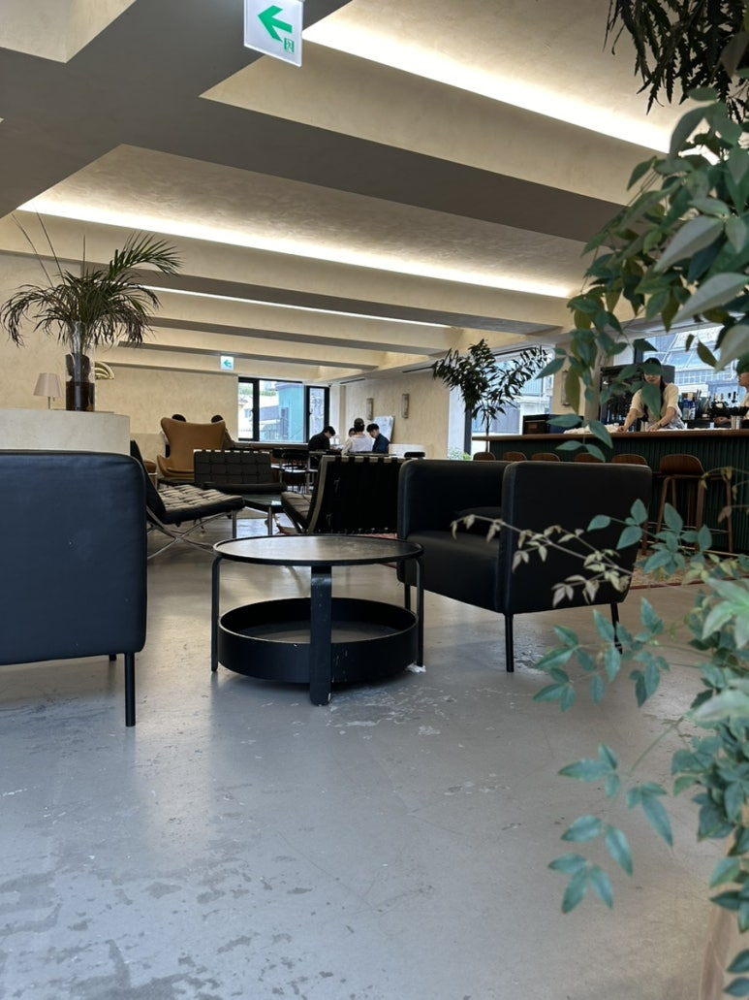

## 겨울이 오기 전에, 나뭇잎이 푸른 동안

​

간만에 신사동 다녀왔다.

주거단지가 살기에는 좋긴한데… 이런 활기찬 곳에서도 살아보고싶다. 🤔

아이폰16프로 구경하러 왔는데,

이제 진짜 혁신은 없는건가?

아이폰15,16 시리즈는 진짜 재미 없군.

메타의 스마트글래스 ‘오라이온’만 존버 중.

메타 퀘스트는 가성비 좋아서 마음에 들었고… 애플 비전프로는 다 좋은데 너무 크기가 커서…

​

스마트폰에서 혁신은 끝난것 같구 글래스 쓰고싶음.

스마트폰 들고 손가락 타닥거리기도 귀찮다.

내가 스무살 때는 ‘감성타코’가 되게 힙한 느낌이라 데이트코스로 가곤 했는데, 요즘은 동네 타코집도 꽤 수준이 높다 🌮

​

타코 사진은 없음 ㅋㅋ

장소명 : 타코앤칠리

주소 : 서울특별시 강남구 강남대로160길 21 102호

이번주 목/금요일에 비가 너무 많이 왔다.

주말은 안 오길 바랬는데, 주말에는 예쁜 구름만 꼈다. ☁️

텐트 치고 낮잠 때림.

원래 한강 와서 한강 책 읽으려 했는데, 날씨가 너무 좋더라.. 🛌

그리고 프론트서울 왔다.

만화가 박태준 작가님 카페로 유명한 프론트서울.

​

위치 좋고, 소파 편함. 커피 맛도 괜춘.

근데 요즘 왜 대형카페는 죄다 아메리카노 가격이 다 7~8000원 하는걸까… 돈 열심히 벌자.

장소명 : 프론트서울

주소 : 서울특별시 강남구 도산대로11길 29 1층 FRONT SEOUL

인테리어가 예쁜가?: 내 취향은아니긴 하지만, 각각 가구들은 스칸디나비안+아메리칸 감성이 섞여있고… 편해서 좋았음.

덴마크에서 프리츠한센 쇼룸이 진짜 예뻤는데.

우리 회사가 일하기 좋은 곳으로 다시 한 번 선정되었다고 한다.

일하기 좋은 곳 인정. 행복함.

​

왜 좋냐?

(1) 전세계 반도체 회사와 협업하면서 다양한 경험 가능

(2) 주변에 똑똑한 사람들이 정말 많음. 회사에 석박사 비율이 전체 인원의 6~70% 정도라는데… 그래서일까?

(3) 회사 상사들이 다 좋고, 고객도 좋다. 그냥 성격이 좋은건 솔직히 난 필요 없다고 생각함. 내 사람들은 똑똑하고 책임감 있는데 성격도 좋다. 배울 점이 많다.

(4) 일이 어려워서 좋다. 늘 처음 겪는 문제가 나오는데, 나만 못 겪어본게 아니라 그냥 이 세상에서 처음 발견된 문제들. 그리고 이런것에 대해, 사내 문서화가 잘 되어있다.

(5) 물어볼 수 있는 사람이 많다. 특정 기술을 만든 사람이 우리 회사에 있기에, 그런 사람들에게 그냥 사내메신저로 물어볼 수 있다.

​

​

분명 단점도 있긴함. 대부분 ‘(1) 더 큰 보상, (2) 다시 설계 엔지니어로 (3) 루틴화된 업무가 하고싶다.’ 이런 목표 때문에 이직을 하는 것 같다.

​

나도 회사에 기여도 많이 하고!

동시에 회사로부터 내가 얻어갈 수 있는 것들 다 가져가고싶다.

원래 글을 여기서 마치려고 했는데,

최근에 대학생들과 3번의 멘토링을 했기에 간단히 써보려고함.

​

1. 영어 할 줄 알아야 됨. 영어를 할 줄 알면 인터넷에 접근 가능한 정보의 양이 수십배 늘게 됨.

국내에 100조원 넘는 대기업이 2개, 전세계에는 100개가 넘는다. 이중에 상위 10종목은 1000조원을 넘는다.

​

2. 돈을 많이 벌려면? 근로소득은 당신이 소속된 회사가 돈을 많이 벌어야, 많이 주든가 말든가 할 수 있음.

섹터와 회사를 잘 선정해야 함.

​

3. AI가 사람을 완전 대체하기는 힘들겠지만, AI 쓰는 한명이 3명, 5명, x명 일을 할 수 있는것은 맞음.

회사 입장에서는 AI 쓰는 한명이 굳이 한국인일 필요는 없고, 잘 교육된 인도인/베트남인이어도 상관 없음.

 해시태그 : 