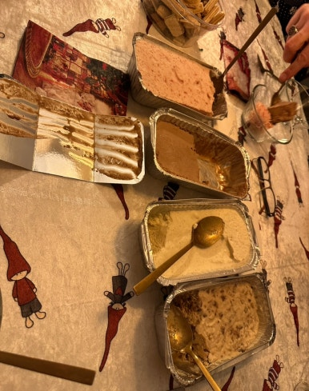
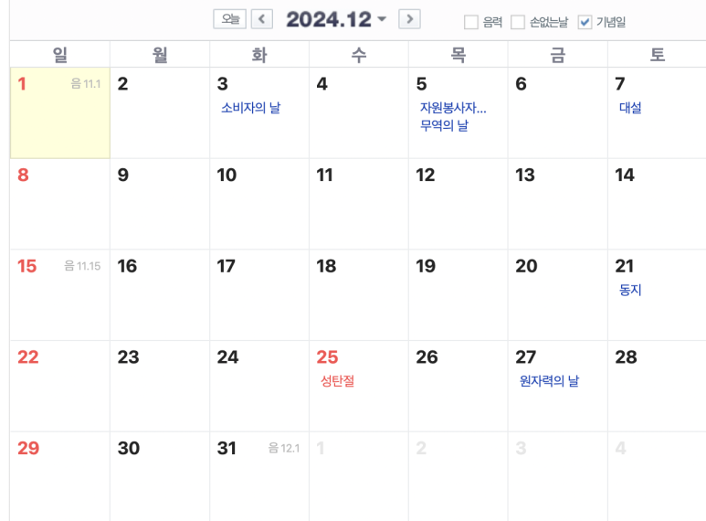

## 미국 회사의 연말 셧다운 이야기: Year end shutdown

미국/유럽계 회사에서 근무하면 좋은 점 중 하나... "연말 Shutdown"

> 크리스마스부터 새해까지 통째로 쉰다

출처 : No Site

회사마다 다르긴한데, 이 기간에 쉬는 회사/쉬는 사람들이 많다.

- 동양 문화에는 "설", "추석"이 있고, 한국의 연중 공휴일은 15개이다.

- 서양 문화에는 이런게 없다! 설, 추석이 없다.

그래서 이들은 Halloween, Christmas, Thanks giving day에 진심인듯 하다. (핼로윈은 쉬는날 아니고, 추수감사절도 2일 정도 쉼.)

​

미국은 그래서… 총 공휴일이 10일 정도다. 정말 안 쉰다 얘네는.

점심시간 없이 🥪 샌드위치 물고 9시 출근 5시 퇴근 하는 사람도 있고,

그냥 회사에 사는 사람들도 있다.

​

​

그래서 이 크리스마스 기간 ~ 신년까지 쉰다. 이 기간이 추석+설이라고 보면 되고, 그래서 이 기간동안 미국의 업무지원이 다 늦다.

이 때에 할머니 할아버지 친척들 보러 가고..... 가족, 친구들끼리 파티도 하고.....여행도 가고.... 그런다.

​

​

​

연말 셧다운 일정은 회사마다 좀 다르다.

(1) 셧다운 자체가 없는 회사

(2) 크리스마스부터 1월1일까지 쉬는 회사

(3) 크리스마스 주 + 새해 주까지 쭉 다 쉬는 회사

​

그리고 또 하나.

(1) 본사 셧다운에 맞춰서 쉬는 회사

(2) 본사가 셧다운 하더라도, 외국 사이트는 일 하는 회사

​

우리 회사 Synopsys는 본사에 맞춰서 다같이 쉰다!

너무 좋다. Synopsys 지금 바로 Apply

https://careers.synopsys.com/

[Working at Synopsys](https://careers.synopsys.com/) : Browse available job openings at Synopsys

​

12월 20일 - 1월2일 아프리카 여행 다녀옵니다.

나라는 비밀...!

​

호주는 곧 갈거고.. 남미 가보고싶은데 딱히 끌리진 않네. 중동 한번 더 가고싶군

 해시태그 : 