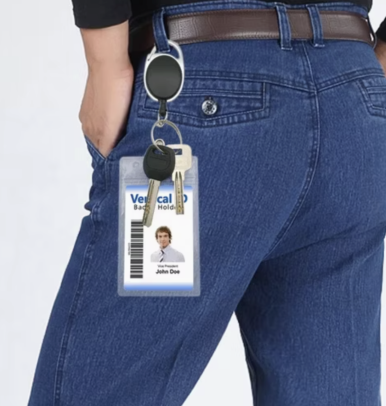
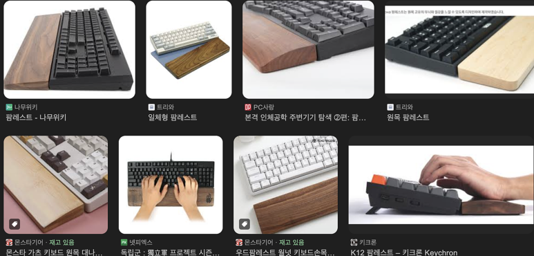

## [개발자 엔지니어 선물 추천] What's on my desk?: 내가 엔지니어로써 느끼는 사무실의 질 향상 아이템

잠시 쉬어가면서.. 제 책상에는 무엇이 있는가! 엔지니어 친구들에게 어떤 것을 선물하면 좋은가에 대해 이야기해보겠습니다.

​

Card Badge reels

(1) 저는 옷 외에는 피부에 뭔가 닿는 느낌을 싫어하는데, 그 중 하나가 사원증 목걸이입니다.

(2) 사원증 목걸이가 오래 매고 있으면... 뭔가 목 노화에 일조하는 느낌입니다.

(3) 그리고 사원증 목에 걸고 있으면 움직일 때 사원증 흔들리는게 거슬립니다.

​

앞쪽에 사원증 차면 움직이면서 부딪히기 때문에, 옆에 차는거 추천합니다.

"Reels" 라서, 안에 낚시줄? 고무줄? 같은게 들어있어서 사원증 잡고 땡기면 쭉 뽑을 수 있습니다. 이거로 출퇴근 찍으면 편합니다 ㅎㅎ

​

​

진짜 마음에 드는 키보드+마우스

나름 키보드 계의 명품 라인업은 (키보드 하나가 30만원 이상!)

해피해킹

리얼포스

레오폴드

이정도 라인업이고, 애플 좋아하시는 분들은 매직키보드 씁니다.

​

인체공학 키보드 좋아하시는 분들은 로지텍꺼.

​

마우스는 MX Master 3S 많이 씁니다. 마우스 이거 강추합니다.... 편하고, 기능도 많은데 각 기능들이나 휠 느낌, 마우스 클릭 감이 정말 부드러워요.

이거 선물로 강력추천합니다!!!

​

키보드 / 마우스 좋은거 쓴다고 일이 잘 되는건 아닌데,

만약에 회사에서 제공하는 키보드/마우스가 본인이랑 잘 안 맞으면, 쓸 때마다 스트레스 받고 이게 손목 건강에도 안 좋더라구요.

​

참고로, 청축 기계식 키보드는 사무실 내에서 사용하지 마세요........

사무실 내 누군가는 스페이스바, 엔터 쎄게 누르는 것도 싫어합니다.............

​

이런 키보드도 인기는 많던데, 저는 소리에 민감해서... 싫긴한데, 많이들 씁니다.

https://www.youtube.com/shorts/EhywgolaHhc

설명 : 이건 그냥 키보드가 아니에요... 만두 키캡과 Hi98의 환상적인 조합! 😍 타건할 때 조약돌을 만지는 듯한 소리까지?! 이번 영상에서 그 특별한 소리를 직접 들어보세요! 🎧 키보드 덕후라면 놓치면 안 되는 타건 사운드 ASMR, 바로 확인하세요!

​

​

​

팜레스트

키보드 높이가 높은 키보드를 사용하시는 경우, 팜레스트 사용하시는 것을 추천합니다.

손목 아프기 시작하면, 이게 뭘 사용해도 아파요. 미리 쓰시는 것을 추천합니다.

​

저는 팜레스트 안 쓰는 대신에 높이가 펜타그래프 타입 키보드 사용합니다.

​

모션데스크 + 의자

회사에서는 스틸케이스 모션데스크 + 제스쳐 체어 (Synopsys는 대부분 오피스가 Steelcase 의자 사용합니다.)

집에서는 허먼밀러 미라 쓰고 있습니다.

​

하루에 2시간도 안 타는 자동차에는 천만원 이상 쓰는데,

의자에는 뭐 12시간 이상 앉아있으니 여러가지 앉아보고 딱 맞는거 사시는 것 추천합니다.

​

허먼밀러, 스틸케이스, 해워스, 휴먼스케일 정도가 프리미엄 라인으로 불리고, 백화점 가보면 괜찮은 국내 브랜드도 많더군요.

허리 아프기 시작하면 돈도 돈인데 몸이 너무 고생해서....!!! 의자는 꼭 잘 맞는 것 쓰십시오.

​

​

​

케이블 오거나이저

강력테이프가 붙어있는데요.

책상 테두리 구석에 붙여놓으면, 선 정리도 되고 좋습니다.

​

책상이 깨끗해야 정신 안 산만해지잖아요?

이런 선들 최대한 안 보이도록해놓는게 좋습니다.

​

전동칫솔

전동칫솔 좋아요. 알아서 시간 체크 되서, 시간 되면 양치 하라고 알려주고...

칫솔질 시간되면 알아서 반대쪽 닦아라 알림 주고...

너무 세게 닦는지 약하게 닦는지 알려주고....

​

저는 오랄비 io10 쓰고 있습니다.

​

​

​

노트북 스탠드

노트북 스탠드 괜찮은거 하나 사면 평생 씁니다.

브랜드는 딱히 추천할게 없고, "2단 거치대"가 적당히 가격도 저렴하고, 가방에도 넣을 수 있고 여러모로 괜찮아요.

​

엔지니어들은 보통 "Laptop + Dual monitor" 셋업으로 사용하는데, 저는 Laptop에서 Teams, Outlook화면만 띄워놓습니다.

​

싸고 리뷰 좋은거 적당한거 사십쇼.

​

고속충전기

엔지니어 / 개발자들은....

Laptop, cellphone, earphone.. 그리고 태블릿, 헤드폰 등 정말 들고 다니는 전자제품들이 많습니다.

회사 책상 위에서는 개별 충전기를 써도 되는데,

​

어쨌든 이 제품들을 보부상마냥 가방에 넣고 다니려면:

(1) 이런 것들 한번에 다 들고 다니려면 멀티 충전기 있어야됨.

(2) 멀티충전기는 열이 심하므로, GaN충전기를 사야 그나마 열이 좀 덜함.

(3) 노트북 충전은 보통 최소... 50W 정도를 권하고, 고성능 제품군은 140W 이상 사용.

​

그러므로, "140W 이상 지원되는 GaN 멀티충전기"를 구매하시는 것이 좋습니다.

저는 벨킨 씁니다.

​

​

​

기타

여기에 머그컵, 텀블러, 종합비타민 정도?

​

아... 그리고 책상 밑에 아래 아이템들이 있습니다.

(1) 슬리퍼

(2) 박카스

(3) 타이레놀

(4) 종합감기약

(5) 인공눈물

​

​

여러분의 꿀템 추천 부탁 좀 드릴게요????? 

​

​

 해시태그 : 