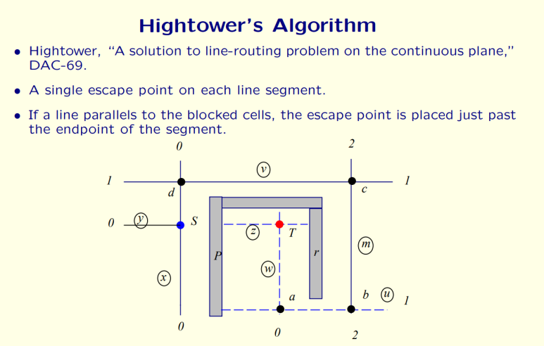

## [VLSI] Physical Design에서 Routing이란? Global routing, Detailed routing

Physical design의 Place & Route 후반부 단계에서 routing은 Chip의 성능, 신뢰성, 제조 수율(yield)에 직결되는 핵심 작업입니다.

​

Placement 이후 모든 In/Out port에 Net을 정확히 interconnect하고, Foundry가 제시하는 Manufacturing Design Rule을 만족시키며, PPA, SI, manufacturability 측면의 목표를 달성해야 합니다..

​

What Is Routing In VLSI Physical Design?, SiliconVLSI​

Technology node가 5nm 이하로 내려감에 따라 transistor density는 기하급수적으로 증가하고, multi-layer, multi-patterning 환경에서의 routing 문제 복잡도는 매우 빠르게 커지고있습니다.

예를들면, 요즘 AI Chip Instance count가 Billion 단위가 되는 것을 흔히 볼 수 있는데, 이 Billion단위의 instance를 연결 하는 Billion 이상의 net을 포함하며 조건(PPA와 Yield)를 위한 routing 알고리즘이 꼭 필요합니다.

​

간단히 얘기하면, "디자인과 제약조건이 담긴 Code"들을 "Routing 된 Code"로 변환하는 과정이라..... 텍스트파일을 읽고, 조건문 돌리고 반복문 돌리면서 함수 적용하는 Code2Code 작업입니다.

​

말이야 쉬운데, NP-complete 문제라서, 코드 짜려면, 진짜 어렵습니다.

---

Two-Stage Routing란?

Routing 문제는 일반적으로 크게 두 단계로 나누어 해결합니다.

Routing: Global routinfg -> Detailed Routing 순서.

​

​

1. Global Routing란?

목적: chip을 tile(또는 global cell)로 partition한 뒤, 각 port들을 찾고, 각 net이 통과할 tile-to-tile 방향성 결정 (위 그림 참조)

모델링: chip 전체를 coarse한 grid 형태로 나누어 global-routing graph를 형성한다. 각 tile은 node, tile 간 경계는 edge로 표현되며, 각 edge는 해당 경로를 통과 가능한 capacity(대략적인 track 수)를 가진다. Multi-commodity flow, ILP, min-cost flow, linear programming relaxation 등의 수학적 기법이나 heuristic을 사용하기도하고, Neural net으로 해결하려는 시도들도 있음.

목표 함수:

total wirelength 최소화

congestion 완화

timing-driven 경로 선택

critical net 우선 처리

SI 개선 등

​

2. Detailed Routing란?

목적: global routing이 제시한 경로를 기반으로 실제 track 배치, via 위치 결정, 각 metal layer별 wire shape 및 spacing을 정한다. (위 그림 참조)

모델:

Grid-Based: Routing grid 위에서 wire를 track 단위로 할당하고, reserved layer model(짝수 layer 수직, 홀수 layer 수평)을 통해 DRC 만족을 용이하게 한다.

Gridless (Shape-Based): variable wire width, spacing, off-grid via 등...  corner stitching, implicit connection graph

---

Routing 제약사항 (Constraints) 및 고려사항

Design Rule Constraints (DRC): 최소 wire width, spacing, via dimension, end-of-line spacing, multi-patterning alignment, CMP rule, density rule 등...

​

2. Performance Constraints:

Timing: 선진 공정에서는 Interconnect delay가 게이트 delay를 능가하기에 Routing이 매우 중요.

Signal Integrity (SI): Crosstalk noise, coupling capacitance, IR-drop 고려를 위해 shield wire, spacing 증가, layer 선택 등의 전략이 필요.

Comparative STM-based study of thermal evolution of Co and Ni germanide nanostructures on Ge(001), Tomasz Grzela Poznań University of Technology​

3. Reliability and Manufacturability Constraints:

EM (Electromigration): 높은 current density를 견딜 수 있도록 wire width를 조정하거나 via redundancy 고려.

Patterning Complexity (SADP/SAQP): Double, Quadruple patterning, Directed Self-Assembly  기반 공정에서 mask resolution가능하도록 routing 레이아웃을 구성해야 한다. routing 과정에서 coloring conflict와 pattern decomposition feasibility를 함께 고려 필요

---

대표적인 기본 Routing 알고리즘들:

(이 내용들은 EDA 회사 R&D 신입 면접에서 종종 나오는 것들)

Maze Routing (Lee’s Algorithm): 1961년에 나온 유서깊은 알고리즘...!!!

특징: BFS 기반 wave propagation으로 shortest path를 찾으며, 경로가 존재하면 반드시 발견한다는 최적성

단점: O(mN) 복잡도. 현대 디자인에는 비현실적임.

개선: 2-bit coding (Akers), framing, double fanout, hierarchical routing 등으로 메모리 사용량 및 runtime 단축, Blind search를 줄이기 위한 heuristic 적용..?

2. Line-Search Routing (Mikami-Tabuchi, Hightower):

개념: grid cell 단위가 아닌 line segment 단위로 탐색 공간을 축소한다.

장점: 메모리 및 런타임 개선

단점: shortest path 보장 어려움, 경우에 따라 path 존재 시에도 실패 가능. Backtracking 필요.

3. A*-Search Routing:

개념: A*-search는 f(x)=g(x)+h(x) 형태의 heuristic 기반 best-first search를 사용한다. Manhattan routing 상황에서 h(x)가 admissible하다면 최적성을 보장.

효용: blind BFS에 비해 훨씬 적은 탐색으로 target 근방 경로를 빠르게 찾는다.

By dbenzhuser - self-made after a sample from Snorky, CC BY-SA 3.0​

위 알고리즘들 관련하여, 아래 링크에 설명 아주 잘 되어있으므로, 제 설명은 무시하고 아래꺼 보십시오. 제가 오개념을 넣었을까봐 두렵군요. 

https://www.eecs.northwestern.edu/~haizhou/357/lec6.pdf

---

이 외 Global Routing 기법:

Multi-Commodity Flow / Min-Cost Flow / ILP 기반 모델링:

Negotiated Congestion (e.g., BoxRouter, NCTU-GR):

Hierarchical & Multilevel Routing:

Machine Learning (ML) 및 Reinforcement Learning (RL) 응용:

---

이 외 Detailed Routing Considerations 기법:

Gridless (Shape-Based) Routing:

Complex DRC & LFD (Lithography-Friendly Design):

Pattern Decomposition-Friendly Routing:

A Novel Framework for Multilevel Full-Chip Gridless Routing ∗ Tai-Chen Chen Yao-Wen Chang Shyh-Chang Lin​

---

Routing은 placement 결과를 토대로 복잡한 DRC, timing, SI, EM, multi-patterning constraint를 모두 만족해야 하는 어려운 NP-hard 문제로, maze routing, A*-search routing, line-search routing과 같은 고전적 알고리즘부터 ILP, min-cost flow, ML/RL 기반의 최신 기법까지 폭넓은 스펙트럼의 접근법이 존재합니다.

​

앞으로의 routing 알고리즘은 manufacturability, yield, 성능을 극대화하기 위해 통계적 기법, 경험적 기법, 인공지능 기반 기법들을 소개 할 예정입니다.  iterative co-optimization, advanced patterning rule도 계속 다뤄보겠습니다.

GR -> DR 순서로 세부 알고리즘을 소개하고 Parasitic extraction에 대한 내용도 쭉 달려보겠습니다.

​

​

어쨌든 이런 것들이 모여서, P&R Tool이 만들어지고, 이런 P&R Tool을 통해 디지털 회로의 Layout이 그려지는구나~ 이정도만 이 글에서 가져가시면 좋겠군요.

 해시태그 : 