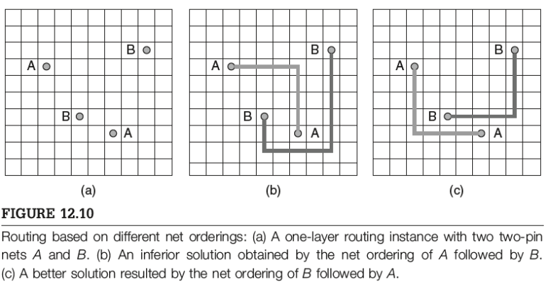
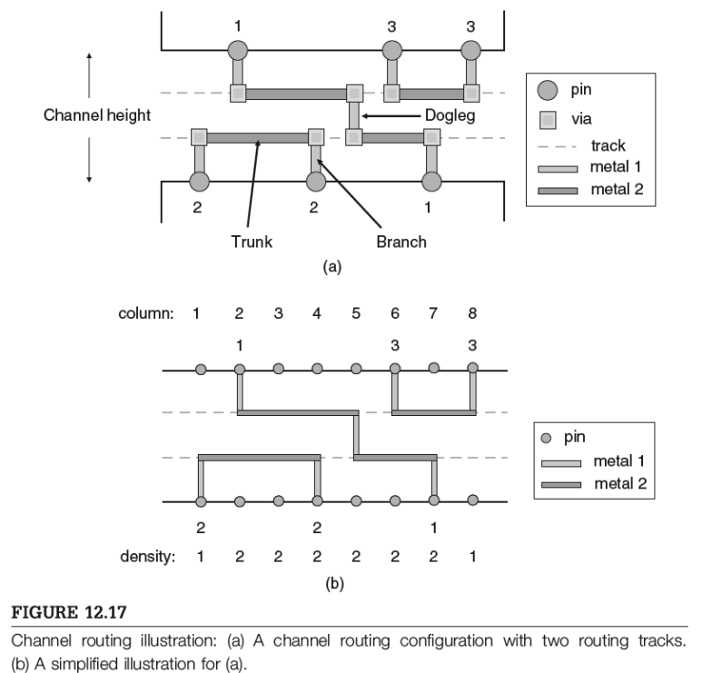
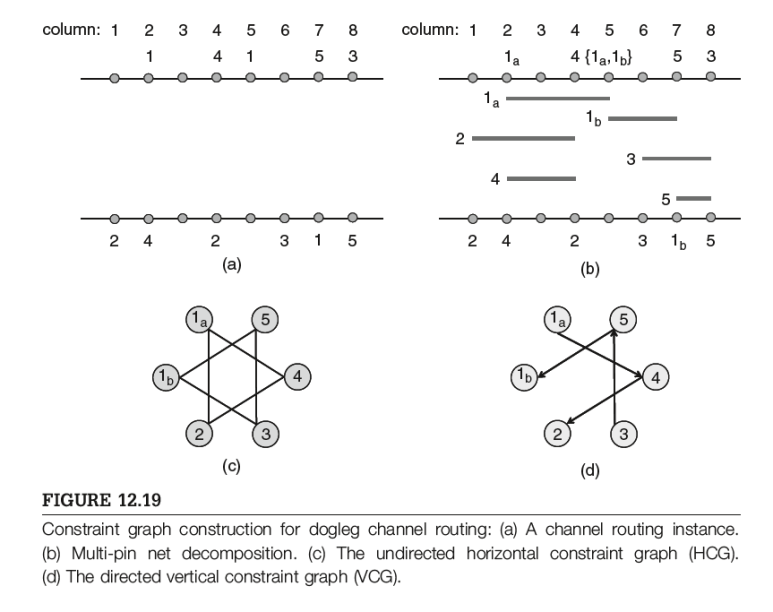
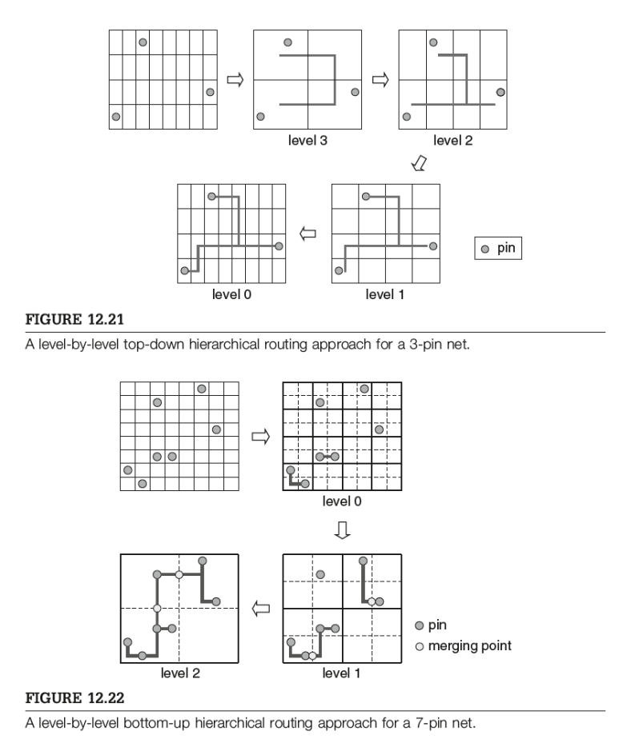
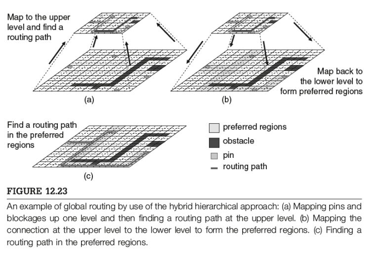
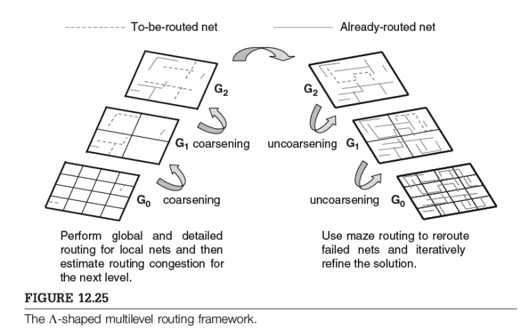

## [VLSI 설계 가이드] Global Routing이란? Detailed Routing이란?

참고서적: Electronic Design Automation, Yao-Wen Chang

​

반도체 설계에서는

칩 전체의 메탈 배선 전략을 잡고(Global Routing)

실제 트랙(track)과 비아(via)를 이용해 세밀하게 배선을 결정(Detailed Routing)함으로써

최종적으로 제조 가능한 형태의 레이아웃을 형성합니다.

---

1. Global Routing

Global Routing은 칩 전체를 Tile으로 나눈 뒤, 각 Net이 어느 경로로 배선될지를 ‘대략적’으로 결정하는 단계입니다.

​

목표:

Congestion 최소화: 특정 구역이 과도하게 배선으로 막히지 않도록 균형 있게 분산

Wirelength 최소화: 불필요하게 긴 배선을 줄여 지연(latency)과 면적 절감을 유도

Timing 고려: 타이밍에 민감한 경로(critical path)는 우회 없이 배선

전통적으로 Flat level 접근이 존재하지만, 칩 규모가 커질수록 이 방식은 비효율적이므로, Hierarchical 또는 Multilevel 접근이 부상하고 있습니다.

​

대표 기법

Sequential Global Routing

넷을 한 줄로(어떤 순서로) 나열해 순차적으로 라우팅

Net Ordering(순서)에 따라 결과가 크게 달라짐 → Rip-Up and Reroute로 보완

Pattern Routing(L- 혹은 Z-shaped 라우팅) 등을 자주 사용해 빠르게 전체 경로를 잡음

Concurrent Global Routing

모든 넷을 동시에 고려 (예: 0-1 Integer Linear Programming(ILP) 기반)

이론적으로 더욱 최적解에 가까울 수 있으나, 문제 크기가 커질수록 계산량 폭증 → 주로 부분 문제(subproblem) 단위로 해결

Tree-Based Routing (Steiner Tree)

Multi-pin 넷을 Steiner Tree로 연결해 전체 Wirelength를 줄이는 기법

Minimum Rectilinear Steiner Tree(MRST)를 구하는 것은 NP-hard → MST 기반 근사 알고리즘(예: Iterated 1-Steiner, FLUTE 등) 활용

​

---

2. Detailed Routing

Detailed Routing은 Global Routing 결과를 기반으로, 실제로 어느 Track(층별 수평·수직 배선)과 어느 Via(층간 연결)을 사용할지 결정하는 단계입니다.

과거 메탈 레이어가 2~3개에 불과할 때는, 블록 사이 “채널”만 사용했던 Channel Routing이 일반적이었습니다.

요즘은 10개 이상의 레이어가 흔해, 셀 위를 직접 배선하는 Full-Chip Routing이 필수가 되었습니다.

 

Channel Routing

Channel Density: 특정 세로 컬럼을 지나는 넷들의 최대 개수를 밀도(density)라고 하며, 필요한 최소 트랙 수의 하한이 됩니다

Dogleg:하나의 넷이 여러 트랙을 오가며 “굽은” 형태로 배선하는 기법. 이를 허용하면 트랙(채널 높이) 수를 줄일 수 있음.

Channel Routing 알고리즘:

Constrained Left-Edge Algorithm 및 HCG/VCG(Horizontal/Vertical Constraint Graph)를 통해, 겹치는 구간을 공유할 수 없도록 트랙을 배정. Dogleg을 활용해 채널 높이 최소화.

​

Full-Chip Routing: 채널만이 아닌, 칩 전체에 대해 세밀한 라우팅을 수행

​

Hierarchical Framework(Top-Down, Bottom-Up, Hybrid): 문제를 여러 레벨로 분할해 부분 문제를 해결한 뒤 통합

​

Multilevel Framework

Coarsening과 Uncoarsening반복

각 레벨에서 Global & Detailed Routing을 동시 고려 → capacity 예측이 실제에 가깝게 조정됨

​

---

이외에도, 

Crosstalk(신호 간섭), CMP(Chemical-Mechanical Polishing) Variations, OPC(Optical Proximity Correction) 비용 등을 고려해야 함

Layer/Track Assignment 단계에서 미리 간섭이나 제조 변화를 줄일 수 있는 방향으로 배선 경로 결정

​

4. 종합 정리

Global Routing: 대략적인 경로(혼잡도·배선 길이·타이밍 고려)를 결정

Detailed Routing: 결정된 경로를 실제 Track과 Via에 Mapping하면서 실제로 제조가 가능한 수준의 회로도를 만듬.

Channel Routing에서 Full-Chip Routing으로: 현대 공정에서 셀 위 배선이 일반화되면서, 채널 기반 접근이 줄고 칩 전체 범위를 고려하는 방식으로 왔음.

​

미세공정에서 고려해야하는 주요 요소로는 아래와 같은 아이템들

Crosstalk & Timing

OPC & CMP

Antenna & Redundant-Via

→ 모두 라우팅 단계에서 제대로 고려되어야, Signoff까지 무사히 나갈 수 있음.

 해시태그 : 