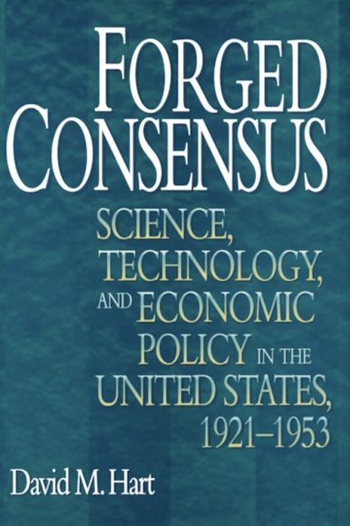
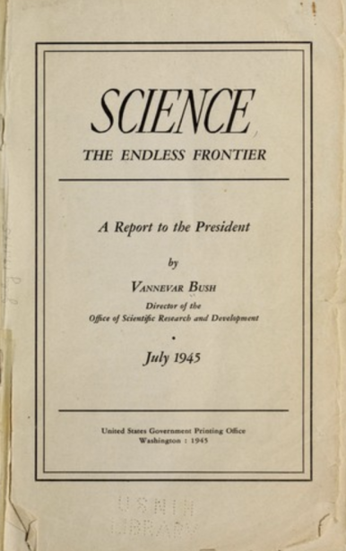

## [과학기술 이념 정리] 미국은 어떻게 과학기술 강대국이 되었는가?

미국 연방 과학 지원의 조직과 혁신에 대해 심도 있게 탐구해보려 합니다.

특히, 리처드 넬슨의 혁신 생태계 개념을 바탕으로, 미국의 R&D 혁신 주체들의 조직적 역사와 이들이 지닌 강점과 약점을 분석해보겠습니다.

​

이 글은 David Hart의 저서 Forged Consensus에서 제시된 다섯 가지 주요 이념을 중심으로 전개됩니다.

보수주의 (Conservatism)

보수주의는 국가의 역할을 주로 국방과 군사 기술 혁신에 한정시키려는 시각입니다.

이 관점에 따르면, 정부는 방위 측면에서만 R&D를 지원하고, 국내 경제와는 분리하여 관리해야 한다고 주장합니다. 이러한 이념은 우드로 윌슨의 제1차 세계대전 동원 기간 동안 과도한 산업 통제에 대한 반발로 등장했습니다. 대표적인 인물로는 Bell lab의 전 회장이자 국가 과학 아카데미의 전 회장인 Frank Jewett가 있습니다. 그는 정부가 사적 연구개발에 과도하게 개입하는 것을 경계했습니다.

​

​

연합주의 (Associationalism)

연합주의는 공공-민간 파트너십 모델을 지지하는 이념입니다. Herbert Hoober 는 이 관점의 초기 대표자로, 정부와 산업계가 협력하여 장기적인 R&D를 촉진하고, 산업 간의 중복을 피하며 효율성을 높이는 데 중점을 두었습니다.

프랭클린 루즈벨트 대통령 시절의 National Recovery Administration도 이러한 연합주의적 접근을 보여주는 사례입니다.

​

개혁적 자유주의 (Reform Liberalism)

개혁적 자유주의는 독점과 카르텔이 혁신을 저해한다고 보는 시각으로, 반독점 정책과 정부 규제를 통해 시장을 재정립하려는 이념입니다. 한동안 국제 경쟁의 심화로 인해 미국 경제에서 독점적 경향이 약화되었다고 여겨졌으나, 최근 첨단기술 산업의 독점적 경향이 다시 부각되면서 이 이념이 부활하고 있습니다.

​

케인즈주의 (Keynesianism)

케인즈주의는 정부 지출이 민간 시장의 유동성을 높여 수요를 촉진할 수 있다는 경제 이론에 기반합니다.

이는 특히 장기적인 위험을 감수하기 어려운 민간 부문에 대해, 정부가 장기적인 R&D를 지원함으로써 혁신을 촉진할 수 있다는 점에서 중요합니다. 과학 기술 정책에서 R&D 투자의 증대나 기초 연구에 대한 연방 정부의 투자는 케인즈주의적 접근에 해당됩니다.

​

국가 안보 국가 (National Security State)

국가 안보 국가는 보수주의의 변형으로, 국가 안보를 확보하기 위해 정부가 과학 기술 시스템을 적극적으로 통제하고 지원해야 한다는 이념입니다. 이는 특히 냉전 시기와 같이 국가 안보가 중요한 시기에 두드러지게 나타났으며, 기술 혁신이 국가 방위에 필수적이라는 인식에서 비롯되었습니다.

​

위 다섯 가지 이념은 20세기 초반에 형성되었으며, 현재까지도 미국의 과학 기술 정책에 깊은 영향을 미치고 있습니다. 보수주의, 연합주의, 개혁적 자유주의, 케인즈주의, 그리고 국가 안보 국가는 서로 결합하여 현대의 정책 논의에서 다양한 형태로 나타나고 있습니다.

이러한 이념들을 이해하는 것은 미국의 과학 및 기술 혁신을 보다 잘 이해 할 수 있습니다.

​

​

세계2차대전 동안: "정부 - 산업 - 대학" 협력 연구소 탄생

Alfred Loomis는 1928년, 대공황 직전 자신의 재산을 전부 매각하고 은퇴하여 뉴욕 근교의Puxedo Park에 위치한 대저택을 과학 연구소로 전환하였습니다. 그리고 이 연구소는 방공망을 연구하는 레이더 연구소, 핵/원자폭탄을 연구하는 맨해튼 프로젝트까지 영향을 끼치게 되었습니다.

알프레드의 연구소는 아인슈타인, 닐스 보어 등 당대 최고의 과학자들이 이곳에 모여 연구와 사교를 병행하며 아이디어를 교환했습니다. 이러한 환경은 룸미스가 후에 미국의 과학기술 조직을 재편하는 데 중요한 기반이 되었습니다.

​

제2차 세계대전이 발발하면서 레이더 기술은 전쟁의 승패를 가를 중요한 요소로 떠올랐습니다. 영국은 독일의 공습에 대비하기 위해 레이더 시스템을 개발했지만, 산업 생산 능력의 한계로 인해 이를 대규모로 확산시키는 데 어려움을 겪었습니다. 영국은 미국의 막강한 산업 생산 능력을 활용하기로 결정하였습니다.

​

1940년, 영국의 기술 전문가 헨리 티자드와 윈스턴 처칠은 미국에 레이더 기술을 이전하기 위해 룸미스와 협력하였습니다. 이 과정에서 룸미스는 Vannevar Bush, 미군과 긴밀히 협력하여 MIT에 레이더 연구소를 설립하게 됩니다. 이 연구소는 기존의 군사 연구소와는 달리 민간 과학자들이 주도하는 형태로 운영되었으며, 유연한 자금 지원과 신속한 기술 개발을 가능하게 했습니다.

​

레이더 연구소는 단기간에 혁신적인 마이크로파 레이더 시스템을 개발하여 미국의 공군과 해군에 큰 기여를 하였습니다. 이 기술은 전쟁 중 연합군의 공중 방어를 강화하고, 독일의 공습을 효과적으로 저지하는 데 중요한 역할을 하였습니다.

​

룸미스의 조직 혁신: FFRDC의 탄생

룸미스는 단순히 기술 개발에 그치지 않고, 과학기술 연구의 새로운 조직 모델을 제시하였습니다. 그는 정부, 대학, 산업계 간의 긴밀한 협력을 통해 혁신을 촉진하는 Federally Funded Research and Development Centers(FFRDC)의 전신이 되는 레이더 연구소로 확장하였습니다. 이 모델은 민간 과학자들이 주도하고, 정부의 지원을 받아 유연하게 운영되는 형태로, 이후 미국 과학기술 발전에 중요한 역할을 하게 되었습니다.

이러한 조직 모델은 맨해튼 프로젝트의 Los Alamos 연구소에도 적용되어, 오펜하이머(J. Robert Oppenheimer)가 핵무기 개발에 성공할 수 있었습니다.

​

레이더 연구소의 유산과 현대 과학기술 정책에 미친 영향

전쟁이 끝난 후, 룸미스와 밴네버 부시(Vannevar Bush)는 레이더 연구소를 폐쇄하였지만, 그 동안 쌓아온 연구 성과와 조직 모델은 미국의 민간 경제에 큰 영향을 미쳤습니다. MIT 레이더 연구소는 전자공학, 핵물리학 등 다양한 분야에서 혁신적인 연구를 지속하며, 수많은 노벨상 수상자를 배출하였습니다.

​

> 2차 세계대전, "유럽 -> 미국" 기술 이전산학연 체제로 STEM 인재, 기술, 투자가 미국에 몰리게 되었고,전쟁이 끝난 후, 기반 연구를 바탕으로 "미국의 황금기 시작"

출처 : No Site

​

세계 2차대전 이후: Vannevar Bush의 미국 과학 연구 체제 재정립

반네버 부시는 MIT의 공학 학장과 부총재를 역임한 후, 전쟁이 임박하자 워싱턴 D.C.에 위치한 카네기 연구소를 이끌게 되었습니다. 그는 프랭클린 루즈벨트 대통령의 과학 정책 담당자로 활약하며, NACA(전미 항공 우주 협회)와 같은 민간 R&D 조직을 창설하고 운영했습니다. 부시는 정부와 민간 부문 간의 협력을 통해 새로운 항공 기술을 개발하는 공공-민간 파트너십 모델을 확립하였습니다.

​

'끝없는 개척지'와 미국 과학기술의 미래 비전

전쟁이 끝난 후, 반네버 부시는 트루먼 대통령에게 "Science, The Endless Frontier"를 작성했습니다. 이 보고서에서 부시는 과학을 미국의 새로운 개척지로 비유하며, 정부의 지속적인 지원이 과학과 기술의 발전에 필수적이라고 주장했습니다.

부시는 과학 연구의 확산과 경제 성장을 연결지으며, 다음과 같은 네 가지 주요 방향을 제시했습니다:

질병과의 전쟁: 과학 연구에 대한 투자를 통해 공중 보건을 향상시키고, 질병과 싸우는 전쟁을 수행할 것을 제안했습니다. 이는 펜실린과 같은 의학적 혁신이 전쟁 중 많은 생명을 구한 경험에서 비롯된 것입니다.

국가 안보: 과학 연구에 대한 투자가 국가 안보를 강화시킬 것이라는 점을 강조했습니다. 레이더, 전자공학, 원자무기 등 전쟁 중의 과학적 성과가 이를 뒷받침합니다.

공공 복지: 과학 연구에 대한 투자가 경제 성장을 촉진하고, 전후 실업 문제를 해결하는 데 기여할 것이라고 주장했습니다. 이는 기본 연구가 경제 전반에 걸쳐 혁신을 일으킬 수 있다는 믿음에서 비롯되었습니다.

인재 양성: 과학 인재를 양성하고 교육하는 데 정부의 역할이 중요하다고 강조했습니다. 이는 지속적인 혁신을 위한 인적 자원의 중요성을 반영한 것입니다.

​

국립과학재단(NSF)의 설립과 과학의 탈중앙화

부시는 보고서를 통해 국립과학재단(NSF)의 설립을 제안했지만, 당시 대통령 해리 트루먼과의 갈등으로 인해 그의 설계는 즉각적으로 받아들여지지 않았습니다. 트루먼은 과학 연구가 행정부의 통제를 받지 않는 독립적인 기관으로 운영되는 것에 반대했으며, 이는 과학 연구의 탈중앙화를 초래하게 되었습니다.

결과적으로, 미국은 다수의 과학 기관과 연구소가 각각 독립적으로 운영되는 구조를 가지게 되었으며, 이는 과학 연구의 다양성과 혁신을 촉진하는 동시에, 전체적인 조정과 협력을 어렵게 만드는 양면성을 지니게 되었습니다.

​

​

정리: 미국이 어떻게 과학기술 선질국이 되었을까?

0. 레이더 연구소(Rad Lab)의 탄생과 신속한 성장:

제2차 세계대전 동안, MIT 레이더 연구소는 단 4년 만에 놀라운 속도로 설립되고 성장했습니다. 이는 전쟁이라는 긴박한 상황과 함께, 몇 가지 핵심 요인 덕분에 가능했습니다.

1. 긴급한 필요성과 외부 위협:

전쟁이라는 외부 위협, 특히 나치 독일의 공습 위협은 레이더 기술의 급속한 발전을 촉진했습니다. 이러한 위기는 과학자들과 연구 기관들이 빠르게 협력하고 혁신을 이루도록 압박을 가했습니다.

2. 알프레드 리 룸미스(Alfred Lee Loomis)의 리더십:

룸미스는 개인적인 자금 지원과 함께 강력한 리더십을 발휘하여 연구소의 초기 단계부터 모든 자원을 효율적으로 배분할 수 있었습니다. 정부에서 시작했으면, 수많은 도장을 찍어야 하기 때문에, 훨씬 늦었을 것입니다. 그의 방대한 재정적 지원과 정치적 연결은 연구소가 빠르게 성장할 수 있는 기반을 마련해주었습니다.

3. 정부와의 긴밀한 협력:

룸미스는 헨리 스티스먼(Henry Stimson)과의 긴밀한 협력을 통해 정부의 지원을 확보하고, 연구소가 필요한 자원을 신속하게 받을 수 있도록 했습니다. 이는 정부와 연구 기관 간의 효과적인 협력 모델의 예시가 되었습니다.

​

대한민국에서 이것이 가능한가?

회의에서 제기된 주요 질문 중 하나는, 전쟁과 같은 긴박한 상황 없이도 오늘날 과학 연구와 개발의 속도를 어떻게 높일 수 있을까 하는 것이었습니다. 이에 대해 여러 가지 의견이 나왔습니다.

​

1. 정부 자금 지원과 열정적인 젊은 연구자들:

MIT의 학생들은 정부 기관으로부터의 자금 지원과 젊고 열정적인 연구자들이 결합할 때 연구 개발의 속도가 크게 증가할 수 있다고 주장했습니다. 예를 들어, 학생들이 두 해 만에 CubeSat 인공위성을 개발하고 발사하는 사례는 이러한 속도 가속화의 가능성을 보여줍니다.

프로젝트에 큰 경험이 있는 업계의 구루들은 정말 똑똑하지만, 그들은 모든 일을 할 수 없고, 때때로 너무 신중합니다. Theory 기반으로 모든 변수를 통제하여 결론을 내는 것보다, 구루들이 과제를 이끌며 젊은 석박사들이 많은 Case study를 하는 것이 나을 때도 있습니다.

2. 리더십과 조직 구조의 중요성:

룸미스와 같은 강력한 리더십과 유연한 조직 구조는 연구소가 신속하게 목표를 달성할 수 있도록 도와줍니다. 소수의 핵심 인물이 결정을 내리고, 필요한 자원을 빠르게 배분할 수 있는 환경이 중요합니다.

​

3. 대형 연구비와 효율적 사용:

정부나 민간에서 제공하는 자금이 연구자들 레벨에서 효과적으로 사용될 때, 연구 개발의 속도를 높일 수 있습니다. 연구자들이 필요한 자원을 쉽게 접근하고, 팀 간의 협력이 원활하게 이루어질 때 혁신이 촉진됩니다.

​

1~3 모두 미국이 가장 앞서있습니다.

​

과학자와 정치의 상호작용: 어느 쪽에 집중해야 할까?

1. 연구와 정책의 통합:

연구원들은 연구 외에도 정책에 신경 써야 한다고 주장: 과학 연구는 사회에 직접적인 영향을 미치며, 이를 고려하지 않으면 연구의 결과가 사회에 부정적인 영향을 미칠 수 있습니다.

2. 역할의 분리:

과학자들이 연구에만 집중하고, 정책 결정은 별도의 전문가들이 맡아야 한다는 주장: 과학자들이 자신의 연구에 더 집중할 수 있게 해야, 정책 결정 과정에서의 전문성을  보장 가능.

> MIT 레이더 연구소의 성공 사례는 리더십, 산학연 협력, 효율적인 자금 사용"이어떻게 위기를 타계하고, 혁신과 경제 성장으로 이어질 수 있는지 보여줍니다.

출처 : No Site

현대의 과학 연구에서도 이러한 요소들을 고려한다면, 전쟁과 같은 외부 위협 없이도 연구 개발의 속도를 높일 수 있을 것입니다.

​

 해시태그 : 