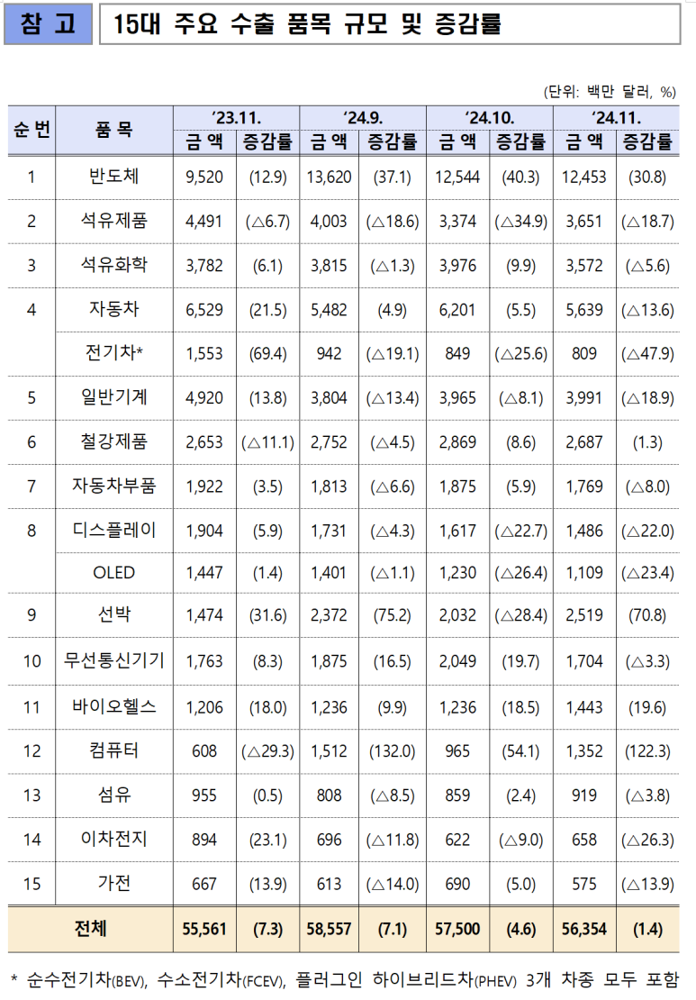

## [2025 신년사] 반도체로 빛나는 대한민국의 새 아침

VLSI Korea 방문자 여러분,

​

2025년의 첫날을 맞아 이곳에서 신년 인사드리게 되어 대단히 기쁩니다. 새해에는 여러분의 삶이 풍요롭고, 건강과 행복이 가득하기를 기원합니다.

[의례상 하는 말이 아니고, 여러분들이 잘 되어야 반도체 산업도 커지고, 우리나라도.. 우리회사도.. 잘 되고, 저도 잘 되니까요.]

진심으로 여러분이 잘 되길 바라면서 글을 쓰고 있으며,

저는 늘 여러분들이 저를 잘 이용하셨으면 좋겠다고 생각하고 있습니다.

​

2024년은 전 세계적으로 급격한 변화와 도전의 연속이었던 한 해였습니다. 대한민국 역시 이러한 변화 속에서 많은 도전을 마주했습니다. 경제적 불확실성, 글로벌 기술 패권 경쟁, 그리고 사회적 갈등까지, 우리 사회는 위기와 기회를 동시에 안고 있습니다.

​

1. 저는 청년 및 장년들이 과학기술정책에 대해 무관심하다고 느낍니다.

이러한 무관심은 결국 정치인들이 그들의 마음대로 정책을 결정하게 만들고, 그 결과로 손해를 보는 것은 우리 모두입니다. 이러한 현실을 직시하고, 더 많은 청년들이 적극적으로 관심을 가지는 것이 필요합니다.

​

2. 2024년 AI는 Peak of Inflated Expectation에서 Through of Disillusionment [환멸의 단계]로 이동하고 있습니다.

AI 기술이 세상을 놀라게 하는 기술이긴 하지만, 현재 수준에 있어서는, 당장 수익성 있는 분야가 제한적이라는 것입니다. 앞으로 반도체의 가격과 전성비가 안정화되면 다시 시장 기대는 올라올테지만, 현재는 채용시장이 얼어있다고 말씀드리고 싶습니다.

Explore Beyond GenAI on the 2024 Hype Cycle for Artificial Intelligence, Gartner, Afraz Jaffri​

2024년에도, 2025년에도, 저는 제 소속이 '과학기술'을 기반으로 글로벌 경쟁력을 강화하고, 모두가 더 나은 삶을 누릴 수 있도록 하는 데 일조하고자 합니다.

​

대한민국의 2025년 반도체 산업은 치열한 글로벌 경쟁 속에서 도전에 직면하고 있습니다.

(1) HBM 메모리 분야에서는 마이크론이 빠르게 따라오며 대한민국의 기술적 우위를 위협하고 있습니다.

(2) DRAM 메모리 분야에서는 중국의 창신 테크놀로지가 생산력을 크게 확장하며 경쟁력을 높이고 있습니다.

(3) 시스템 반도체의 신규 공정에서도 Big-Tech 기업들이 TSMC 만을 선택하고 있습니다.

​

대한민국이 이 분야에서 직면한 어려움이 더욱 분명해지고 있습니다. 이러한 현상을 극복하지 못한다면 글로벌 반도체 시장에서 우리의 위치가 약화될 우려가 있습니다. 현재 글로벌 반도체 산업은 이제 단순한 산업 분야를 넘어 국가의 미래를 책임지는 핵심 동력입니다.

2024년 11월 대한민국 수출입동향, 대한민국 산업자원통상부이에따라, 2025년에는,

반도체 설계 Standard

반도체 공정

반도체 산업의 최신 트렌드

반도체 엔지니어 경력 개발과 글로벌 네트워킹

반도체 주요 행사 일정을 다룰 예정이고,

​

반도체 뿐만 아니라, 반도체를 사용하는 인공지능은 국가의 미래를 좌우하는 필수자산입니다. 현재 정부가 목표하는 "AI G3"를 위해, 제가 가진 GPU와 AI 반도체에 대한 이해, 컴퓨팅 인프라 등 제가 갖고 있는 지식들을 나눌 예정이며, 대한민국이 메모리 반도체 강국에 이어 인공지능 강국이 될 수 있도록 최선을 다하겠습니다. 

​

​

그리고, 내년에는 회사에서 더 적극적으로 일 하려고 합니다.

문득 드는 생각이, 외국계 회사는 정말 많은 정보와 힘이 있습니다. 고객이 내부적으로 고생해도 한계가 있기에, 진짜 ‘고객 성공’을 위해서 제가 할 수 있는건 외부에서 다 지원해보려고 합니다.

​

새해에는 제가 가진 전문성과 경험을 바탕으로, 우리 국가와 회사가 과학기술의 미래를 함께 그려나가는 데 최선을 다하겠습니다.

​

> 새해 복 많이 받으세요. 항상 건강하고 행복하시길 기원합니다.

출처 : No Site

​

2025년 1월 1일

VLSI Korea

Chase (나경채)

 해시태그 : 